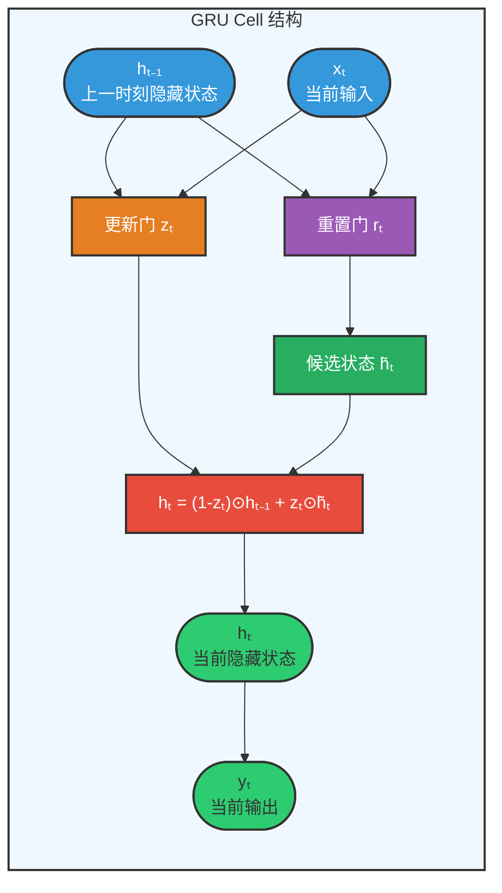
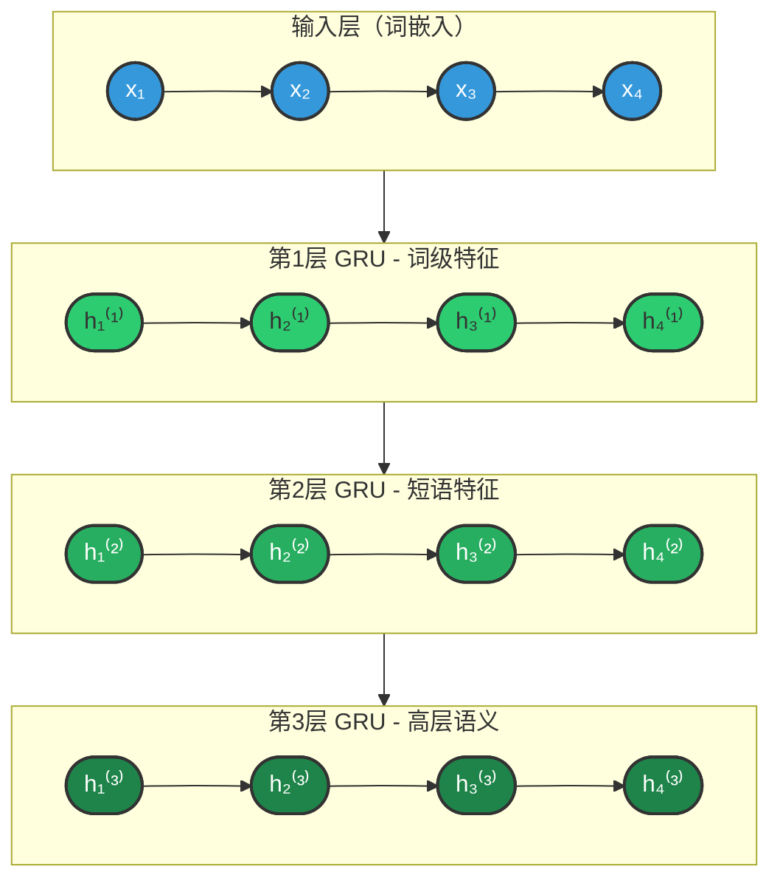
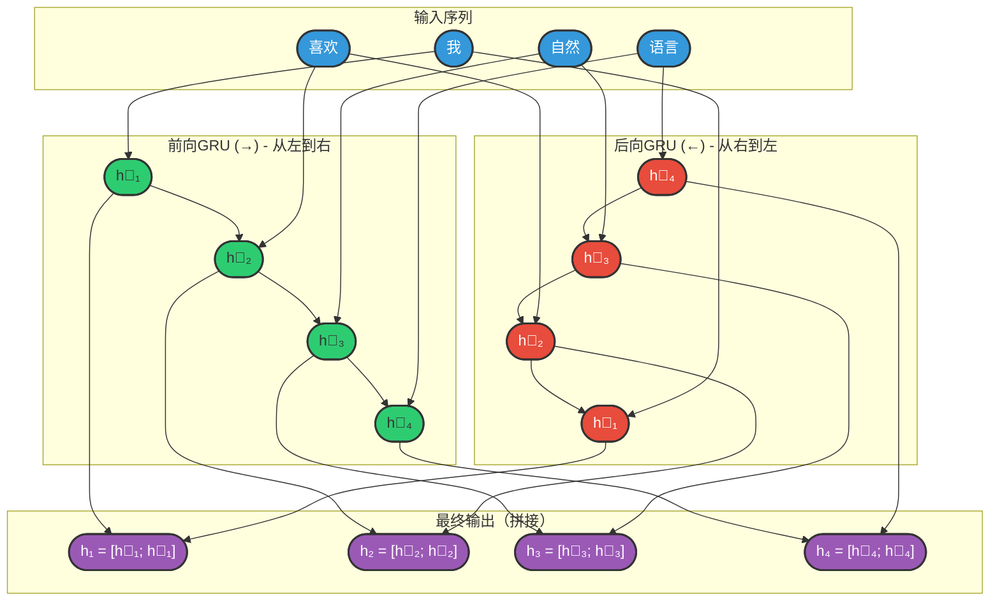
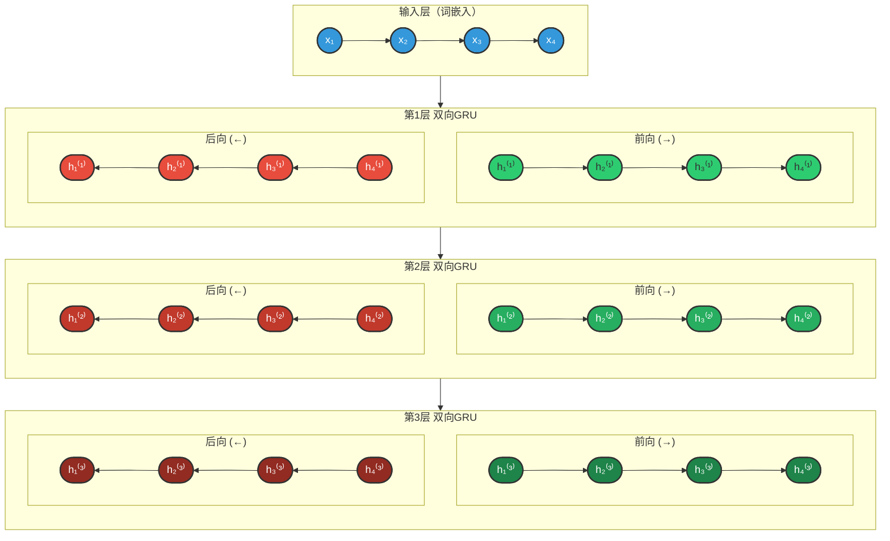
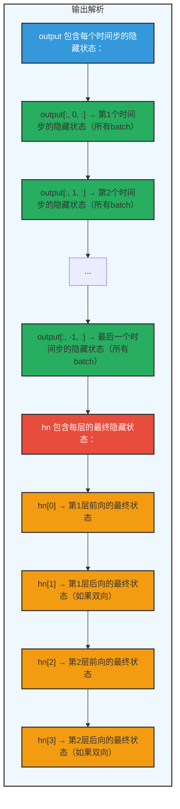
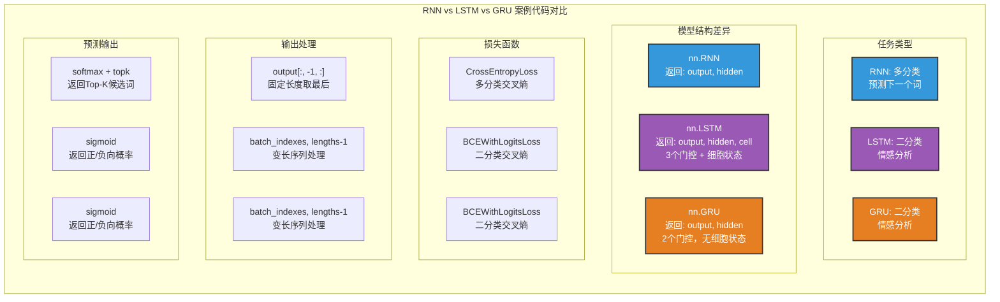

## 3.3 GRU（门控循环单元）

### 3.3.1 概述

**设计动机：**

LSTM虽然有效解决了长期依赖问题，但其结构相对复杂，包含三个门控和两条状态传递路径（隐藏状态hₜ和细胞状态Cₜ）。这导致：
- 参数量较大（约4倍于标准RNN）
- 计算成本较高
- 训练时间较长

2014年，Cho等人在论文《Learning Phrase Representations using RNN Encoder-Decoder for Statistical Machine Translation》中提出了GRU（Gated Recurrent Unit），旨在保持LSTM解决长期依赖能力的同时，简化模型结构。

**核心思想：**

**LSTM vs GRU 设计对比：**

| 特性 | LSTM | GRU |
|------|------|-----|
| **状态数量** | 2个（细胞状态 Cₜ + 隐藏状态 hₜ） | 1个（隐藏状态 hₜ） |
| **门控数量** | 3个（遗忘门、输入门、输出门） | 2个（更新门、重置门） |
| **参数量** | 4 × (input_size + hidden_size) × hidden_size | 3 × (input_size + hidden_size) × hidden_size |
| **效果** | - | 参数量减少约25%，训练速度提升，性能相当 |

### 3.3.2 基础结构

GRU将LSTM的细胞状态和隐藏状态合并为一个单一的隐藏状态，并通过两个门控来控制信息的流动。

**整体结构图：**



**两个门控机制详解：**

**1. 重置门（Reset Gate）—— 决定遗忘多少历史信息**

**重置门（Reset Gate）：**

- **功能**：控制前一时刻隐藏状态有多少信息被用于计算候选状态
- **计算**：`rₜ = σ(Wr · [hₜ₋₁, xₜ])`
- **输出**：`rₜ ∈ (0, 1)`
  - `0` = 完全遗忘历史
  - `1` = 完全保留历史
- **作用**：类似于LSTM的遗忘门，但直接作用于隐藏状态
- **直观理解**：
  - `rₜ ≈ 0`："忘记之前的记忆，主要关注当前输入"
  - `rₜ ≈ 1`："保留之前的记忆，结合当前输入"

**2. 更新门（Update Gate）—— 决定隐藏状态的更新程度**

**更新门（Update Gate）：**

- **功能**：控制前一时刻隐藏状态和新候选状态的混合比例
- **计算**：`zₜ = σ(Wz · [hₜ₋₁, xₜ])`
- **输出**：`zₜ ∈ (0, 1)`
  - `0` = 保留旧状态
  - `1` = 接受新状态
- **作用**：合并了LSTM的遗忘门和输入门的功能
- **直观理解**：
  - `zₜ ≈ 0`："保持之前的记忆不变"
  - `zₜ ≈ 1`："用新计算的状态替换旧状态"
  - `zₜ ∈ (0,1)`："新旧状态按比例混合"

**隐藏状态更新（GRU的核心）：**

**第一步：计算候选隐藏状态**

```
h̃ₜ = tanh(W · [rₜ ⊙ hₜ₋₁, xₜ])
```

- `rₜ ⊙ hₜ₋₁`：重置门过滤后的历史信息
- `[·, ·]`：拼接操作
- `tanh`：非线性激活

**第二步：更新隐藏状态**

```
hₜ = (1 - zₜ) ⊙ hₜ₋₁ + zₜ ⊙ h̃ₜ
        ↑              ↑
   保留旧记忆      添加新记忆
```

**对比LSTM：**

| 模型 | 状态更新公式 | 门控方式 |
|------|-------------|----------|
| LSTM | Cₜ = fₜ⊙Cₜ₋₁ + iₜ⊙C̃ₜ | 两个独立门（遗忘门+输入门） |
| GRU | hₜ = (1-zₜ)⊙hₜ₋₁ + zₜ⊙h̃ₜ | 一个门控制两者（更新门） |

**优势：** zₜ同时控制遗忘和输入，参数更少，计算更快

**GRU与LSTM的对比图示：**

| 特性 | LSTM（复杂） | GRU（简化） |
|------|-------------|-------------|
| **状态** | Cₜ（细胞状态）+ hₜ（隐藏状态） | hₜ（仅隐藏状态） |
| **门控** | 遗忘门、输入门、输出门（3个） | 重置门、更新门（2个） |
| **计算流程** | Cₜ₋₁ → [遗忘门] → Cₜ → [输出门] → hₜ<br>hₜ₋₁ → [输入门] → Cₜ | hₜ₋₁ → [重置门] → hₜ<br>hₜ₋₁ → [更新门] → hₜ |

### 3.3.3 多层结构

**动机：** 单层GRU只能捕捉基础的序列特征，多层GRU可以学习层次化的表示，捕捉更复杂的模式。

**结构设计：**



**层次特征学习：**

| 层级 | 学习特征 | 颜色 | 示例理解 |
|------|----------|------|----------|
| 第1层 | 词级特征 | 🟢 浅绿 | "我"、"喜欢"、"NLP" 等单个词的含义 |
| 第2层 | 短语特征 | 🟢 中绿 | "喜欢NLP" = 动词 + 名词的组合 |
| 第3层 | 高层语义 | 🟢 深绿 | "我喜欢NLP" = 完整句子的语义 |

**关键特性：** 低层输出作为高层输入，逐层抽象，形成层次化表示

---

**前向传播过程：**

```python
def forward(self, x):
    # x: (batch_size, seq_len, input_size)
    
    # 第1层前向传播
    out1, h1 = self.gru1(x)
    
    # 第2层前向传播（输入为第1层的输出）
    out2, h2 = self.gru2(out1)
    
    # 第3层前向传播（输入为第2层的输出）
    out3, h3 = self.gru3(out2)
    
    return out3, h3
```

**多层GRU的优势：**

| 层数 | 优势 | 适用场景 |
|------|------|----------|
| 1层 | 计算快，适合简单任务 | 短序列分类、基本预测 |
| 2-3层 | 平衡性能和复杂度 | 大多数NLP任务 |
| 3层以上 | 捕获复杂模式 | 机器翻译、对话系统 |

**注意事项：**
- 层数越多，参数量越大，越容易过拟合
- 需要更多数据和更强的正则化（如dropout）
- 训练时间会显著增加

### 3.3.4 双向结构

**动机：** 传统GRU只考虑过去的信息（从左到右处理），而双向GRU同时考虑过去和未来的上下文信息。

**结构设计：**



**图例说明：**
- 🔵 **蓝色输入**：词嵌入向量
- 🟢 **绿色 h⃗**：前向隐藏状态（从左到右，捕获上文信息）
- 🔴 **红色 h⃖**：后向隐藏状态（从右到左，捕获下文信息）
- 🟣 **紫色 h**：最终输出（前后向拼接，捕获完整上下文）

**核心思想：** 同时运行两个GRU，一个正向读取序列，一个反向读取序列，将两者的隐藏状态拼接，使每个时刻都能获得完整的上下文信息

---

**双向GRU的应用场景：**

| 任务 | 为什么需要双向 | 示例 |
|------|----------------|------|
| 命名实体识别 | 确定实体边界需要前后文 | "北京大学"需要看到"北京"和"大学"才能确定是ORG |
| 情感分析 | 否定词可能在后面 | "这部电影不差"需要看到"不"和"差"才能确定情感 |
| 词性标注 | 词性依赖上下文 | "record"可以是名词或动词，需要看前后词确定 |
| 机器翻译 | 翻译需要完整理解句子 | 翻译"他喜欢苹果"时需要知道"苹果"是水果还是公司 |

**优势：**
- 捕获更完整的上下文信息
- 提高模型性能
- 特别适合需要完整句子理解的任务

**局限性：**
- 必须等整个序列输入后才能处理（无法在线处理）
- 计算量翻倍

### 3.3.5 多层+双向结构

**动机：** 结合多层结构和双向结构的优势，同时捕获层次化特征和完整上下文。

**结构设计：**



**图例说明：**
- 🔵 **蓝色 x**：输入词嵌入
- 🟢 **绿色 h⃗**：前向隐藏状态（每层颜色深浅递增）
- 🔴 **红色 h⃖**：后向隐藏状态（每层颜色深浅递增）
- 每层输出 = [前向隐藏状态 ; 后向隐藏状态] 的拼接

**架构优势：**
1. **垂直方向**：多层堆叠，逐层抽象（词级→短语级→句子级）
2. **水平方向**：双向处理，捕获完整上下文（上文+下文）

---

**参数计算：**

如果单层双向GRU的隐藏维度是 `hidden_size`，则：
- 每层的输出维度：`hidden_size * 2`（前向+后向）
- 参数量：`6 * hidden_size * (input_size + hidden_size)`（每层两个方向，每个方向3个门）

**PyTorch实现示例：**

```python
import torch
import torch.nn as nn

class MultiLayerBiGRU(nn.Module):
    def __init__(self, input_size, hidden_size, num_layers, output_size):
        super(MultiLayerBiGRU, self).__init__()
        
        self.num_layers = num_layers
        self.hidden_size = hidden_size
        
        # 多层双向GRU
        self.gru = nn.GRU(
            input_size=input_size,
            hidden_size=hidden_size,
            num_layers=num_layers,
            batch_first=True,
            bidirectional=True  # 双向
        )
        
        # 全连接层（输入维度需要考虑双向和层数）
        self.fc = nn.Linear(hidden_size * 2, output_size)
    
    def forward(self, x):
        # 前向传播
        out, _ = self.gru(x)
        
        # 取最后一个时间步的输出
        out = out[:, -1, :]
        out = self.fc(out)
        return out

# 模型初始化
model = MultiLayerBiGRU(
    input_size=100,      # 词向量维度
    hidden_size=128,     # 隐藏层维度
    num_layers=3,        # 层数
    output_size=2        # 分类数
)
```

**多层双向GRU的应用：**
- 复杂的文本分类任务
- 命名实体识别（NER）
- 机器翻译的编码器
- 问答系统的上下文理解

### 3.3.6 API使用

**PyTorch GRU API：**

```python
import torch
import torch.nn as nn

# 基本GRU
gru = nn.GRU(
    input_size=input_size,    # 输入特征维度
    hidden_size=hidden_size,  # 隐藏层维度
    num_layers=num_layers,    # 层数
    bias=True,               # 是否使用偏置
    batch_first=False,        # 输入是否为(batch, seq, feature)
    dropout=0,               # 层间dropout概率（num_layers>1时有效）
    bidirectional=False       # 是否双向
)

# 输入形状：(seq_len, batch_size, input_size)
# 如果batch_first=True，则为(batch_size, seq_len, input_size)
input = torch.randn(10, 32, 100)  # 10个时间步，32个batch，100维输入

# 初始隐藏状态：(num_layers * num_directions, batch_size, hidden_size)
h0 = torch.randn(num_layers, 32, hidden_size)

# 前向传播
output, hn = gru(input, h0)
# output形状：(seq_len, batch_size, num_directions * hidden_size)
# hn形状：(num_layers * num_directions, batch_size, hidden_size)
```

**常用参数说明：**

| 参数 | 说明 | 推荐值 |
|------|------|--------|
| input_size | 输入特征维度 | 词向量维度（如100, 300） |
| hidden_size | 隐藏层维度 | 64-512，根据任务复杂度 |
| num_layers | 层数 | 1-3层 |
| batch_first | 是否以batch为第一维度 | True（符合直觉） |
| bidirectional | 是否双向 | 任务需要完整上下文时使用 |
| dropout | 层间dropout | 0.1-0.5（防止过拟合） |

**输入输出内容详解：**

| 类型 | 参数 | 说明 | 形状 |
|------|------|------|------|
| **输入** | **input** | 输入序列 | `(seq_len, batch_size, input_size)`，如果 `batch_first=True`，则为 `(batch_size, seq_len, input_size)` |
| | **h_0** | 可选，初始隐藏状态 | `(num_layers × num_directions, batch_size, hidden_size)` |
| **输出** | **output** | GRU层的输出，包含最后一层每个时间步的隐藏状态 | `(seq_len, batch_size, num_directions × hidden_size)`，如果 `batch_first=True`，则为 `(batch_size, seq_len, num_directions × hidden_size)` |
| | **h_n** | 最后一个时间步的隐藏状态，包含每一层的每个方向 | `(num_layers × num_directions, batch_size, hidden_size)` |

**形状详解示例：**

```python
import torch
import torch.nn as nn

# 假设参数
batch_size = 32      # 批次大小
seq_len = 10         # 序列长度
input_size = 100     # 输入维度
hidden_size = 128    # 隐藏层维度
num_layers = 2       # 层数
bidirectional = True # 是否双向

# 计算方向数
num_directions = 2 if bidirectional else 1

# 创建GRU
gru = nn.GRU(
    input_size=input_size,
    hidden_size=hidden_size,
    num_layers=num_layers,
    batch_first=True,  # 批次优先
    bidirectional=bidirectional
)

# 输入数据
x = torch.randn(batch_size, seq_len, input_size)

# 初始隐藏状态（可选，默认为0）
h0 = torch.zeros(num_layers * num_directions, batch_size, hidden_size)

# 前向传播
output, hn = gru(x, h0)

print(f"输入 x 形状:        {x.shape}")      # [32, 10, 100]
print(f"初始状态 h0 形状:    {h0.shape}")    # [4, 32, 128]  (2层×2方向)
print(f"输出 output 形状:    {output.shape}") # [32, 10, 256] (128×2方向)
print(f"最终状态 hn 形状:    {hn.shape}")    # [4, 32, 128]  (2层×2方向)
```

**输出解析：**



### 3.3.7 案例实操（AI智评V2.0）

#### 项目概述

本案例实现一个基于GRU的中文评论情感分析系统（AI智评V2.0），能够自动判断用户评论的情感倾向（正向/负向）。项目完整代码位于 `review_analyze_gru` 目录下。

#### 核心思路

**任务定义：** 给定一条评论文本，预测其情感倾向（0=负向，1=正向）

```
输入文本："这款手机真的太好用了，强烈推荐！"
模型输出：正向情感（概率：0.91）

处理流程：
1. 分词：["这款", "手机", "真的", "太好用", "了", "，", "强烈", "推荐", "！"]
2. 编码：[45, 892, 123, 567, 8, 2, 234, 789, 3]
3. GRU编码 → 提取特征
4. 分类：正向（概率>0.5）
```

#### 项目结构

```
review_analyze_gru/
├── src/
│   ├── config.py      # 配置文件（路径、超参数）
│   ├── process.py     # 数据预处理（清洗、分词、编码、划分）
│   ├── dataset.py     # Dataset类和DataLoader
│   ├── model.py       # GRU模型定义
│   ├── train.py       # 训练流程
│   ├── evaluate.py    # 模型评估
│   ├── predict.py     # 预测接口
│   └── tokenizer.py   # 分词器实现
├── data/
│   ├── raw/           # 原始评论数据
│   └── processed/     # 处理后的训练/测试集
├── models/            # 保存的词表和模型权重
└── logs/              # TensorBoard日志
```

#### 详细实现

> **【与RNN/LSTM案例的对比说明】**
> 
> 本案例与RNN、LSTM案例相比，有以下核心差异：
> 
> | 对比维度 | RNN案例 | LSTM案例 | GRU案例（本案例） |
> |----------|---------|----------|------------------|
> | **任务类型** | 多分类（预测下一个词） | 二分类（情感分析） | 二分类（情感分析） |
> | **输出维度** | vocab_size | 1 | 1 |
> | **模型结构** | `nn.RNN` | `nn.LSTM`（3门+细胞状态） | `nn.GRU`（2门，无细胞状态） |
> | **状态数量** | 1个（hidden） | 2个（hidden+cell） | 1个（hidden） |
> | **参数量** | 基准 | 约4×RNN | 约3×RNN（比LSTM少25%） |
> | **损失函数** | `CrossEntropyLoss` | `BCEWithLogitsLoss` | `BCEWithLogitsLoss` |
> | **前向传播返回值** | `output, hidden` | `output, (hidden, cell)` | `output, hidden`（同RNN） |
> 
> **GRU vs LSTM 核心差异：**
> - **门控数量**：LSTM有3个门（遗忘、输入、输出），GRU有2个门（更新、重置）
> - **细胞状态**：LSTM有独立的细胞状态Cₜ，GRU将细胞状态合并到隐藏状态中
> - **前向传播返回值**：GRU同RNN返回 `(output, hidden)`，LSTM返回 `(output, (hidden, cell))`
> 
> 以下代码中，**【与LSTM差异】** 标记表示与LSTM案例不同的部分。

**1. 模型定义（model.py）**

```python
"""
模型定义模块

功能描述:
    本模块定义了基于GRU的情感分析模型ReviewAnalyzeModel。
    模型结构：Embedding层 -> GRU层 -> Linear层
    支持变长序列处理，通过提取最后一个有效时间步的隐藏状态进行分类。

作者: Red_Moon
创建日期: 2026-02
"""

import torch.nn as nn
import config
import torch


class ReviewAnalyzeModel(nn.Module):
    """
    【与LSTM差异】基于GRU的评论情感分析模型

    架构说明:
        1. Embedding层: 将词索引映射为稠密向量表示
        2. GRU层: 建模序列的时序依赖关系，捕获上下文信息
           【与LSTM差异】使用nn.GRU替代nn.LSTM，门控从3个减少到2个
           【与LSTM差异】无细胞状态，参数量减少约25%
        3. Linear层: 将GRU最终隐藏状态映射到输出空间
    """

    def __init__(self, vocab_size, padding_index):
        """
        初始化模型

        参数:
            vocab_size (int): 词表大小，决定Embedding层的输入维度
            padding_index (int): 填充标记<pad>的索引，用于处理变长序列
        """
        super().__init__()
        self.embedding = nn.Embedding(vocab_size, config.EMBEDDING_DIM, padding_idx=padding_index)
        # 【与LSTM差异】使用nn.GRU替代nn.LSTM
        # GRU只有更新门和重置门，无细胞状态，参数量更少
        self.gru = nn.GRU(input_size=config.EMBEDDING_DIM, hidden_size=config.HIDDEN_SIZE, batch_first=True)
        self.linear = nn.Linear(config.HIDDEN_SIZE, 1)

    def forward(self, x: torch.Tensor):
        """
        前向传播

        参数:
            x (torch.Tensor): 输入词索引序列，形状为[batch_size, seq_len]

        返回:
            torch.Tensor: 情感预测logits，形状为[batch_size]
        """
        # x.shape : [batch_size, seq_len]
        embed = self.embedding(x)
        # embed.shape : [batch_size, seq_len, embedding_dim]
        # 【与LSTM差异】GRU返回(output, hidden)，LSTM返回(output, (hidden, cell))
        # 【与RNN相同】GRU的前向传播返回值与RNN一致
        gru_out, _ = self.gru(embed)
        # gru_out.shape : [batch_size, seq_len, hidden_size]
        # 【同LSTM】处理变长序列：通过padding_idx找到每个序列的实际长度
        batch_indexes = torch.arange(0, gru_out.shape[0])
        lengths = (x != self.embedding.padding_idx).sum(dim=1)
        last_hidden = gru_out[batch_indexes, lengths - 1]
        # last_hidden.shape : [batch_size, hidden_size]
        out = self.linear(last_hidden).squeeze(-1)
        # out.shape : [batch_size]
        return out
```

**2. 训练流程（train.py）**

```python
"""
模型训练模块

功能描述:
    本模块实现了基于GRU的情感分析模型的完整训练流程。

作者: Red_Moon
创建日期: 2026-02
"""

import time
from tqdm import tqdm
import torch
import torch.nn as nn
from dataset import get_dataloader
from model import ReviewAnalyzeModel
from tokenizer import JiebaTokenizer
import config
from torch.utils.tensorboard import SummaryWriter


def train_one_epoch(model, dataloader, loss_fn, optimizer, device):
    """
    训练一个epoch
    """
    model.train()
    total_loss = 0
    for inputs, targets in tqdm(dataloader):
        inputs, targets = inputs.to(device), targets.to(device)
        outputs = model(inputs)
        loss = loss_fn(outputs, targets)
        optimizer.zero_grad()
        loss.backward()
        optimizer.step()
        total_loss += loss.item()
    return total_loss / len(dataloader)


def train():
    """
    完整的模型训练流程
    """
    # 1. 设备
    device = torch.device("cuda" if torch.cuda.is_available() else "cpu")
    # 2. 数据
    dataloader = get_dataloader()
    # 3. 分词器
    tokenizer = JiebaTokenizer.from_vocab(config.MODELS_DIR / "vocab.txt")
    # 4. 模型
    # 【与LSTM差异】使用ReviewAnalyzeModel（内部使用GRU而非LSTM）
    model = ReviewAnalyzeModel(vocab_size=tokenizer.vocab_size, 
                               padding_index=tokenizer.pad_token_index).to(device)
    # 5. 损失函数（同LSTM：二分类使用BCEWithLogitsLoss）
    loss_fn = torch.nn.BCEWithLogitsLoss()
    # 6. 优化器
    optimizer = torch.optim.Adam(model.parameters(), lr=config.LEARNING_RATE)
    # 7. TensorBoard Writer
    writer = SummaryWriter(log_dir=config.LOGS_DIR / time.strftime('%Y-%m-%d_%H-%M-%S'))

    best_loss = float('inf')
    for epoch in range(1, config.EPOCHS + 1):
        print(f'======= Epoch {epoch} =======')
        loss = train_one_epoch(model, dataloader, loss_fn, optimizer, device)
        print(f'loss:{loss:.4f}')
        writer.add_scalar('loss', loss, epoch)
        if loss < best_loss:
            best_loss = loss
            torch.save(model.state_dict(), config.MODELS_DIR / 'best.pt')
            print("保存模型")
    writer.close()
```

**3. 预测接口（predict.py）**

```python
"""
模型预测模块

功能描述:
    本模块实现了基于GRU的情感分析模型的预测功能。
    支持批量预测和单条文本预测，提供交互式命令行界面。

作者: Red_Moon
创建日期: 2026-02
"""

import torch
import config
from model import ReviewAnalyzeModel
from tokenizer import JiebaTokenizer


def predict_batch(model, inputs):
    """
    批量预测
    """
    model.eval()
    with torch.no_grad():
        output = model(inputs)
    # 【同LSTM】二分类使用sigmoid获取概率
    batch_result = torch.sigmoid(output)
    return batch_result.tolist()


def predict(text, model, tokenizer, device):
    """
    单条文本预测
    """
    indexes = tokenizer.encode(text, seq_len=config.SEQ_LEN)
    input_tensor = torch.tensor([indexes], dtype=torch.long).to(device)
    batch_result = predict_batch(model, input_tensor)
    return batch_result[0]


def run_predict():
    """
    运行交互式预测界面
    """
    device = torch.device('cuda' if torch.cuda.is_available() else 'cpu')
    print(f"使用设备: {device}")

    tokenizer = JiebaTokenizer.from_vocab(config.MODELS_DIR / 'vocab.txt')
    print("词表加载成功")

    # 【与LSTM差异】使用GRU版本的ReviewAnalyzeModel
    model = ReviewAnalyzeModel(vocab_size=tokenizer.vocab_size, 
                               padding_index=tokenizer.pad_token_index).to(device)
    model.load_state_dict(torch.load(config.MODELS_DIR / 'best.pt'))
    print("模型加载成功")

    print("\n" + "=" * 40)
    print("欢迎使用情感分析模型(输入q或者quit退出)")
    print("=" * 40)

    while True:
        user_input = input("> ")
        if user_input in ['q', 'quit']:
            print("欢迎下次再来")
            break
        if user_input.strip() == '':
            print("请输入内容")
            continue

        result = predict(user_input, model, tokenizer, device)
        print(f'预测结果: {result}')
        # 【同LSTM】二分类结果解释（>0.5为正，<0.5为负）
        if result > 0.5:
            print(f"正向评论,置信度:{result}")
        else:
            print(f"负向评论,置信度:{1-result}")
        print("-" * 40)
```

---

**【三模型案例代码对比总结】**



#### 运行示例

```bash
# 1. 数据预处理
python src/process.py

# 2. 训练模型
python src/train.py

# 3. 评估模型
python src/evaluate.py

# 4. 交互式预测
python src/predict.py
```

预测效果：
```
使用设备: cuda
词表加载成功
模型加载成功

========================================
欢迎使用情感分析模型(输入q或者quit退出)
========================================
> 这款手机质量太差了，完全不值这个价
预测结果: 0.15
负向评论,置信度:0.85
----------------------------------------
> 非常满意，物流很快，商品质量很好
预测结果: 0.89
正向评论,置信度:0.89
```

### 3.3.8 存在问题

**1. 表达能力限制**

GRU相比LSTM少了一个输出门，这导致：
- 无法像LSTM那样精细控制输出内容
- 在某些复杂任务上性能略逊于LSTM
- 对于需要精确记忆控制的任务（如复杂推理）表现不佳

**2. 长期依赖的权衡**

虽然GRU也能解决长期依赖问题，但相比LSTM：
- 更新门同时控制遗忘和输入，灵活性较低
- 在某些超长序列任务上，效果不如LSTM稳定

**3. 适用场景限制**

| 场景 | 推荐模型 | 原因 |
|------|----------|------|
| 简单文本分类 | GRU | 参数少，训练快 |
| 复杂机器翻译 | LSTM | 表达能力更强 |
| 资源受限环境 | GRU | 计算效率高 |
| 需要精确控制 | LSTM | 门控更精细 |

---

## LSTM vs GRU 详细对比

| 特性 | LSTM | GRU |
|------|------|-----|
| 门控数量 | 3个（遗忘、输入、输出） | 2个（更新、重置） |
| 状态数量 | 2个（细胞状态+隐藏状态） | 1个（隐藏状态） |
| 参数数量 | 较多 | 较少（约25%减少） |
| 训练速度 | 较慢 | 较快 |
| 表达能力 | 更强 | 稍弱但通常足够 |
| 适用场景 | 复杂任务、长序列 | 中等复杂度任务 |

**选择建议：**
- 数据量小：GRU（参数少，不易过拟合）
- 数据量大：LSTM（表达能力更强）
- 实际应用中两者性能差异通常不大

---

## 相关文档

- [RNN（循环神经网络）](./03_RNN.md) - GRU的基础版本
- [LSTM（长短期记忆网络）](./03_LSTM.md) - GRU的完整版本，表达能力更强

---

## 参考资源

- PyTorch官方文档：https://pytorch.org/docs/stable/nn.html#gru
- 经典论文：
  - GRU: "Learning Phrase Representations using RNN Encoder-Decoder for Statistical Machine Translation" (2014) - Cho et al.
