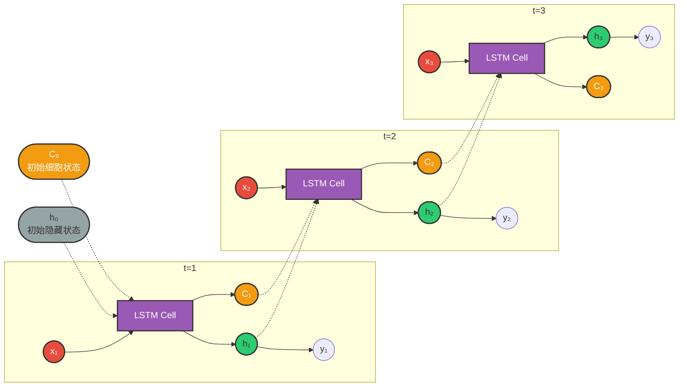
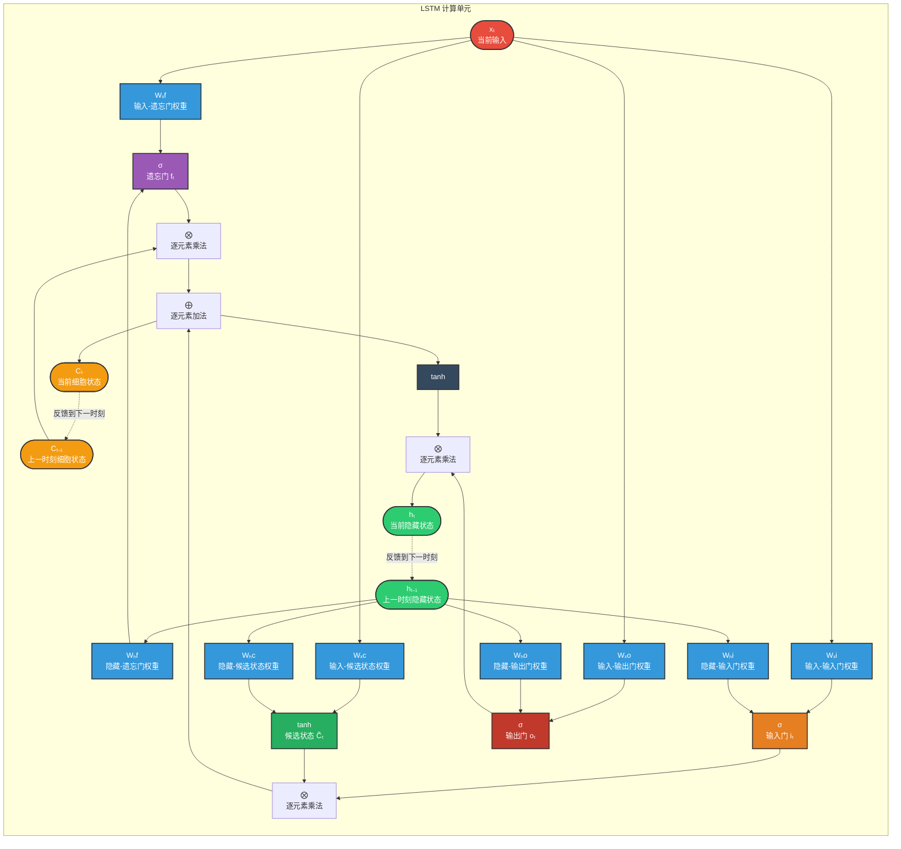
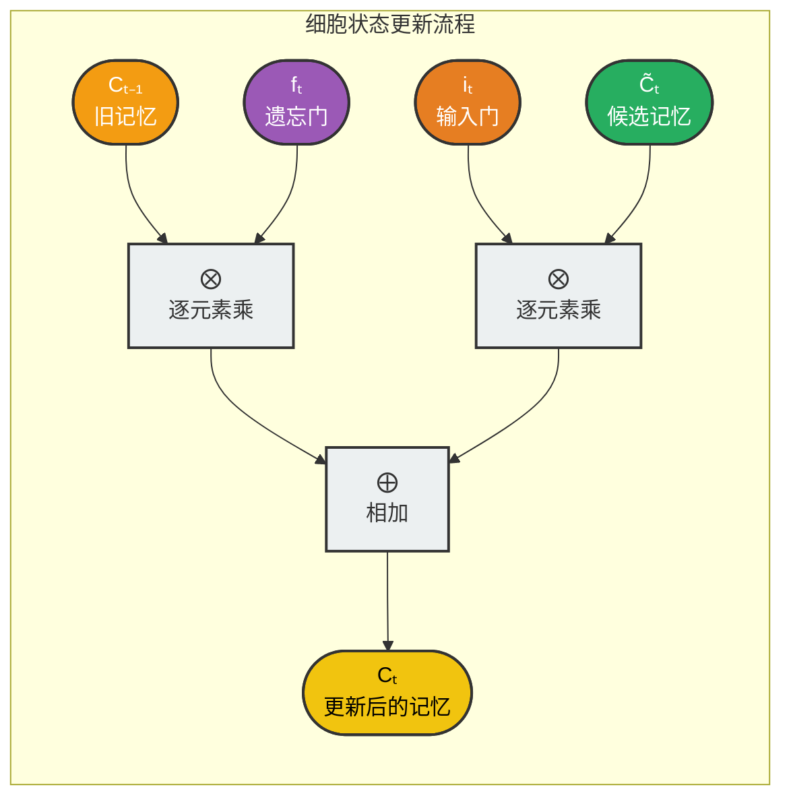
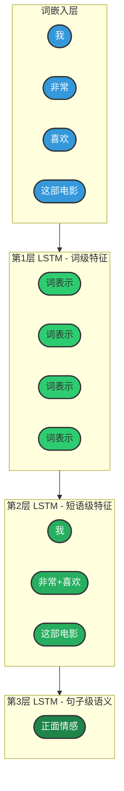
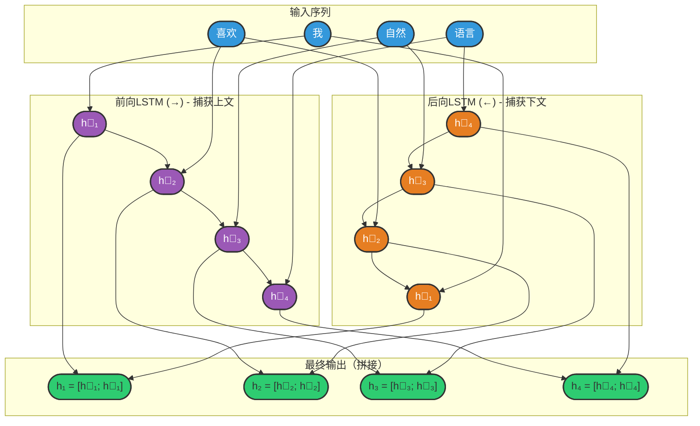
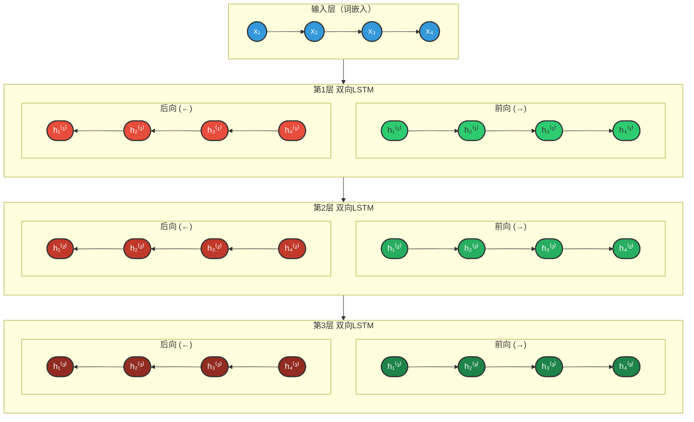

## 3.2 LSTM（长短期记忆网络）

### 3.2.1 概述

**问题根源：**

传统RNN在处理长序列时，由于梯度消失问题，前面时刻的信息难以传递到后面。这导致RNN只能有效捕捉短距离的依赖关系，而无法建立长距离的记忆。

**LSTM的解决方案：**

1997年，Hochreiter和Schmidhuber提出了长短期记忆网络（Long Short-Term Memory，LSTM），专门设计用于解决RNN的长期依赖问题。

**核心创新：**

LSTM引入了"细胞状态"（Cell State）和"门控机制"（Gating Mechanism）：
- **细胞状态**：像一条传送带，信息可以在上面相对 unchanged 地流动
- **门控机制**：通过可学习的门来控制信息的流动，决定哪些信息应该保留、丢弃或输出

**为什么叫"长短期记忆"？**

**长短记忆机制：**

- **短期记忆（Short-term）：隐藏状态 hₜ**
  - 类似RNN的隐藏状态
  - 携带当前时刻的上下文信息

- **长期记忆（Long-term）：细胞状态 Cₜ**
  - 贯穿整个序列的信息通道
  - 可以选择性地保留或遗忘历史信息

- **门控机制**：控制信息在长短记忆之间的流动

### 3.2.2 基础结构

LSTM的核心是一个精心设计的记忆单元，包含三条信息流和三个门控机制。

**结构展开图：**



**图例说明：**
- 🔴 **红色 xₜ**：当前时刻输入
- 🟣 **紫色 LSTM Cell**：共享参数的LSTM单元
- 🟢 **绿色 hₜ**：隐藏状态（短期记忆）
- 🟡 **黄色 Cₜ**：细胞状态（长期记忆）
- ⚪ **灰色 h₀, C₀**：初始状态（通常为零向量）
- 虚线箭头：状态的跨时间步传递

---

**LSTM单元详细结构：**



**核心公式：**

```
遗忘门：fₜ = σ(Wf · [hₜ₋₁, xₜ] + bf)
输入门：iₜ = σ(Wi · [hₜ₋₁, xₜ] + bi)
候选状态：C̃ₜ = tanh(Wc · [hₜ₋₁, xₜ] + bc)
细胞状态更新：Cₜ = fₜ ⊙ Cₜ₋₁ + iₜ ⊙ C̃ₜ
输出门：oₜ = σ(Wo · [hₜ₋₁, xₜ] + bo)
隐藏状态：hₜ = oₜ ⊙ tanh(Cₜ)
```

**图例说明：**
- 🟣 **紫色 σ**：遗忘门（Forget Gate）— 决定保留多少旧记忆
- 🟠 **橙色 σ**：输入门（Input Gate）— 决定存储多少新信息
- 🟢 **绿色 tanh**：候选状态 — 生成新的候选记忆
- 🔴 **红色 σ**：输出门（Output Gate）— 决定输出多少信息
- 🔵 **蓝色 xₜ**：当前时刻输入
- 🟢 **绿色 hₜ**：隐藏状态（短期记忆）
- 🟡 **黄色 Cₜ**：细胞状态（长期记忆）
- ⭕ **⨂**：逐元素乘法（Hadamard积）
- ➕ **⨁**：逐元素加法

**关键特性：** LSTM通过细胞状态（Cₜ）直接传递信息，避免了传统RNN中梯度消失的问题，使重要信息可以长距离传递而不衰减

---

### 3.2.3 三个门控机制详解

**1. 遗忘门（Forget Gate）—— 决定保留多少旧记忆**

**功能：** 控制前一时刻的细胞状态有多少信息被保留到当前时刻

**计算：**
```
fₜ = σ(Wf · [hₜ₋₁, xₜ] + bf)
```

**输出：** fₜ ∈ (0, 1)
- `0` = 完全遗忘（清除旧记忆）
- `1` = 完全保留（保持旧记忆不变）

**直观理解：**
- `fₜ ≈ 1`："这条信息很重要，继续保留"
- `fₜ ≈ 0`："这条信息不重要，可以忘记"

**示例：**
```
句子："我出生在北京，...，我会说中文"

在处理"我会说"时：
- 遗忘门检测到与"出生地"相关的信息
- fₜ ≈ 1（保留"北京"的信息）
- 这样"中文"可以与"北京"建立关联
```

---

**2. 输入门（Input Gate）—— 决定存储多少新信息**

**功能：** 控制当前输入有多少信息被写入细胞状态

**计算：**
```
iₜ = σ(Wi · [hₜ₋₁, xₜ] + bi)      # 输入门（决定写入比例）
C̃ₜ = tanh(Wc · [hₜ₋₁, xₜ] + bc)   # 候选状态（新信息）
```

**输出：**
- iₜ ∈ (0, 1)：写入比例
- C̃ₜ ∈ (-1, 1)：候选记忆内容

**直观理解：**
- `iₜ ≈ 1`："当前信息很重要，写入长期记忆"
- `iₜ ≈ 0`："当前信息不重要，不写入"

**示例：**
```
句子："今天天气很好，我心情愉快"

在处理"心情愉快"时：
- 输入门检测到情感信息
- iₜ ≈ 1（将"愉快"写入记忆）
- C̃ₜ 编码"愉快"的语义信息
```

---

**3. 输出门（Output Gate）—— 决定输出多少信息**

**功能：** 控制细胞状态有多少信息被输出到隐藏状态

**计算：**
```
oₜ = σ(Wo · [hₜ₋₁, xₜ] + bo)
hₜ = oₜ ⊙ tanh(Cₜ)
```

**输出：**
- oₜ ∈ (0, 1)：输出比例
- hₜ：当前时刻的隐藏状态（短期记忆输出）

**直观理解：**
- `oₜ ≈ 1`："当前需要输出大量信息"
- `oₜ ≈ 0`："当前只需要输出少量信息"

**示例：**
```
句子："这部电影非常精彩"

在处理"精彩"时：
- 输出门检测到这是情感关键词
- oₜ ≈ 1（充分输出情感信息）
- hₜ 携带强烈的正面情感信号
```

---

### 3.2.4 细胞状态更新流程

**细胞状态更新（LSTM的核心）：**

```
Cₜ = fₜ ⊙ Cₜ₋₁ + iₜ ⊙ C̃ₜ
      ↑              ↑
  保留旧记忆      添加新记忆
```

**更新流程图解：**



**关键特性：**

1. **加法更新**：细胞状态通过加法更新，而非RNN的乘法更新
   - RNN：hₜ = tanh(W·hₜ₋₁ + U·xₜ) → 梯度连乘导致消失/爆炸
   - LSTM：Cₜ = fₜ⊙Cₜ₋₁ + iₜ⊙C̃ₜ → 梯度直接传播

2. **线性通道**：细胞状态的流动几乎是线性的（只有逐元素乘法和加法）
   - 这使得梯度可以长距离稳定传播
   - 解决了RNN的长期依赖问题

3. **选择性记忆**：通过门控机制选择性地保留和更新信息
   - 遗忘门：决定忘记什么
   - 输入门：决定记住什么

### 3.2.5 优势分析

**1. 解决长期依赖问题**

LSTM通过细胞状态（Cell State）直接传递信息，避免了传统RNN中梯度消失的问题：

**RNN vs LSTM 梯度传播对比：**

| 特性 | RNN | LSTM |
|------|-----|------|
| **状态更新** | hₜ = tanh(W·hₜ₋₁ + U·xₜ) | Cₜ = fₜ ⊙ Cₜ₋₁ + iₜ ⊙ C̃ₜ |
| **梯度传播** | ∂hₜ/∂hₜ₋₁ 涉及 tanh' 和 W 的连乘 | ∂Cₜ/∂Cₜ₋₁ = fₜ（遗忘门输出） |
| **长序列表现** | 梯度 → 0（消失） | 当 fₜ ≈ 1 时，梯度稳定传播 |
| **关键优势** | - | 可学习让遗忘门保持开启，信息长距离流动 |

**2. 灵活的信息控制**

三个门控机制使LSTM能够选择性地记忆或遗忘：

| 场景 | 遗忘门 fₜ | 输入门 iₜ | 行为描述 |
|------|-----------|-----------|----------|
| 保留旧信息 | ≈ 1 | ≈ 0 | 细胞状态几乎不变，长期记忆得以保留 |
| 更新信息 | ≈ 0 | ≈ 1 | 丢弃旧信息，写入新信息 |
| 部分更新 | (0,1) | (0,1) | 选择性保留和添加信息 |
| 完全重置 | ≈ 0 | ≈ 0 | 清除细胞状态（句子边界等） |

**3. 实际应用优势**

```
示例：机器翻译中的长距离依赖

输入："The cat, which was sitting on the mat that was placed 
       near the window overlooking the garden, was hungry."
       
关键依赖："cat"(主语) ←→ "was hungry"(谓语)
距离：相隔20+个词

LSTM能力：
- 遗忘门保持开启，保留"cat"的信息
- 细胞状态将"cat"的信息传递到句子末尾
- 输出门在需要时提取该信息进行翻译
```

### 3.2.6 多层结构

**动机：** 单层LSTM只能捕捉基础特征，多层LSTM可以学习层次化的表示。

**结构设计：**



**层次化特征学习：**

| 层级 | 特征类型 | 学习内容 | 颜色 | 示例 |
|------|----------|----------|------|------|
| 词嵌入层 | 分布式表示 | 词的语义向量 | 🔵 蓝色 | "我"→[0.2, -0.5, ...] |
| 第1层 LSTM | 词级特征 | 单个词的上下文表示 | 🟢 浅绿 | "喜欢"在句中的含义 |
| 第2层 LSTM | 短语级特征 | 词组合和局部结构 | 🟢 中绿 | "非常喜欢"=程度+动词 |
| 第3层 LSTM | 句子级语义 | 整体理解和情感 | 🟢 深绿 | "我非常喜欢这部电影"=正面 |

**关键洞察：**
- 低层学习局部、具体的特征
- 高层学习抽象、全局的特征
- 逐层抽象，形成层次化的语义理解

**层数选择建议：**

| 层数 | 适用场景 | 注意事项 |
|------|----------|----------|
| 1层 | 简单任务、小数据集 | 可能欠拟合 |
| 2层 | 大多数NLP任务 | 平衡性能和效率 |
| 3-4层 | 复杂任务 | 需要更多数据和正则化 |
| 4层以上 | 很少使用 | 收益递减，容易过拟合 |

### 3.2.7 双向结构

**动机：** 在NLP任务中，理解当前词往往需要同时考虑其前面和后面的上下文。

**结构：**



**图例说明：**
- 🔵 **蓝色输入**：词嵌入向量
- 🟣 **紫色 h⃗**：前向LSTM隐藏状态（从左到右，捕获上文信息）
- 🟠 **橙色 h⃖**：后向LSTM隐藏状态（从右到左，捕获下文信息）
- 🟢 **绿色 h**：最终输出（前后向拼接，捕获完整上下文）

**核心优势：**
- 前向LSTM：理解"我 喜欢" → 预测"自然语言"
- 后向LSTM：理解"语言处理" → 预测"自然"
- 拼接输出：同时利用前后文，准确理解每个词

**应用场景：**

| 任务 | 为什么需要双向 | 示例 |
|------|----------------|------|
| 命名实体识别 | 确定实体边界需要前后文 | "北京大学"需要看到"北京"和"大学"才能确定是ORG |
| 情感分析 | 否定词可能在后面 | "这部电影不差"需要看到"不"和"差"才能确定情感 |
| 词性标注 | 词性依赖上下文 | "record"可以是名词或动词，需要看前后词确定 |

### 3.2.8 多层+双向结构

**动机：** 结合多层结构和双向结构的优势，同时捕获层次化特征和完整上下文。

**结构设计：**



**图例说明：**
- 🔵 **蓝色 x**：输入词嵌入
- 🟢 **绿色 h⃗**：前向隐藏状态（每层颜色深浅递增）
- 🔴 **红色 h⃖**：后向隐藏状态（每层颜色深浅递增）
- 每层输出 = [前向隐藏状态 ; 后向隐藏状态] 的拼接

**架构优势：**
1. **垂直方向**：多层堆叠，逐层抽象（词级→短语级→句子级）
2. **水平方向**：双向处理，捕获完整上下文（上文+下文）

### 3.2.9 API使用

**PyTorch LSTM API：**

```python
import torch
import torch.nn as nn

# 基本LSTM
lstm = nn.LSTM(
    input_size=input_size,    # 输入特征维度
    hidden_size=hidden_size,  # 隐藏层维度
    num_layers=num_layers,    # 层数
    bias=True,               # 是否使用偏置
    batch_first=False,        # 输入是否为(batch, seq, feature)
    dropout=0,               # 层间dropout概率（num_layers>1时有效）
    bidirectional=False,      # 是否双向
    proj_size=0              # 投影层大小（可选）
)

# 输入形状：(seq_len, batch_size, input_size)
# 如果batch_first=True，则为(batch_size, seq_len, input_size)
input = torch.randn(10, 32, 100)  # 10个时间步，32个batch，100维输入

# 初始隐藏状态：(num_layers * num_directions, batch_size, hidden_size)
h0 = torch.randn(num_layers, 32, hidden_size)
# 初始细胞状态：(num_layers * num_directions, batch_size, hidden_size)
c0 = torch.randn(num_layers, 32, hidden_size)

# 前向传播
output, (hn, cn) = lstm(input, (h0, c0))
# output形状：(seq_len, batch_size, num_directions * hidden_size)
# hn形状：(num_layers * num_directions, batch_size, hidden_size)
# cn形状：(num_layers * num_directions, batch_size, hidden_size)
```

**常用参数说明：**

| 参数 | 说明 | 推荐值 |
|------|------|--------|
| input_size | 输入特征维度 | 词向量维度（如100, 300） |
| hidden_size | 隐藏层维度 | 64-512，根据任务复杂度 |
| num_layers | 层数 | 1-3层 |
| batch_first | 是否以batch为第一维度 | True（符合直觉） |
| bidirectional | 是否双向 | 任务需要完整上下文时使用 |
| dropout | 层间dropout | 0.1-0.5（防止过拟合） |

**输入输出内容详解：**

| 类型 | 参数 | 说明 | 形状 |
|------|------|------|------|
| **输入** | **input** | 输入序列 | `(seq_len, batch_size, input_size)`，如果 `batch_first=True`，则为 `(batch_size, seq_len, input_size)` |
| | **h_0** | 可选，初始隐藏状态 | `(num_layers × num_directions, batch_size, hidden_size)` |
| | **c_0** | 可选，初始细胞状态 | `(num_layers × num_directions, batch_size, hidden_size)` |
| **输出** | **output** | LSTM层的输出，包含最后一层每个时间步的隐藏状态 | `(seq_len, batch_size, num_directions × hidden_size)`，如果 `batch_first=True`，则为 `(batch_size, seq_len, num_directions × hidden_size)` |
| | **h_n** | 最后一个时间步的隐藏状态，包含每一层的每个方向 | `(num_layers × num_directions, batch_size, hidden_size)` |
| | **c_n** | 最后一个时间步的细胞状态，包含每一层的每个方向 | `(num_layers × num_directions, batch_size, hidden_size)` |

### 3.2.10 案例实操（AI智评V2.0）

#### 项目概述

本案例实现一个基于LSTM的中文评论情感分析系统（AI智评V2.0），能够自动判断用户评论的情感倾向（正向/负向）。项目完整代码位于 `review_analyze_lstm` 目录下。

#### 核心思路

**任务定义：** 给定一条评论文本，预测其情感倾向（0=负向，1=正向）

```
输入文本："这款手机真的太好用了，强烈推荐！"
模型输出：正向情感（概率：0.92）

处理流程：
1. 分词：["这款", "手机", "真的", "太好用", "了", "，", "强烈", "推荐", "！"]
2. 编码：[45, 892, 123, 567, 8, 2, 234, 789, 3]
3. LSTM编码 → 提取特征
4. 分类：正向（概率>0.5）
```

#### 项目结构

```
review_analyze_lstm/
├── src/
│   ├── config.py      # 配置文件（路径、超参数）
│   ├── process.py     # 数据预处理（清洗、分词、编码、划分）
│   ├── dataset.py     # Dataset类和DataLoader
│   ├── model.py       # LSTM模型定义
│   ├── train.py       # 训练流程
│   ├── evaluate.py    # 模型评估
│   ├── predict.py     # 预测接口
│   └── tokenizer.py   # 分词器实现
├── data/
│   ├── raw/           # 原始评论数据
│   └── processed/     # 处理后的训练/测试集
├── models/            # 保存的词表和模型权重
└── logs/              # TensorBoard日志
```

#### 详细实现

> **【与RNN案例的对比说明】**
> 
> 本案例与RNN案例（智能输入法）相比，有以下核心差异：
> 
> | 对比维度 | RNN案例 | LSTM案例（本案例） |
> |----------|---------|-------------------|
> | **任务类型** | 多分类（预测下一个词） | 二分类（情感分析） |
> | **输出维度** | vocab_size | 1 |
> | **模型结构** | `nn.RNN` | `nn.LSTM`（增加细胞状态） |
> | **损失函数** | `CrossEntropyLoss` | `BCEWithLogitsLoss` |
> | **序列处理** | 固定长度，直接取最后一维 | 变长序列，通过padding_idx找有效长度 |
> | **前向传播返回值** | `output, hidden` | `output, (hidden, cell)` |
> 
> 以下代码中，**【与RNN差异】** 标记表示与RNN案例不同的部分。

**1. 配置文件（config.py）**

> 文件路径：`review_analyze_lstm/src/config.py`

```python
"""
配置文件模块

功能描述:
    本模块定义了输入法LSTM模型的全局配置参数，包括数据路径、模型超参数等。
    所有路径均基于项目根目录进行定义，确保跨平台兼容性。

作者: Red_Moon
创建日期: 2026-02
"""

from pathlib import Path

# =============================================================================
# 路径配置
# =============================================================================
ROOT_DIR = Path(__file__).parent.parent

RAW_DATA_DIR = ROOT_DIR / "data" / "raw"
PROCESSED_DATA_DIR = ROOT_DIR / "data" / "processed"
LOGS_DIR = ROOT_DIR / "logs"
MODELS_DIR = ROOT_DIR / "models"


# =============================================================================
# 模型超参数配置
# =============================================================================
# 【与RNN差异】序列长度更长（RNN通常较短，如5-10；LSTM可处理更长序列）
SEQ_LEN = 128
BATCH_SIZE = 64
EMBEDDING_DIM = 128
HIDDEN_SIZE = 256
LEARNING_RATE = 1e-3
EPOCHS = 50
```

**2. 数据预处理（process.py）**

> 文件路径：`review_analyze_lstm/src/process.py`

```python
"""
数据预处理模块

功能描述:
    本模块实现了情感分析任务的数据预处理流程。
    主要功能包括：原始数据加载、训练/测试集划分、词表构建、
    文本编码和JSONL格式数据保存。

作者: Red_Moon
创建日期: 2026-02
"""

from sklearn.model_selection import train_test_split
from tokenizer import JiebaTokenizer
import config
import pandas as pd


def process():
    """
    执行完整的数据预处理流程

    处理流程:
        1. 读取原始CSV数据（online_shopping_10_cats.csv）
        2. 选择label和review列，删除缺失值
        3. 采样10%数据用于快速实验（可根据需要调整）
        4. 按标签分层划分训练集(80%)和测试集(20%)
        5. 基于训练集构建词表并保存
        6. 使用分词器将文本编码为词索引序列
        7. 保存处理后的训练集和测试集为JSONL格式
    """
    print("开始处理数据")
    # 【与RNN差异】使用CSV格式而非JSONL，且包含标签列（情感分析需要）
    df = pd.read_csv(config.RAW_DATA_DIR / "online_shopping_10_cats.csv", 
                     usecols=["label", "review"], 
                     encoding="utf-8").dropna().sample(frac=0.1)

    train_df, test_df = train_test_split(df, test_size=0.2, stratify=df["label"])

    JiebaTokenizer.build_vocab(train_df['review'].tolist(), config.MODELS_DIR / 'vocab.txt')

    tokenizer = JiebaTokenizer.from_vocab(config.MODELS_DIR / 'vocab.txt')

    train_df['review'] = train_df['review'].apply(lambda x: tokenizer.encode(x, config.SEQ_LEN))
    train_df.to_json(config.PROCESSED_DATA_DIR / 'train.jsonl', orient='records', lines=True)

    test_df['review'] = test_df['review'].apply(lambda x: tokenizer.encode(x, config.SEQ_LEN))
    test_df.to_json(config.PROCESSED_DATA_DIR / 'test.jsonl', orient='records', lines=True)
    print("数据处理结束")
```

**3. 模型定义（model.py）**

> 文件路径：`review_analyze_lstm/src/model.py`

```python
"""
模型定义模块

功能描述:
    本模块定义了基于LSTM的情感分析模型ReviewAnalyzeModel。
    模型结构：Embedding层 -> LSTM层 -> Linear层
    支持变长序列处理，通过提取最后一个有效时间步的隐藏状态进行分类。

作者: Red_Moon
创建日期: 2026-02
"""

import torch.nn as nn
import config
import torch


class ReviewAnalyzeModel(nn.Module):
    """
    【与RNN差异】基于LSTM的评论情感分析模型

    架构说明:
        1. Embedding层: 将词索引映射为稠密向量表示
        2. LSTM层: 建模序列的时序依赖关系，捕获上下文信息
           【与RNN差异】LSTM增加细胞状态，可解决长期依赖问题
        3. Linear层: 将LSTM最终隐藏状态映射到输出空间
           【与RNN差异】输出维度为1（二分类），而非vocab_size
    """

    def __init__(self, vocab_size, padding_index):
        """
        初始化模型

        参数:
            vocab_size (int): 词表大小，决定Embedding层的输入维度
            padding_index (int): 【与RNN差异】填充标记<pad>的索引，用于处理变长序列
        """
        super().__init__()
        # 【与RNN差异】增加padding_idx参数，支持变长序列处理
        self.embedding = nn.Embedding(vocab_size, config.EMBEDDING_DIM, padding_idx=padding_index)
        # 【与RNN差异】使用nn.LSTM替代nn.RNN，增加细胞状态
        self.lstm = nn.LSTM(input_size=config.EMBEDDING_DIM, hidden_size=config.HIDDEN_SIZE, batch_first=True)
        # 【与RNN差异】输出维度为1（二分类），而非vocab_size（多分类）
        self.linear = nn.Linear(config.HIDDEN_SIZE, 1)

    def forward(self, x: torch.Tensor):
        """
        前向传播

        参数:
            x (torch.Tensor): 输入词索引序列，形状为[batch_size, seq_len]

        返回:
            torch.Tensor: 情感预测logits，形状为[batch_size]
        """
        # x.shape : [batch_size, seq_len]
        embed = self.embedding(x)
        # embed.shape : [batch_size, seq_len, embedding_dim]
        # 【与RNN差异】LSTM返回(output, (hidden, cell))，RNN返回(output, hidden)
        lstm_out, (_, _) = self.lstm(embed)
        # lstm_out.shape : [batch_size, seq_len, hidden_size]
        # 【与RNN差异】处理变长序列：通过padding_idx找到每个序列的实际长度
        batch_indexes = torch.arange(0, lstm_out.shape[0])
        lengths = (x != self.embedding.padding_idx).sum(dim=1)
        last_hidden = lstm_out[batch_indexes, lengths - 1]
        # 【RNN差异对比】RNN案例直接取output[:, -1, :]，假设固定长度
        # last_hidden.shape : [batch_size, hidden_size]
        out = self.linear(last_hidden).squeeze(-1)
        # out.shape : [batch_size]
        return out
```

**4. 训练流程（train.py）**

> 文件路径：`review_analyze_lstm/src/train.py`

```python
"""
模型训练模块

功能描述:
    本模块实现了基于LSTM的情感分析模型的完整训练流程。

作者: Red_Moon
创建日期: 2026-02
"""

import time
from tqdm import tqdm
import torch
import torch.nn as nn
from dataset import get_dataloader
from model import ReviewAnalyzeModel
from tokenizer import JiebaTokenizer
import config
from torch.utils.tensorboard import SummaryWriter


def train_one_epoch(model, dataloader, loss_fn, optimizer, device):
    """
    训练一个epoch

    训练流程:
        1. 设置模型为训练模式
        2. 遍历数据加载器
        3. 前向传播、计算损失、反向传播、更新参数
    """
    model.train()
    total_loss = 0
    for inputs, targets in tqdm(dataloader):
        inputs, targets = inputs.to(device), targets.to(device)
        outputs = model(inputs)
        loss = loss_fn(outputs, targets)
        optimizer.zero_grad()
        loss.backward()
        optimizer.step()
        total_loss += loss.item()
    return total_loss / len(dataloader)


def train():
    """
    完整的模型训练流程
    """
    # 1. 设备
    device = torch.device("cuda" if torch.cuda.is_available() else "cpu")
    # 2. 数据
    dataloader = get_dataloader()
    # 3. 分词器
    tokenizer = JiebaTokenizer.from_vocab(config.MODELS_DIR / "vocab.txt")
    # 4. 模型
    # 【与RNN差异】传入padding_index参数，支持变长序列
    model = ReviewAnalyzeModel(vocab_size=tokenizer.vocab_size, 
                               padding_index=tokenizer.pad_token_index).to(device)
    # 5. 【与RNN差异】二分类损失函数：BCEWithLogitsLoss
    #    RNN案例使用：CrossEntropyLoss（多分类）
    loss_fn = torch.nn.BCEWithLogitsLoss()
    # 6. 优化器
    optimizer = torch.optim.Adam(model.parameters(), lr=config.LEARNING_RATE)
    # 7. TensorBoard Writer
    writer = SummaryWriter(log_dir=config.LOGS_DIR / time.strftime('%Y-%m-%d_%H-%M-%S'))

    best_loss = float('inf')
    for epoch in range(1, config.EPOCHS + 1):
        print(f'======= Epoch {epoch} =======')
        loss = train_one_epoch(model, dataloader, loss_fn, optimizer, device)
        print(f'loss:{loss:.4f}')
        writer.add_scalar('loss', loss, epoch)
        if loss < best_loss:
            best_loss = loss
            torch.save(model.state_dict(), config.MODELS_DIR / 'best.pt')
            print("保存模型")
    writer.close()
```

**5. 预测接口（predict.py）**

> 文件路径：`review_analyze_lstm/src/predict.py`

```python
"""
模型预测模块

功能描述:
    本模块实现了基于LSTM的情感分析模型的预测功能。
    支持批量预测和单条文本预测，提供交互式命令行界面。

作者: Red_Moon
创建日期: 2026-02
"""

import torch
import config
from model import ReviewAnalyzeModel
from tokenizer import JiebaTokenizer


def predict_batch(model, inputs):
    """
    批量预测

    功能描述:
        对输入批次进行情感预测，返回每个样本属于正向情感的概率。
    """
    model.eval()
    with torch.no_grad():
        output = model(inputs)
    # 【与RNN差异】二分类使用sigmoid获取概率，多分类使用softmax
    batch_result = torch.sigmoid(output)
    return batch_result.tolist()


def predict(text, model, tokenizer, device):
    """
    单条文本预测

    功能描述:
        对单条文本进行情感分析预测，返回该文本属于正向情感的概率。
    """
    indexes = tokenizer.encode(text, seq_len=config.SEQ_LEN)
    input_tensor = torch.tensor([indexes], dtype=torch.long).to(device)
    batch_result = predict_batch(model, input_tensor)
    return batch_result[0]


def run_predict():
    """
    运行交互式预测界面
    """
    device = torch.device('cuda' if torch.cuda.is_available() else 'cpu')
    print(f"使用设备: {device}")

    tokenizer = JiebaTokenizer.from_vocab(config.MODELS_DIR / 'vocab.txt')
    print("词表加载成功")

    # 【与RNN差异】传入padding_index参数
    model = ReviewAnalyzeModel(vocab_size=tokenizer.vocab_size, 
                               padding_index=tokenizer.pad_token_index).to(device)
    model.load_state_dict(torch.load(config.MODELS_DIR / 'best.pt'))
    print("模型加载成功")

    print("\n" + "=" * 40)
    print("欢迎使用情感分析模型(输入q或者quit退出)")
    print("=" * 40)

    while True:
        user_input = input("> ")
        if user_input in ['q', 'quit']:
            print("欢迎下次再来")
            break
        if user_input.strip() == '':
            print("请输入内容")
            continue

        result = predict(user_input, model, tokenizer, device)
        print(f'预测结果: {result}')
        # 【与RNN差异】二分类结果解释（>0.5为正，<0.5为负）
        if result > 0.5:
            print(f"正向评论,置信度:{result}")
        else:
            print(f"负向评论,置信度:{1-result}")
        print("-" * 40)
```

#### 运行示例

```bash
# 1. 数据预处理
python src/process.py

# 2. 训练模型
python src/train.py

# 3. 评估模型
python src/evaluate.py

# 4. 交互式预测
python src/predict.py
```

预测效果：
```
使用设备: cuda
词表加载成功
模型加载成功

========================================
欢迎使用情感分析模型(输入q或者quit退出)
========================================
> 这款手机质量太差了，完全不值这个价
预测结果: 0.12
负向评论,置信度:0.88
----------------------------------------
> 非常满意，物流很快，商品质量很好
预测结果: 0.91
正向评论,置信度:0.91
```

### 3.2.11 存在问题

**1. 参数量较大**

LSTM相比RNN有显著的参数量增加：

| 模型 | 参数量公式 | 示例（input=100, hidden=128） |
|------|-----------|------------------------------|
| RNN | 1 × (input + hidden) × hidden | 29,184 |
| LSTM | 4 × (input + hidden) × hidden | 116,736 |

LSTM的参数量是RNN的4倍，这导致：
- 需要更多的训练数据
- 训练时间更长
- 更容易过拟合

**2. 计算复杂度较高**

每个时间步需要进行：
- 4次矩阵乘法（遗忘门、输入门、候选状态、输出门）
- 多次逐元素运算

这使得LSTM的推理速度比RNN慢，不适合实时性要求极高的场景。

**3. 缓解方法**

| 方法 | 原理 | 效果 |
|------|------|------|
| 使用GRU | 减少门控数量（3→2） | 参数量减少25%，速度提升 |
| 模型剪枝 | 移除不重要的权重 | 减少参数量，保持性能 |
| 量化 | 使用低精度表示 | 减少内存占用，加速推理 |
| 知识蒸馏 | 用大模型教小模型 | 小模型达到接近大模型的效果 |

---

## 相关文档

- [RNN（循环神经网络）](./03_RNN.md) - LSTM的基础版本，理解RNN有助于掌握LSTM
- [GRU（门控循环单元）](./03_GRU.md) - LSTM的简化版本，参数更少，训练更快

---

## 参考资源

- PyTorch官方文档：https://pytorch.org/docs/stable/nn.html#lstm
- 经典论文：
  - LSTM: "Long Short-Term Memory" (1997) - Hochreiter & Schmidhuber
