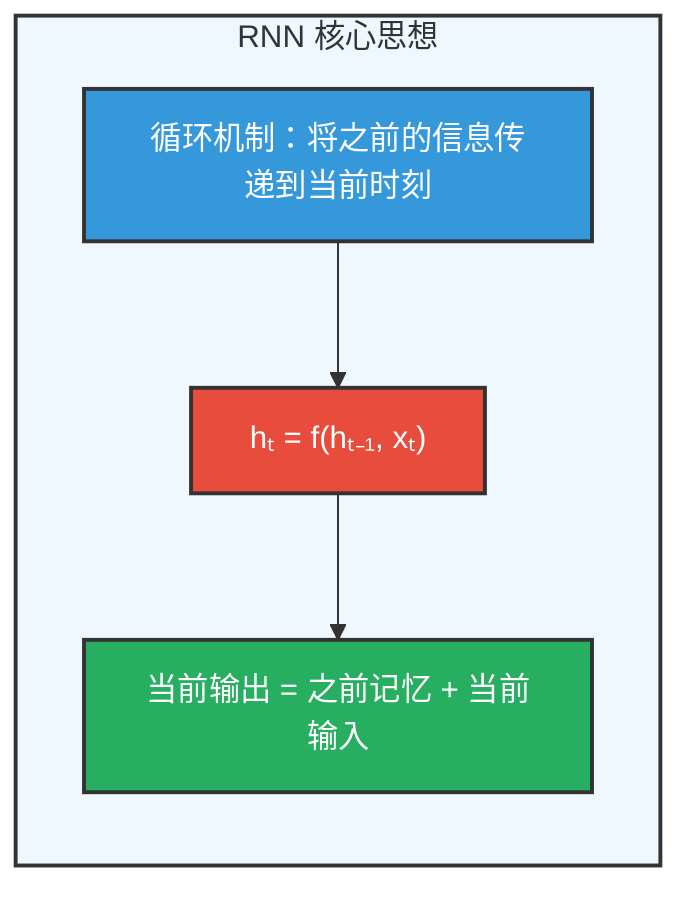
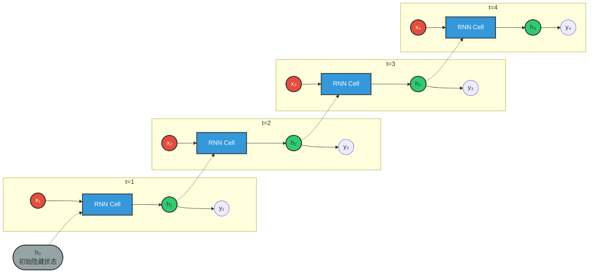
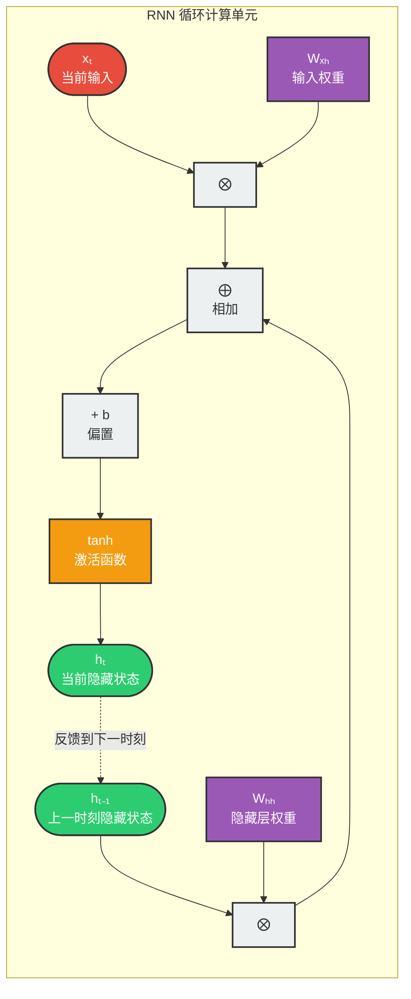
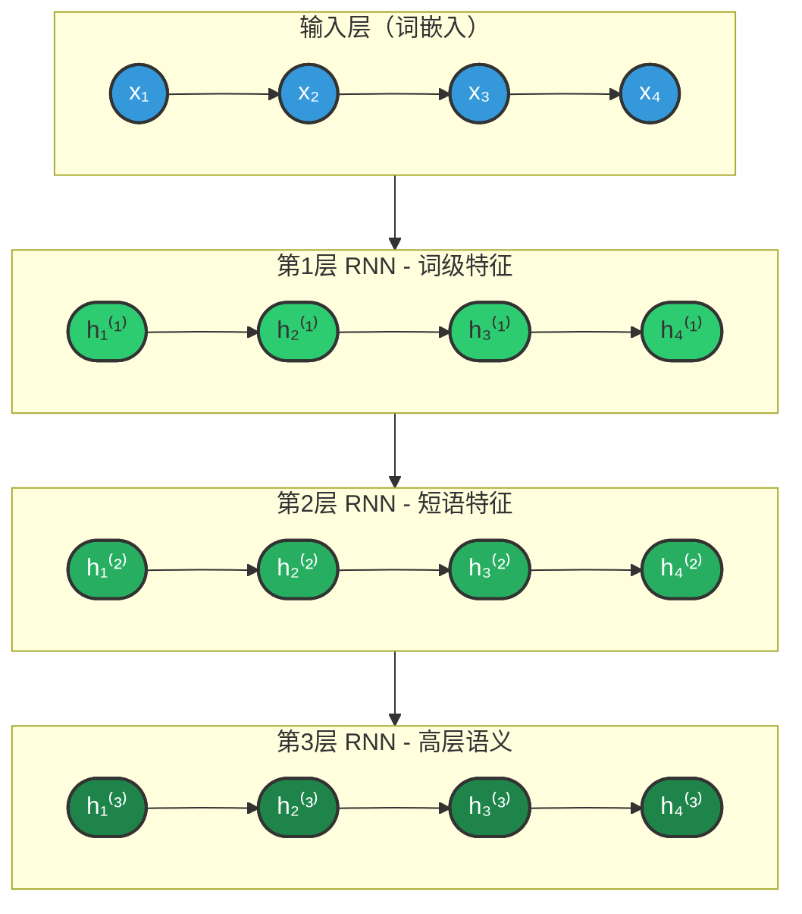
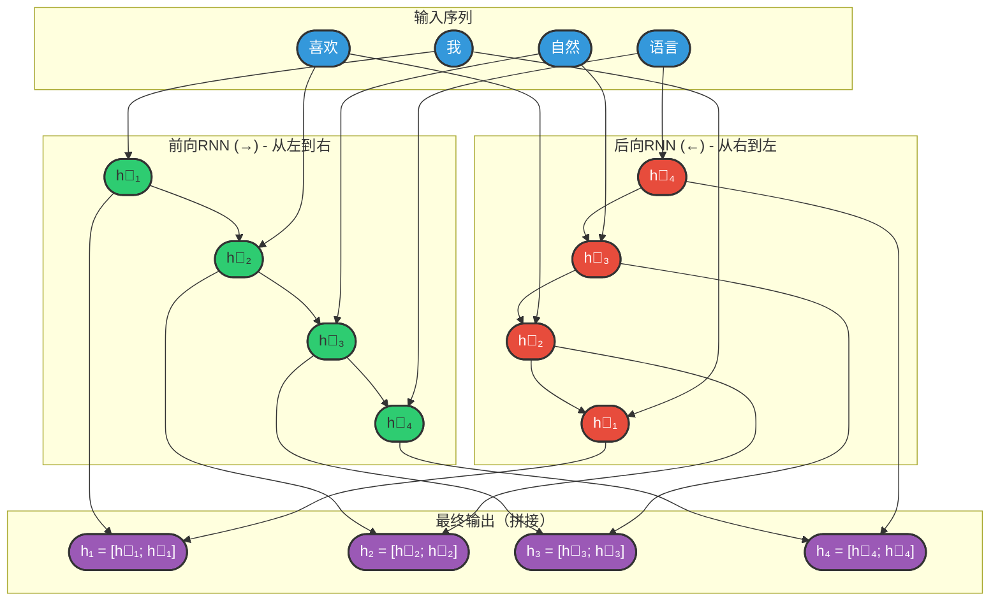
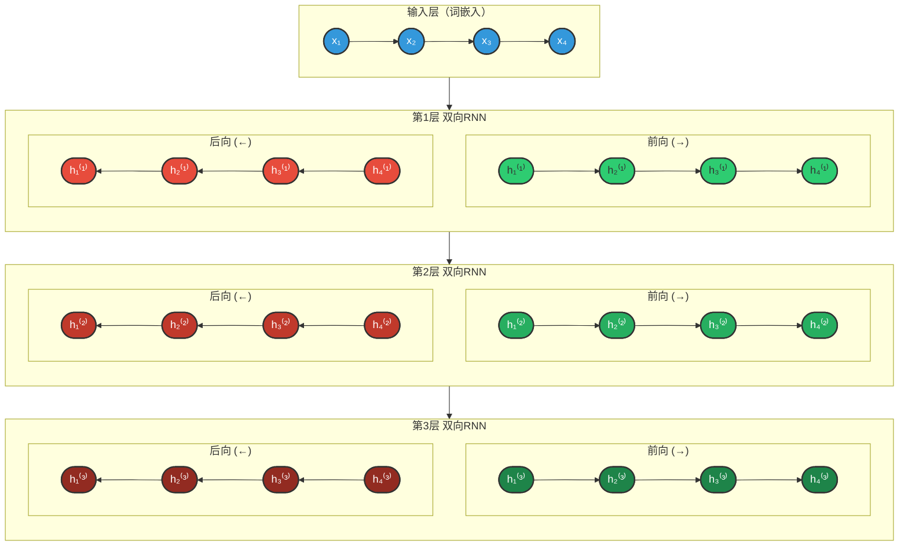
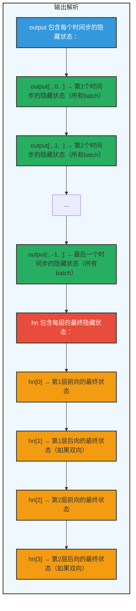
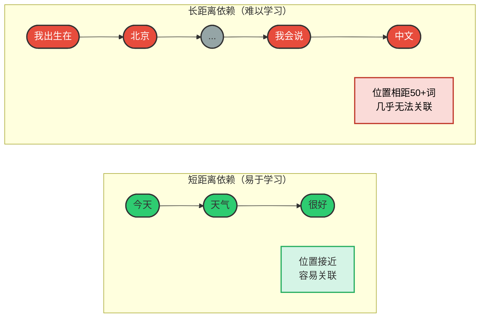

## 3.1 RNN（循环神经网络）

### 3.1.1 概述

**什么是RNN？**

循环神经网络（Recurrent Neural Network，RNN）是一种专门设计用于处理序列数据的神经网络结构。它通过引入"记忆"机制，能够在处理序列的每个元素时，考虑到之前所有元素的信息。

**RNN的核心价值：**

在自然语言处理中，词语的顺序对于理解句子的含义至关重要。虽然词向量能够表示词语的语义，但它本身并不包含词语之间的顺序信息。RNN通过循环结构解决了这一问题。

**传统神经网络的局限性：**

| 问题 | 说明 | 示例 |
|------|------|------|
| 固定维度 | 输入和输出的维度必须预先确定 | 无法处理不同长度的句子 |
| 无序列建模能力 | 不考虑数据的时间/顺序关系 | "我爱猫"和"猫爱我"被视为相同 |
| 独立处理 | 每个输入之间没有关联 | 无法利用上下文信息 |

**序列数据的挑战：**

在NLP任务中，我们面临的数据天然具有序列特性：

```
文本序列："我 喜欢 自然语言处理"
         ↓  ↓    ↓  ↓  ↓
        x₁ x₂   x₃ x₄ x₅

时间序列：股票价格、天气数据、传感器读数
语音信号：连续的音频波形
```

**RNN的核心思想：**



**RNN的三大特性：**

1. **记忆传递**：每个时刻的隐藏状态hₜ携带了从开始到当前时刻的所有历史信息
2. **参数共享**：同一套参数处理序列中的所有位置，大大减少了模型参数量
3. **变长处理**：天然支持不同长度的输入序列

> **说明：** 随着技术的发展，RNN已经逐渐被结构更灵活、计算效率更高的Transformer模型所取代，后者已成为当前自然语言处理的主流方法。但理解RNN的原理对于掌握序列建模的基础概念仍然非常重要。

### 3.1.2 基础结构

RNN的核心结构是一个具有循环连接的隐藏层，它以时间步（time step）为单位，依次处理输入序列中的每个token。

**工作机制：**

在每个时间步，RNN接收当前token的向量和上一个时间步的隐藏状态（即隐藏层的输出），计算并生成新的隐藏状态，并将其传递到下一时间步。

**结构展开图：**



**图例说明：**
- 🔴 **红色 xₜ**：当前时刻输入
- 🔵 **蓝色 RNN Cell**：共享参数的循环单元
- 🟢 **绿色 hₜ**：隐藏状态（记忆传递）
- ⚪ **灰色 h₀**：初始隐藏状态（通常为零向量）
- 虚线箭头：隐藏状态的跨时间步传递

---

**循环连接的本质：**



**核心公式：**

```
hₜ = tanh(Wₕₕ · hₜ₋₁ + Wₓₕ · xₜ + bₕ)
```

**图例说明：**
- 🟣 **紫色 W**：权重矩阵（Wₓₕ控制输入影响，Wₕₕ控制历史传递）
- 🔴 **红色 xₜ**：当前输入向量
- 🟢 **绿色 hₜ**：隐藏状态（跨时间步传递的记忆）
- 🟡 **黄色 tanh**：激活函数（将值压缩到-1~1范围）
- 虚线箭头：循环反馈（hₜ作为下一时刻的hₜ₋₁）

**关键特性：** 同一组参数(Wₕₕ, Wₓₕ, b)在每个时间步共享，这是RNN能够处理变长序列的关键

---

**数学公式详解：**

```
隐藏状态更新：hₜ = tanh(Wₕₕ · hₜ₋₁ + Wₓₕ · xₜ + bₕ)
输出计算：    yₜ = Wₕᵧ · hₜ + bᵧ
```

**参数说明：**

| 符号 | 名称 | 维度 | 说明 |
|------|------|------|------|
| xₜ | 输入向量 | (input_size, 1) | t时刻的输入（如词向量） |
| hₜ | 隐藏状态 | (hidden_size, 1) | t时刻的记忆/上下文表示 |
| yₜ | 输出向量 | (output_size, 1) | t时刻的预测输出 |
| Wₕₕ | 隐藏层权重 | (hidden_size, hidden_size) | 控制历史信息的传递 |
| Wₓₕ | 输入权重 | (hidden_size, input_size) | 控制当前输入的影响 |
| Wₕᵧ | 输出权重 | (output_size, hidden_size) | 将隐藏状态映射到输出 |
| bₕ, bᵧ | 偏置项 | - | 偏移量 |

**输入输出模式：**

根据输入输出序列长度的不同，RNN可以分为四种基本模式：

| 模式 | 结构 | 应用场景 | 输入输出示例 |
|------|------|----------|--------------|
| **一对一（One-to-One）** | 传统神经网络结构 | 图像分类、简单预测 | 输入：单个向量 → 输出：单个类别 |
| **一对多（One-to-Many）** | 单输入多输出 | 图像描述生成、音乐生成 | 输入：图片 → 输出："一只猫在跑" |
| **多对一（Many-to-One）** | 多输入单输出 | 情感分析、文本分类、意图识别 | 输入："这部电影太棒了" → 输出：正面 |
| **多对多（Many-to-Many）** | 多输入多输出 | 机器翻译、命名实体识别、词性标注 | 输入："I love NLP" → 输出："我爱NLP" |

### 3.1.3 多层结构

**动机：** 单层RNN只能捕捉基础的序列特征，多层RNN可以学习层次化的表示，捕捉更复杂的模式。

**结构设计：**



**层次特征学习：**

| 层级 | 学习特征 | 颜色 | 示例理解 |
|------|----------|------|----------|
| 第1层 | 词级特征 | 🟢 浅绿 | "我"、"喜欢"、"NLP" 等单个词的含义 |
| 第2层 | 短语特征 | 🟢 中绿 | "喜欢NLP" = 动词 + 名词的组合 |
| 第3层 | 高层语义 | 🟢 深绿 | "我喜欢NLP" = 完整句子的语义 |

**关键特性：** 低层输出作为高层输入，逐层抽象，形成层次化表示

---

**前向传播过程：**

```python
def forward(self, x):
    # x: (batch_size, seq_len, input_size)
    
    # 第1层前向传播
    out1, h1 = self.rnn1(x)
    
    # 第2层前向传播（输入为第1层的输出）
    out2, h2 = self.rnn2(out1)
    
    # 第3层前向传播（输入为第2层的输出）
    out3, h3 = self.rnn3(out2)
    
    return out3, h3
```

**多层RNN的优势：**

| 层数 | 优势 | 适用场景 |
|------|------|----------|
| 1层 | 计算快，适合简单任务 | 短序列分类、基本预测 |
| 2-3层 | 平衡性能和复杂度 | 大多数NLP任务 |
| 3层以上 | 捕获复杂模式 | 机器翻译、对话系统 |

**注意事项：**
- 层数越多，参数量越大，越容易过拟合
- 需要更多数据和更强的正则化（如dropout）
- 训练时间会显著增加

### 3.1.4 双向结构

**动机：** 传统RNN只考虑过去的信息（从左到右处理），而双向RNN同时考虑过去和未来的上下文信息。

**结构设计：**



**图例说明：**
- 🔵 **蓝色输入**：词嵌入向量
- 🟢 **绿色 h⃗**：前向隐藏状态（从左到右，捕获上文信息）
- 🔴 **红色 h⃖**：后向隐藏状态（从右到左，捕获下文信息）
- 🟣 **紫色 h**：最终输出（前后向拼接，捕获完整上下文）

**核心思想：** 同时运行两个RNN，一个正向读取序列，一个反向读取序列，将两者的隐藏状态拼接，使每个时刻都能获得完整的上下文信息

---

**双向RNN的应用场景：**

| 任务 | 为什么需要双向 | 示例 |
|------|----------------|------|
| 命名实体识别 | 确定实体边界需要前后文 | "北京大学"需要看到"北京"和"大学"才能确定是ORG |
| 情感分析 | 否定词可能在后面 | "这部电影不差"需要看到"不"和"差"才能确定情感 |
| 词性标注 | 词性依赖上下文 | "record"可以是名词或动词，需要看前后词确定 |
| 机器翻译 | 翻译需要完整理解句子 | 翻译"他喜欢苹果"时需要知道"苹果"是水果还是公司 |

**优势：**
- 捕获更完整的上下文信息
- 提高模型性能
- 特别适合需要完整句子理解的任务

**局限性：**
- 必须等整个序列输入后才能处理（无法在线处理）
- 计算量翻倍

### 3.1.5 多层+双向结构

**动机：** 结合多层结构和双向结构的优势，同时捕获层次化特征和完整上下文。

**结构设计：**



**图例说明：**
- 🔵 **蓝色 x**：输入词嵌入
- 🟢 **绿色 h⃗**：前向隐藏状态（每层颜色深浅递增）
- 🔴 **红色 h⃖**：后向隐藏状态（每层颜色深浅递增）
- 每层输出 = [前向隐藏状态 ; 后向隐藏状态] 的拼接

**架构优势：**
1. **垂直方向**：多层堆叠，逐层抽象（词级→短语级→句子级）
2. **水平方向**：双向处理，捕获完整上下文（上文+下文）

---

**参数计算：**

如果单层双向RNN的隐藏维度是 `hidden_size`，则：
- 每层的输出维度：`hidden_size * 2`（前向+后向）
- 参数量：`4 * hidden_size * (input_size + hidden_size)`（每层两个方向）

**PyTorch实现示例：**

```python
import torch
import torch.nn as nn

class MultiLayerBiRNN(nn.Module):
    def __init__(self, input_size, hidden_size, num_layers, output_size):
        super(MultiLayerBiRNN, self).__init__()
        
        self.num_layers = num_layers
        self.hidden_size = hidden_size
        
        # 多层双向RNN
        self.rnn = nn.RNN(
            input_size=input_size,
            hidden_size=hidden_size,
            num_layers=num_layers,
            batch_first=True,
            bidirectional=True  # 双向
        )
        
        # 全连接层（输入维度需要考虑双向和层数）
        self.fc = nn.Linear(hidden_size * 2, output_size)
    
    def forward(self, x):
        # 前向传播
        out, _ = self.rnn(x)
        
        # 取最后一个时间步的输出
        out = out[:, -1, :]
        out = self.fc(out)
        return out

# 模型初始化
model = MultiLayerBiRNN(
    input_size=100,      # 词向量维度
    hidden_size=128,     # 隐藏层维度
    num_layers=3,        # 层数
    output_size=2        # 分类数
)
```

**多层双向RNN的应用：**
- 复杂的文本分类任务
- 命名实体识别（NER）
- 机器翻译的编码器
- 问答系统的上下文理解

### 3.1.6 API使用

**PyTorch RNN API：**

```python
import torch
import torch.nn as nn

# 基本RNN
rnn = nn.RNN(
    input_size=input_size,    # 输入特征维度
    hidden_size=hidden_size,  # 隐藏层维度
    num_layers=num_layers,    # 层数
    bias=True,               # 是否使用偏置
    batch_first=False,        # 输入是否为(batch, seq, feature)
    dropout=0,               # 层间dropout概率
    bidirectional=False,      # 是否双向
    nonlinearity='tanh'       # 激活函数，可选'tanh'或'relu'
)

# 输入形状：(seq_len, batch_size, input_size)
# 如果batch_first=True，则为(batch_size, seq_len, input_size)
input = torch.randn(10, 32, 100)  # 10个时间步，32个batch，100维输入

# 初始隐藏状态：(num_layers * num_directions, batch_size, hidden_size)
h0 = torch.randn(num_layers, 32, hidden_size)

# 前向传播
output, hn = rnn(input, h0)
# output形状：(seq_len, batch_size, num_directions * hidden_size)
# hn形状：(num_layers * num_directions, batch_size, hidden_size)
```

**常用参数说明：**

| 参数 | 说明 | 推荐值 |
|------|------|--------|
| input_size | 输入特征维度 | 词向量维度（如100, 300） |
| hidden_size | 隐藏层维度 | 64-512，根据任务复杂度 |
| num_layers | 层数 | 1-3层 |
| batch_first | 是否以batch为第一维度 | True（符合直觉） |
| bidirectional | 是否双向 | 任务需要完整上下文时使用 |
| dropout | 层间dropout | 0.1-0.5（防止过拟合） |

**输入输出内容详解：**

| 类型 | 参数 | 说明 | 形状 |
|------|------|------|------|
| **输入** | **input** | 输入序列 | `(seq_len, batch_size, input_size)`，如果 `batch_first=True`，则为 `(batch_size, seq_len, input_size)` |
| | **h_0** | 可选，初始隐藏状态 | `(num_layers × num_directions, batch_size, hidden_size)` |
| **输出** | **output** | RNN层的输出，包含最后一层每个时间步的隐藏状态 | `(seq_len, batch_size, num_directions × hidden_size)`，如果 `batch_first=True`，则为 `(batch_size, seq_len, num_directions × hidden_size)` |
| | **h_n** | 最后一个时间步的隐藏状态，包含每一层的每个方向 | `(num_layers × num_directions, batch_size, hidden_size)` |

**形状详解示例：**

```python
import torch
import torch.nn as nn

# 假设参数
batch_size = 32      # 批次大小
seq_len = 10         # 序列长度
input_size = 100     # 输入维度
hidden_size = 128    # 隐藏层维度
num_layers = 2       # 层数
bidirectional = True # 是否双向

# 计算方向数
num_directions = 2 if bidirectional else 1

# 创建RNN
rnn = nn.RNN(
    input_size=input_size,
    hidden_size=hidden_size,
    num_layers=num_layers,
    batch_first=True,  # 批次优先
    bidirectional=bidirectional
)

# 输入数据
x = torch.randn(batch_size, seq_len, input_size)

# 初始隐藏状态（可选，默认为0）
h0 = torch.zeros(num_layers * num_directions, batch_size, hidden_size)

# 前向传播
output, hn = rnn(x, h0)

print(f"输入 x 形状:        {x.shape}")      # [32, 10, 100]
print(f"初始状态 h0 形状:    {h0.shape}")    # [4, 32, 128]  (2层×2方向)
print(f"输出 output 形状:    {output.shape}") # [32, 10, 256] (128×2方向)
print(f"最终状态 hn 形状:    {hn.shape}")    # [4, 32, 128]  (2层×2方向)
```

**输出解析：**



**TensorFlow/Keras API：**

```python
from tensorflow.keras.layers import SimpleRNN, Bidirectional

# 基本RNN
rnn = SimpleRNN(
    units=hidden_size,
    return_sequences=True,  # 是否返回所有时间步的输出
    return_state=True,      # 是否返回最终隐藏状态
    dropout=0.2,
    recurrent_dropout=0.2
)

# 双向RNN
bi_rnn = Bidirectional(
    SimpleRNN(
        units=hidden_size,
        return_sequences=True
    )
)
```

### 3.1.7 案例实操（智能输入法）

#### 项目概述

本案例实现一个基于RNN的中文智能输入法，能够根据用户输入的前缀预测下一个词。项目完整代码位于 `input_method_rnn` 目录下。

#### 核心思路

**任务定义：** 给定前N个词，预测第N+1个词

```
输入序列："希望 以后 我们 能 有"
目标词："更多"

模型输入：[word2idx("希望"), word2idx("以后"), word2idx("我们"), word2idx("能"), word2idx("有")]
模型输出：词表中每个词的概率分布，取概率最高的作为预测结果
```

**数据构建方式（滑动窗口）：**

```
原始句子："希望以后我们能有更多机会一起交流学习经验"

分词后：["希望", "以后", "我们", "能", "有", "更多", "机会", "一起", "交流", "学习", "经验"]

使用SEQ_LEN=5的滑动窗口生成训练样本：
```

```mermaid
flowchart TB
    subgraph SlidingWindow["滑动窗口生成训练样本"]
        direction TB

        %% 样本1
        Sample1["样本1: 输入=["希望","以后","我们","能","有"], 目标="更多""]

        %% 样本2
        Sample2["样本2: 输入=["以后","我们","能","有","更多"], 目标="机会""]

        %% 样本3
        Sample3["样本3: 输入=["我们","能","有","更多","机会"], 目标="一起""]

        %% 样本4
        Sample4["样本4: 输入=["能","有","更多","机会","一起"], 目标="交流""]

        %% 省略
        Ellipsis["..."]

        %% 连接
        Sample1 --> Sample2 --> Sample3 --> Sample4 --> Ellipsis
    end

    style SlidingWindow fill:#f0f8ff,stroke:#333,stroke-width:2px
    style Sample1 fill:#27ae60,stroke:#333,stroke-width:2px
    style Sample2 fill:#27ae60,stroke:#333,stroke-width:2px
    style Sample3 fill:#27ae60,stroke:#333,stroke-width:2px
    style Sample4 fill:#27ae60,stroke:#333,stroke-width:2px
```

#### 项目结构

```
input_method_rnn/
├── src/
│   ├── config.py      # 配置文件（路径、超参数）
│   ├── process.py     # 数据预处理（清洗、分词、编码、划分）
│   ├── dataset.py     # Dataset类和DataLoader
│   ├── model.py       # RNN模型定义
│   ├── train.py       # 训练流程
│   ├── evaluate.py    # 模型评估
│   └── predict.py     # 预测接口
├── data/
│   ├── raw/           # 原始对话数据
│   └── processed/     # 处理后的训练/测试集
├── models/            # 保存的词表和模型权重
└── logs/              # TensorBoard日志
```

#### 详细实现

**1. 数据预处理（process.py）**

本模块负责将原始数据进行清洗、分词、编码与划分，最终生成模型可直接读取的标准格式数据集，并保存到jsonl文件中。

```python
# 原始数据格式（对话数据）
{
    "topic": "校园生活分享",
    "user1": "李晓明",
    "user2": "杨欢",
    "dialog": [
        "user1：杨欢，最近校园里有什么新鲜事吗？",
        "user2：嗨，李晓明！我们学校刚刚举办了一次科技节...",
        ...
    ]
}

# 处理后数据格式（jsonl，每行一个样本）
{"input": [625, 103, 932, 202, 808], "target": 597}
{"input": [103, 932, 202, 808, 597], "target": 13}
...
```

处理流程：
1. 读取原始对话数据（jsonl格式）
2. 提取所有句子（去除"user1："等前缀）
3. 划分训练集（80%）和测试集（20%）
4. 构建词表（训练集所有词的集合，添加<unk>标记）
5. 使用滑动窗口构建(input, target)样本对
6. 保存为jsonl格式

**2. 模型定义（model.py）**

```python
class InputMethodModel(nn.Module):
    """
    模型结构：Embedding层 -> RNN层 -> Linear层
    """
    def __init__(self, vocab_size):
        super().__init__()
        # Embedding层：将词索引映射为稠密向量
        self.embedding = nn.Embedding(vocab_size, config.EMBEDDING_DIM)
        
        # RNN层：建模序列信息
        self.rnn = nn.RNN(
            input_size=config.EMBEDDING_DIM,
            hidden_size=config.HIDDEN_SIZE,
            batch_first=True
        )
        
        # 全连接层：映射到词表空间
        self.linear = nn.Linear(config.HIDDEN_SIZE, vocab_size)

    def forward(self, x):
        # x: [batch_size, seq_len]
        embed = self.embedding(x)           # [batch_size, seq_len, embedding_dim]
        output, _ = self.rnn(embed)          # [batch_size, seq_len, hidden_size]
        last_hidden = output[:, -1, :]       # [batch_size, hidden_size]
        output = self.linear(last_hidden)    # [batch_size, vocab_size]
        return output
```

**3. 训练流程（train.py）**

```python
def train():
    # 1. 设备选择
    device = torch.device("cuda" if torch.cuda.is_available() else "cpu")
    
    # 2. 数据加载
    train_dataloader = get_dataloader(train=True)
    test_dataloader = get_dataloader(train=False)
    
    # 3. 模型初始化
    model = InputMethodModel(vocab_size).to(device)
    
    # 4. 损失函数和优化器
    criterion = nn.CrossEntropyLoss()
    optimizer = optim.Adam(model.parameters(), lr=config.LEARNING_RATE)
    
    # 5. 训练循环
    for epoch in range(config.EPOCHS):
        # 训练阶段
        model.train()
        for input_tensor, target_tensor in train_dataloader:
            output = model(input_tensor)
            loss = criterion(output, target_tensor)
            
            optimizer.zero_grad()
            loss.backward()
            optimizer.step()
        
        # 验证阶段
        model.eval()
        with torch.no_grad():
            # 在测试集上计算损失
            ...
        
        # 保存最佳模型
        if val_loss < best_val_loss:
            torch.save(model.state_dict(), config.MODELS_DIR / 'best.pth')
```

**4. 预测接口（predict.py）**

```python
def predict_next_word(prefix, model, word2index, index2word, top_k=5):
    """
    根据输入前缀预测下一个词
    
    Args:
        prefix: 输入前缀，如"我今天"
        top_k: 返回候选词数量
    
    Returns:
        [(word1, prob1), (word2, prob2), ...]
    """
    # 1. 分词
    tokens = jieba.lcut(prefix)
    
    # 2. 取最后SEQ_LEN个词（不足则前面补<unk>）
    if len(tokens) >= config.SEQ_LEN:
        tokens = tokens[-config.SEQ_LEN:]
    else:
        tokens = ['<unk>'] * (config.SEQ_LEN - len(tokens)) + tokens
    
    # 3. 转换为索引
    input_ids = [word2index.get(token, 0) for token in tokens]
    input_tensor = torch.tensor([input_ids], dtype=torch.long)
    
    # 4. 模型预测
    with torch.no_grad():
        output = model(input_tensor)
        probabilities = torch.softmax(output, dim=1)
        top_k_probs, top_k_indices = torch.topk(probabilities, top_k, dim=1)
    
    # 5. 转换回词
    results = [(index2word[int(idx)], float(prob)) 
               for idx, prob in zip(top_k_indices, top_k_probs)]
    return results
```

#### 运行示例

```bash
# 1. 数据预处理
python src/process.py

# 2. 训练模型
python src/train.py

# 3. 评估模型
python src/evaluate.py

# 4. 交互式预测
python src/predict.py
```

预测效果：
```
请输入前缀（输入'quit'退出）：我今天
预测结果：
  1. 去 (概率: 0.3124)
  2. 要 (概率: 0.2856)
  3. 想 (概率: 0.1987)
  4. 感觉 (概率: 0.1023)
  5. 已经 (概率: 0.0562)
```

#### 模型改进方向

1. **使用双向RNN**：`Bidirectional(SimpleRNN(...))`，利用未来上下文
2. **增加层数**：堆叠2-3层RNN，捕获层次化特征
3. **使用LSTM/GRU**：解决长期依赖问题
4. **更大的语料库**：使用真实的大规模对话数据
5. **Beam Search**：不仅考虑概率最高的词，还考虑序列整体概率

### 3.1.8 存在问题

**1. 梯度消失/爆炸问题**

在训练RNN时，我们需要通过时间反向传播（Backpropagation Through Time, BPTT）来计算梯度。当序列较长时，梯度需要经过多次矩阵乘法和激活函数运算。

```
梯度消失：当梯度值在反向传播过程中逐渐缩小，最终导致前面层的参数几乎无法更新

梯度爆炸：当梯度值在反向传播过程中不断放大，导致参数更新过大，模型无法收敛
```

**数学分析：**

对于梯度∂L/∂W，涉及雅可比矩阵的连乘：

```
∂hₜ/∂hₜ₋₁ = diag(1 - hₜ²) · Wₕₕ

当|Wₕₕ| < 1时（梯度消失）：
   ∂L/∂W ∝ (Wₕₕ)ᵀ · (Wₕₕ)ᵀ · ... · (Wₕₕ)ᵀ → 0

当|Wₕₕ| > 1时（梯度爆炸）：
   ∂L/∂W ∝ (Wₕₕ)ᵀ · (Wₕₕ)ᵀ · ... · (Wₕₕ)ᵀ → ∞
```

**2. 长期依赖问题**

RNN难以建立序列中相距较远位置之间的关联：

```
示例1："我出生在中国，……，我会说中文"
问题：RNN难以记住"出生在中国"和"会说中文"之间的长期关联

示例2："天空是蓝色的，因为……所以草是绿色的"
问题：RNN难以建立因果关系的长距离依赖
```

**形象说明：**



**对比分析：**

| 特性 | 短距离依赖 | 长距离依赖 |
|------|------------|------------|
| 距离 | 1-3个词 | 10+个词 |
| 梯度传播 | 稳定，信息完整 | 梯度消失，信息丢失 |
| RNN表现 | ✅ 良好 | ❌ 很差 |
| 示例 | "今天天气[很好]" | "我出生在北京...我会说[中文]" |
| 解决方案 | 无需特殊处理 | 需要LSTM/GRU/Attention |

---

**3. 计算效率问题**

- **顺序计算**：RNN必须按顺序处理序列，无法并行化
- **内存消耗**：BPTT需要存储整个序列的隐藏状态
- **长序列限制**：由于梯度问题和内存限制，RNN难以处理过长的序列

**4. 缓解方法**

| 方法 | 原理 | 效果 |
|------|------|------|
| 梯度裁剪 | 限制梯度的最大值 | 防止梯度爆炸 |
| 使用ReLU激活 | 缓解梯度衰减 | 部分缓解梯度消失 |
| LSTM/GRU | 门控机制 | 有效解决长期依赖 |
| 截断BPTT | 限制反向传播步长 | 缓解长序列问题 |
| 注意力机制 | 直接关注相关位置 | 彻底解决长期依赖 |

> **结论：** RNN虽然概念简单直观，但在处理长序列时存在根本性的问题。这也是LSTM、GRU以及后来的Transformer等模型相继出现的原因。

---

## 相关文档

- [LSTM（长短期记忆网络）](./03_LSTM.md) - RNN的改进版本，通过门控机制解决长期依赖问题
- [GRU（门控循环单元）](./03_GRU.md) - LSTM的简化版本，参数更少，训练更快

---

## 参考资源

- PyTorch官方文档：https://pytorch.org/docs/stable/nn.html#recurrent-layers
- 经典论文：
  - RNN: "Learning representations by back-propagating errors" (1986)
