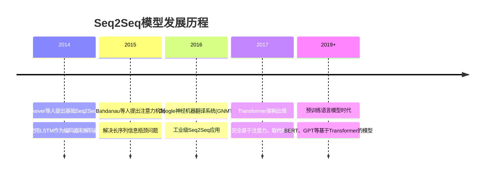
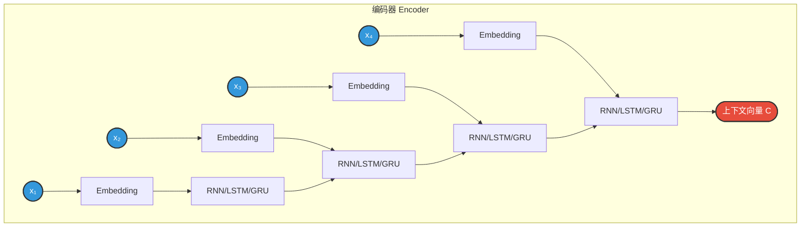
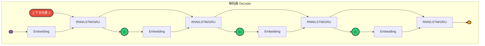
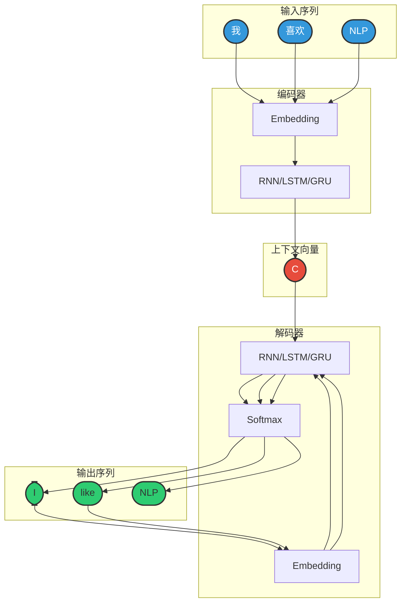
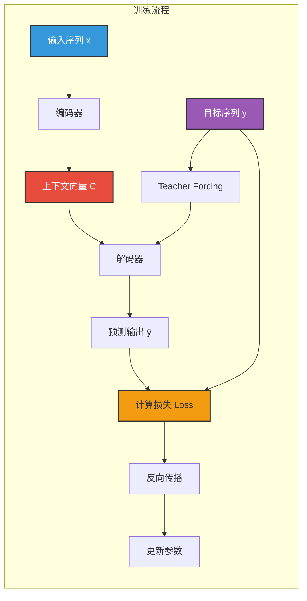
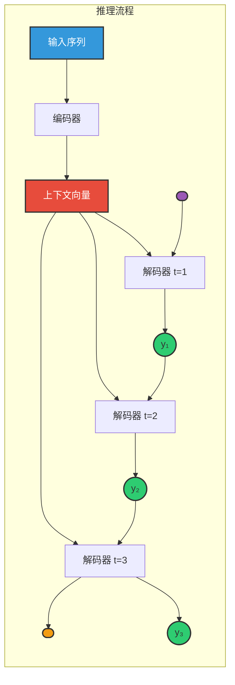
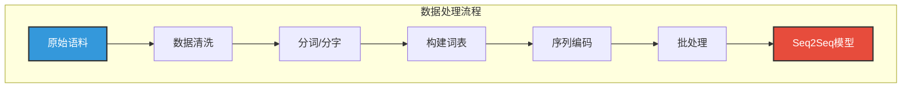
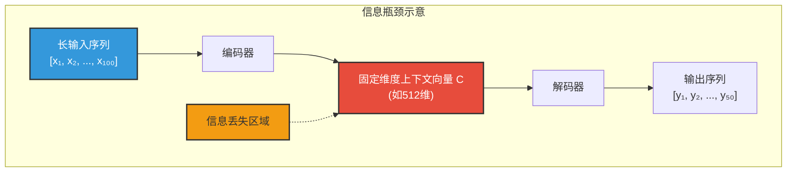
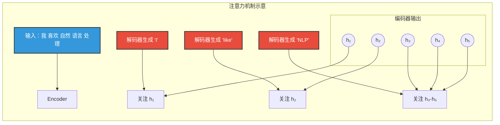

## 4.1 概述

### 4.1.1 什么是Seq2Seq

**Seq2Seq（Sequence to Sequence，序列到序列）** 是一种深度学习架构，专门用于处理输入和输出都是变长序列的任务。它将一个序列（如一句话）映射到另一个序列（如另一句话的翻译）。

**核心思想：**

```
输入序列（源语言）        输出序列（目标语言）
     ↓                        ↓
"我喜欢自然语言处理"  →  "I like natural language processing"
     ↓                        ↓
[x₁, x₂, x₃, x₄, x₅]  →  [y₁, y₂, y₃, y₄, y₅, y₆]
```

**为什么需要Seq2Seq？**

| 传统方法的问题 | Seq2Seq的解决方案 |
|---------------|------------------|
| 输入输出长度必须相同 | 支持变长输入和变长输出 |
| 无法处理复杂的映射关系 | 通过编码器-解码器结构学习复杂映射 |
| 缺乏对上下文的整体理解 | 编码器将输入压缩为上下文向量，捕获全局信息 |

### 4.1.2 应用场景

Seq2Seq模型广泛应用于以下NLP任务：

| 任务类型 | 输入示例 | 输出示例 |
|---------|---------|---------|
| **机器翻译** | "你好世界" | "Hello World" |
| **文本摘要** | 长篇文章 | 简短摘要 |
| **对话系统** | "今天天气怎么样？" | "今天晴天，气温25度" |
| **语音识别** | 音频特征序列 | 文本转录 |
| **代码生成** | "写一个排序函数" | Python代码 |
| **问答系统** | "巴黎是哪个国家的首都？" | "法国" |

### 4.1.3 发展历程



---

## 4.2 模型结构详解

### 4.2.1 编码器（Encoder）

**功能：** 将输入序列压缩成一个固定长度的上下文向量（Context Vector），捕获输入序列的语义信息。

**结构组成：**



**工作流程：**

1. **词嵌入（Embedding）**：将输入的词索引转换为稠密向量
2. **循环编码**：通过RNN/LSTM/GRU逐层处理序列，更新隐藏状态
3. **提取上下文**：取最后一个时间步的隐藏状态作为上下文向量

**数学表达：**

```
hₜ = RNN(xₜ, hₜ₋₁)    # 每个时间步更新隐藏状态
C = h_T               # 取最后一个隐藏状态作为上下文向量
```

**关键特性：**

| 特性 | 说明 |
|------|------|
| 信息瓶颈 | 无论输入多长，都压缩为固定维度向量 |
| 双向编码 | 常用双向RNN捕获完整上下文 |
| 多层堆叠 | 多层编码器学习层次化表示 |

---

### 4.2.2 解码器（Decoder）

**功能：** 根据编码器生成的上下文向量，逐步生成输出序列。

**结构组成：**



**工作流程：**

1. **初始状态**：使用上下文向量C初始化解码器的隐藏状态
2. **自回归生成**：每个时间步的输入是上一个时间步的输出
3. **终止条件**：生成特殊标记`<END>`时停止

**数学表达：**

```
sₜ = RNN(yₜ₋₁, sₜ₋₁, C)    # 解码器隐藏状态更新
yₜ = softmax(W·sₜ)          # 生成当前输出词的概率分布
```

**两种解码策略：**

| 策略 | 说明 | 优点 | 缺点 |
|------|------|------|------|
| **贪心解码** | 每步选择概率最高的词 | 简单快速 | 可能陷入局部最优 |
| **束搜索（Beam Search）** | 保留Top-k个候选序列 | 质量更高 | 计算量大 |

---

### 4.2.3 整体架构

**编码器-解码器完整流程：**



**图例说明：**
- 🔵 **蓝色**：输入序列的词
- 🔴 **红色**：上下文向量（信息压缩中心）
- 🟢 **绿色**：输出序列的词

---

## 4.3 模型训练和推理机制

### 4.3.1 模型训练

**训练目标：** 最大化生成正确目标序列的概率

**损失函数：** 交叉熵损失（Cross-Entropy Loss）

```
L = -Σ log P(yₜ | y₁, y₂, ..., yₜ₋₁, x)
```

**训练流程：**



**Teacher Forcing（教师强制）：**

在训练时，解码器的输入使用真实的目标序列（Ground Truth），而不是上一个时间步的预测输出。

| 方式 | 训练时解码器输入 | 优点 | 缺点 |
|------|-----------------|------|------|
| **Teacher Forcing** | 真实标签 yₜ₋₁ | 训练稳定、收敛快 | 训练和推理不一致（Exposure Bias） |
| **Free Running** | 模型预测 ŷₜ₋₁ | 训练和推理一致 | 训练困难、误差累积 |

**Scheduled Sampling：** 逐步减少Teacher Forcing的比例，平衡两种方式的优点。

---

### 4.3.2 模型推理

**推理流程：**



**推理策略：**

**1. 贪心搜索（Greedy Search）**

```python
# 每步选择概率最高的词
y_t = argmax(P(y|y_1, ..., y_{t-1}, x))
```

- **优点**：简单快速
- **缺点**：局部最优，可能错过全局最优序列

**2. 束搜索（Beam Search）**

```python
# 保留k个最优候选序列
# 每步扩展k个候选，保留得分最高的k个
```

| Beam Size | 特点 | 适用场景 |
|-----------|------|---------|
| k=1 | 退化为贪心搜索 | 快速推理 |
| k=3-5 | 平衡质量和速度 | 大多数任务 |
| k=10+ | 质量更高但慢 | 对质量要求高的任务 |

**3. 采样策略（Sampling）**

- **Temperature Sampling**：通过温度参数控制随机性
- **Top-k Sampling**：从概率最高的k个词中采样
- **Top-p (Nucleus) Sampling**：从累积概率达到p的最小集合中采样

---

## 4.4 案例实操（中英翻译V1.0）

### 4.4.1 需求说明

**项目目标：** 实现一个基于Seq2Seq的中英神经机器翻译系统

**功能需求：**
1. 输入中文句子，输出英文翻译
2. 支持变长序列处理
3. 使用LSTM/GRU作为基础单元

**示例：**

```
输入："我喜欢自然语言处理"
输出："I like natural language processing"
```

### 4.4.2 需求分析

**数据流分析：**



**技术选型：**

| 组件 | 选择 | 原因 |
|------|------|------|
| 编码器 | 双向LSTM | 捕获完整上下文 |
| 解码器 | 单向LSTM | 自回归生成 |
| 词嵌入 | 随机初始化 | 基础版本 |
| 注意力 | 基础版本 | 后续可升级 |

### 4.4.3 需求实现

**项目结构：**

```
translation_seq2seq/
├── src/
│   ├── config.py      # 配置文件
│   ├── process.py     # 数据预处理
│   ├── dataset.py     # Dataset和DataLoader
│   ├── model.py       # Seq2Seq模型定义
│   ├── train.py       # 训练流程
│   ├── evaluate.py    # 模型评估
│   ├── predict.py     # 预测接口
│   └── utils.py       # 工具函数
├── data/
│   ├── raw/           # 原始平行语料
│   └── processed/     # 处理后的数据
├── models/            # 保存的词表和模型权重
└── logs/              # 训练日志
```

**1. 配置文件（config.py）**

```python
"""
配置文件

功能描述:
    定义模型超参数、路径配置等全局设置

作者: Red_Moon
创建日期: 2026-02
"""

from pathlib import Path

# 路径配置
ROOT_DIR = Path(__file__).parent.parent
DATA_DIR = ROOT_DIR / "data"
MODELS_DIR = ROOT_DIR / "models"
LOGS_DIR = ROOT_DIR / "logs"

# 数据路径
RAW_DATA_PATH = DATA_DIR / "raw" / "translation_pairs.txt"
TRAIN_DATA_PATH = DATA_DIR / "processed" / "train.pkl"
TEST_DATA_PATH = DATA_DIR / "processed" / "test.pkl"
SRC_VOCAB_PATH = MODELS_DIR / "src_vocab.txt"
TGT_VOCAB_PATH = MODELS_DIR / "tgt_vocab.txt"

# 模型超参数
SRC_VOCAB_SIZE = 5000      # 源语言词表大小
TGT_VOCAB_SIZE = 5000      # 目标语言词表大小
EMBEDDING_DIM = 256        # 词嵌入维度
HIDDEN_SIZE = 512          # 隐藏层维度
NUM_LAYERS = 2             # LSTM层数
DROPOUT = 0.3              # Dropout概率

# 训练超参数
BATCH_SIZE = 32
LEARNING_RATE = 0.001
EPOCHS = 50
TEACHER_FORCING_RATIO = 0.5  # Teacher Forcing比例

# 序列长度
MAX_SRC_LEN = 50           # 最大源序列长度
MAX_TGT_LEN = 50           # 最大目标序列长度
```

**2. 数据预处理（process.py）**

```python
"""
数据预处理模块

功能描述:
    对原始平行语料进行清洗、分词、构建词表、编码等处理

作者: Red_Moon
创建日期: 2026-02
"""

# TODO: 实现数据预处理逻辑
```

**3. Dataset类（dataset.py）**

```python
"""
Dataset和DataLoader模块

功能描述:
    定义PyTorch Dataset类和DataLoader，支持批处理和填充

作者: Red_Moon
创建日期: 2026-02
"""

# TODO: 实现Dataset和DataLoader
```

**4. 模型定义（model.py）**

```python
"""
Seq2Seq模型定义模块

功能描述:
    定义基于LSTM的Seq2Seq模型，包含编码器和解码器

作者: Red_Moon
创建日期: 2026-02
"""

# TODO: 实现Encoder、Decoder和Seq2Seq模型
```

**5. 训练流程（train.py）**

```python
"""
模型训练模块

功能描述:
    实现Seq2Seq模型的完整训练流程，支持Teacher Forcing

作者: Red_Moon
创建日期: 2026-02
"""

# TODO: 实现训练流程
```

**6. 预测接口（predict.py）**

```python
"""
模型预测模块

功能描述:
    实现Seq2Seq模型的推理功能，支持贪心搜索和束搜索

作者: Red_Moon
创建日期: 2026-02
"""

# TODO: 实现预测逻辑
```

**7. 评估脚本（evaluate.py）**

```python
"""
模型评估模块

功能描述:
    使用BLEU等指标评估翻译质量

作者: Red_Moon
创建日期: 2026-02
"""

# TODO: 实现评估逻辑
```

**运行示例：**

```bash
# 1. 数据预处理
python src/process.py

# 2. 训练模型
python src/train.py

# 3. 评估模型
python src/evaluate.py

# 4. 交互式翻译
python src/predict.py
```

---

## 4.5 存在问题

### 4.5.1 信息瓶颈问题

**问题描述：**

编码器将所有输入信息压缩到一个固定维度的上下文向量中，导致：
- 长序列信息丢失
- 难以记住序列开头的信息

**数学解释：**

```
输入序列长度: n
上下文向量维度: d
信息压缩比: n/d （序列越长，压缩比越大）
```

**可视化：**



**解决方案：**
- **注意力机制**：解码器可以关注输入序列的不同部分
- **Transformer**：完全基于注意力，无信息瓶颈

### 4.5.2 长序列建模困难

**问题描述：**

RNN/LSTM/GRU等循环结构在处理长序列时：
- 梯度消失/爆炸
- 难以捕获远距离依赖

**示例：**

```
输入："虽然他很忙，但是...（中间很长）...他还是来了"
问题：模型难以将"虽然"和"但是"关联起来
```

### 4.5.3 训练和推理不一致

**问题描述：**

Teacher Forcing导致训练时使用真实标签，而推理时使用模型预测，造成Exposure Bias。

**影响：**
- 训练时表现好，推理时表现差
- 误差累积（生成一个词错误，后续可能全错）

**缓解方法：**
- Scheduled Sampling
- 强化学习训练
- 对抗训练

### 4.5.4 缺乏可解释性

**问题描述：**

上下文向量是黑盒表示，难以理解模型"关注"了输入的哪些部分。

**对比（引入注意力后）：**

| 特性 | 基础Seq2Seq | 带注意力的Seq2Seq |
|------|------------|------------------|
| 可解释性 | 差 | 好（注意力权重可视化） |
| 长序列性能 | 差 | 好 |
| 计算复杂度 | O(n) | O(n²) |

---

## 4.6 拓展：注意力机制简介

### 4.6.1 为什么需要注意力

**核心思想：** 解码器在生成每个词时，动态地关注输入序列的不同部分。



### 4.6.2 注意力机制原理

**计算步骤：**

1. **计算注意力分数**：衡量解码器当前状态与每个编码器状态的相关性
2. **计算注意力权重**：使用Softmax归一化分数
3. **计算上下文向量**：加权求和编码器状态

**数学表达：**

```
注意力分数:  score(sₜ, hᵢ) = sₜᵀ · hᵢ
注意力权重:  αₜᵢ = softmax(score(sₜ, hᵢ))
上下文向量:  cₜ = Σ αₜᵢ · hᵢ
```

### 4.6.3 注意力类型

| 注意力类型 | 计算方式 | 特点 |
|-----------|---------|------|
| **Dot Product** | score = sᵀ · h | 简单高效，要求维度相同 |
| **Scaled Dot Product** | score = (sᵀ · h) / √dₖ | Transformer中使用，防止梯度消失 |
| **Additive (Bahdanau)** | score = vᵀ · tanh(Wₛ·s + Wₕ·h) | 灵活，可学习参数 |
| **Multi-Head** | 多组并行注意力 | Transformer核心，捕获不同子空间信息 |

---

## Seq2Seq vs 传统方法对比

| 特性 | 传统统计机器翻译(SMT) | 神经机器翻译(NMT/Seq2Seq) |
|------|---------------------|--------------------------|
| 特征工程 | 需要复杂的特征工程 | 端到端学习，无需特征工程 |
| 翻译流畅度 | 片段化，不流畅 | 更流畅自然 |
| 训练数据 | 需要大量对齐语料 | 需要大量平行语料 |
| 训练速度 | 快 | 慢（需要GPU） |
| 可解释性 | 较好（有翻译规则） | 较差（黑盒模型） |
| 处理OOV | 较好 | 较差（需要BPE等子词方法） |

---

## 相关文档

- [RNN（循环神经网络）](./03_RNN.md) - Seq2Seq的基础单元
- [LSTM（长短期记忆网络）](./03_LSTM.md) - 常用编码器/解码器
- [GRU（门控循环单元）](./03_GRU.md) - LSTM的轻量替代

---

## 参考资源

- PyTorch官方教程：https://pytorch.org/tutorials/intermediate/seq2seq_translation_tutorial.html
- 经典论文：
  - "Sequence to Sequence Learning with Neural Networks" (2014) - Sutskever et al.
  - "Neural Machine Translation by Jointly Learning to Align and Translate" (2015) - Bahdanau et al.
