```mermaid
flowchart LR
    subgraph Encoder["编码器 Encoder"]
        direction LR
        
        X1(["x₁"]) --> E1["Embedding"]
        X2(["x₂"]) --> E2["Embedding"]
        X3(["x₃"]) --> E3["Embedding"]
        X4(["x₄"]) --> E4["Embedding"]
        
        E1 --> RNN1["RNN/LSTM/GRU"]
        E2 --> RNN2["RNN/LSTM/GRU"]
        E3 --> RNN3["RNN/LSTM/GRU"]
        E4 --> RNN4["RNN/LSTM/GRU"]
        
        RNN1 --> RNN2 --> RNN3 --> RNN4
        
        RNN4 --> C(["上下文向量 C"])
    end
    
    style X1 fill:#3498db,stroke:#333,stroke-width:2px,color:#fff
    style X2 fill:#3498db,stroke:#333,stroke-width:2px,color:#fff
    style X3 fill:#3498db,stroke:#333,stroke-width:2px,color:#fff
    style X4 fill:#3498db,stroke:#333,stroke-width:2px,color:#fff
    style C fill:#e74c3c,stroke:#333,stroke-width:2px,color:#fff
```

## 4.1 概述

### 4.1.1 什么是Seq2Seq

**Seq2Seq（Sequence to Sequence，序列到序列）** 是一种深度学习架构，专门用于处理输入和输出都是变长序列的任务。它将一个序列（如一句话）映射到另一个序列（如另一句话的翻译）。

**核心思想：**

```
输入序列（源语言）        输出序列（目标语言）
     ↓                        ↓
"我喜欢自然语言处理"  →  "I like natural language processing"
     ↓                        ↓
[x₁, x₂, x₃, x₄, x₅]  →  [y₁, y₂, y₃, y₄, y₅, y₆]
```

**为什么需要Seq2Seq？**

| 传统方法的问题 | Seq2Seq的解决方案 |
|---------------|------------------|
| 输入输出长度必须相同 | 支持变长输入和变长输出 |
| 无法处理复杂的映射关系 | 通过编码器-解码器结构学习复杂映射 |
| 缺乏对上下文的整体理解 | 编码器将输入压缩为上下文向量，捕获全局信息 |

### 4.1.2 应用场景

Seq2Seq模型广泛应用于以下NLP任务：

| 任务类型 | 输入示例 | 输出示例 |
|---------|---------|---------|
| **机器翻译** | "你好世界" | "Hello World" |
| **文本摘要** | 长篇文章 | 简短摘要 |
| **对话系统** | "今天天气怎么样？" | "今天晴天，气温25度" |
| **语音识别** | 音频特征序列 | 文本转录 |
| **代码生成** | "写一个排序函数" | Python代码 |
| **问答系统** | "巴黎是哪个国家的首都？" | "法国" |

### 4.1.3 发展历程

```mermaid
timeline
    title Seq2Seq模型发展历程
    2014 : Sutskever等人提出基础Seq2Seq架构
         : 使用LSTM作为编码器和解码器
    2015 : Bahdanau等人提出注意力机制
         : 解决长序列信息瓶颈问题
    2016 : Google神经机器翻译系统(GNMT)
         : 工业级Seq2Seq应用
    2017 : Transformer架构出现
         : 完全基于注意力，取代RNN
    2019+ : 预训练语言模型时代
          : BERT、GPT等基于Transformer的模型
```



---

## 4.2 模型结构详解

### 4.2.1 编码器（Encoder）

**功能：** 将输入序列压缩成一个固定长度的上下文向量（Context Vector），捕获输入序列的语义信息。

**结构组成：**



**工作流程：**

1. **词嵌入（Embedding）**：将输入的词索引转换为稠密向量
2. **循环编码**：通过RNN/LSTM/GRU逐层处理序列，更新隐藏状态
3. **提取上下文**：取最后一个时间步的隐藏状态作为上下文向量

**代码实现：**

```python
class TranslationEncoder(nn.Module):
    """翻译编码器（意图：将源语言序列编码为上下文向量）"""
    
    def __init__(self, vocab_size, padding_index):
        super().__init__()
        self.embedding = nn.Embedding(
            num_embeddings=vocab_size,
            embedding_dim=config.EMBEDDING_DIM,
            padding_idx=padding_index  # 警示：padding_idx确保<pad>标记不参与梯度计算
        )
        self.GRU = nn.GRU(
            input_size=config.EMBEDDING_DIM,
            hidden_size=config.HIDDEN_SIZE,
            batch_first=True  # 意图：使用[batch, seq, feature]格式，符合PyTorch习惯
        )
    
    def forward(self, x):
        """
        参数:
            x: [batch_size, seq_len] 输入序列
        返回:
            last_hidden_state: [batch_size, hidden_size] 最后时刻隐藏状态
        """
        embed = self.embedding(x)  # [batch, seq_len, embedding_dim]
        gru_out, hidden = self.GRU(embed)  # gru_out: [batch, seq_len, hidden_size]
        
        # 获取每个序列的实际长度（意图：处理变长序列，取真实最后一个时间步）
        lengths = (x != self.embedding.padding_idx).sum(dim=1)
        last_hidden_state = gru_out[torch.arange(gru_out.shape[0]), lengths - 1]
        
        return last_hidden_state  # [batch, hidden_size]
```

**关键特性：**

| 特性 | 说明 |
|------|------|
| 信息瓶颈 | 无论输入多长，都压缩为固定维度向量 |
| 双向编码 | 常用双向RNN捕获完整上下文 |
| 多层堆叠 | 多层编码器学习层次化表示 |

---

### 4.2.2 解码器（Decoder）

**功能：** 根据编码器生成的上下文向量，逐步生成输出序列。

**结构组成：**

```mermaid
flowchart LR
    subgraph Decoder["解码器 Decoder"]
        direction LR
        
        C(["上下文向量 C"]) --> D1["RNN/LSTM/GRU"]
        
        START(["<START>"]) --> E1["Embedding"] --> D1
        D1 --> O1(["y₁"])
        D1 --> D2["RNN/LSTM/GRU"
        
        O1 --> E2["Embedding"] --> D2
        D2 --> O2(["y₂"])
        D2 --> D3["RNN/LSTM/GRU"
        
        O2 --> E3["Embedding"] --> D3
        D3 --> O3(["y₃"])
        D3 --> D4["RNN/LSTM/GRU"
        
        O3 --> E4["Embedding"] --> D4
        D4 --> O4(["<END>"])
    end
    
    style C fill:#e74c3c,stroke:#333,stroke-width:2px,color:#fff
    style START fill:#9b59b6,stroke:#333,stroke-width:2px,color:#fff
    style O1 fill:#2ecc71,stroke:#333,stroke-width:2px
    style O2 fill:#2ecc71,stroke:#333,stroke-width:2px
    style O3 fill:#2ecc71,stroke:#333,stroke-width:2px
    style O4 fill:#f39c12,stroke:#333,stroke-width:2px
```

**工作流程：**

1. **初始状态**：使用上下文向量C初始化解码器的隐藏状态
2. **自回归生成**：每个时间步的输入是上一个时间步的输出
3. **终止条件**：生成特殊标记`<END>`时停止

**代码实现：**

```python
class TranslationDecoder(nn.Module):
    """翻译解码器（意图：根据上下文向量自回归生成目标语言序列）"""
    
    def __init__(self, vocab_size, padding_index):
        super().__init__()
        self.embedding = nn.Embedding(
            num_embeddings=vocab_size,
            embedding_dim=config.EMBEDDING_DIM,
            padding_idx=padding_index
        )
        self.GRU = nn.GRU(
            input_size=config.EMBEDDING_DIM,
            hidden_size=config.HIDDEN_SIZE,
            batch_first=True
        )
        self.linear = nn.Linear(in_features=config.HIDDEN_SIZE, out_features=vocab_size)
    
    def forward(self, x, hidden_0):
        """
        参数:
            x: [batch_size, seq_len] 输入序列
            hidden_0: [1, batch_size, hidden_size] 初始隐藏状态
        返回:
            output: [batch_size, seq_len, vocab_size] 词表分布
            hidden_n: [1, batch_size, hidden_size] 最终隐藏状态
        """
        embed = self.embedding(x)  # [batch, seq_len, embedding_dim]
        gru_out, hidden_n = self.GRU(embed, hidden_0)  # [batch, seq_len, hidden_size]
        output = self.linear(gru_out)  # [batch, seq_len, vocab_size]
        return output, hidden_n
```

**两种解码策略：**

| 策略 | 说明 | 优点 | 缺点 |
|------|------|------|------|
| **贪心解码** | 每步选择概率最高的词 | 简单快速 | 可能陷入局部最优 |
| **束搜索（Beam Search）** | 保留Top-k个候选序列 | 质量更高 | 计算量大 |

---

### 4.2.3 整体架构

**编码器-解码器完整流程：**

```mermaid
flowchart TB
    subgraph Input["输入序列"]
        X1(["我"])
        X2(["喜欢"])
        X3(["NLP"])
    end
    
    subgraph Encoder["编码器"]
        E1["Embedding"]
        E_RNN["RNN/LSTM/GRU"]
    end
    
    subgraph Context["上下文向量"]
        C(["C"])
    end
    
    subgraph Decoder["解码器"]
        D_RNN["RNN/LSTM/GRU"]
        D1["Embedding"]
        D_Out["Softmax"]
    end
    
    subgraph Output["输出序列"]
        Y1(["I"])
        Y2(["like"])
        Y3(["NLP"])
    end
    
    X1 --> E1
    X2 --> E1
    X3 --> E1
    E1 --> E_RNN --> C
    
    C --> D_RNN
    D_RNN --> D_Out --> Y1
    Y1 --> D1 --> D_RNN
    D_RNN --> D_Out --> Y2
    Y2 --> D1 --> D_RNN
    D_RNN --> D_Out --> Y3
    
    style X1 fill:#3498db,stroke:#333,stroke-width:2px,color:#fff
    style X2 fill:#3498db,stroke:#333,stroke-width:2px,color:#fff
    style X3 fill:#3498db,stroke:#333,stroke-width:2px,color:#fff
    style C fill:#e74c3c,stroke:#333,stroke-width:2px,color:#fff
    style Y1 fill:#2ecc71,stroke:#333,stroke-width:2px
    style Y2 fill:#2ecc71,stroke:#333,stroke-width:2px
    style Y3 fill:#2ecc71,stroke:#333,stroke-width:2px
```



**图例说明：**
- 🔵 **蓝色**：输入序列的词
- 🔴 **红色**：上下文向量（信息压缩中心）
- 🟢 **绿色**：输出序列的词

**完整模型代码：**

```python
class TranslationModel(nn.Module):
    """Seq2Seq翻译模型（编码器-解码器架构）"""
    
    def __init__(self, zh_vocab_size, en_vocab_size, zh_padding_index, en_padding_index):
        super().__init__()
        self.encoder = TranslationEncoder(zh_vocab_size, padding_index=zh_padding_index)
        self.decoder = TranslationDecoder(en_vocab_size, padding_index=en_padding_index)
```

---

## 4.3 模型训练和推理机制

### 4.3.1 模型训练

**训练目标：** 最大化生成正确目标序列的概率

**损失函数：** 交叉熵损失（Cross-Entropy Loss）

$$
L = -\sum \log P(y_t | y_1, y_2, ..., y_{t-1}, x)
$$

**训练流程：**

```mermaid
flowchart TB
    subgraph Training["训练流程"]
        direction TB
        
        Input["输入序列 x"] --> Encoder["编码器"]
        Encoder --> Context["上下文向量 C"]
        
        Target["目标序列 y"] --> Teacher["Teacher Forcing"]
        Context --> Decoder["解码器"]
        Teacher --> Decoder
        
        Decoder --> Output["预测输出 ŷ"]
        Output --> Loss["计算损失 Loss"]
        Target --> Loss
        
        Loss --> Backward["反向传播"]
        Backward --> Update["更新参数"]
    end
    
    style Input fill:#3498db,stroke:#333,stroke-width:2px,color:#fff
    style Target fill:#9b59b6,stroke:#333,stroke-width:2px,color:#fff
    style Context fill:#e74c3c,stroke:#333,stroke-width:2px,color:#fff
    style Loss fill:#f39c12,stroke:#333,stroke-width:2px
```



**Teacher Forcing（教师强制）：**

在训练时，解码器的输入使用真实的目标序列（Ground Truth），而不是上一个时间步的预测输出。

| 方式                  | 训练时解码器输入  | 优点       | 缺点                      |
| ------------------- | --------- | -------- | ----------------------- |
| **Teacher Forcing** | 真实标签 yₜ₋₁ | 训练稳定、收敛快 | 训练和推理不一致（Exposure Bias） |
| **Free Running**    | 模型预测 ŷₜ₋₁ | 训练和推理一致  | 训练困难、误差累积               |

**Scheduled Sampling：** 逐步减少Teacher Forcing的比例，平衡两种方式的优点。

**训练代码：**

```python
def train_one_epoch(model, dataloader, loss_fn, optimizer, device):
    """训练一个轮次"""
    model.train()
    total_loss = 0
    
    for inputs, targets in tqdm(dataloader, desc='训练'):
        # 数据移动到设备
        encoder_inputs = inputs.to(device)
        targets = targets.to(device)
        
        # 准备解码器输入和目标（意图：Teacher Forcing策略）
        decoder_inputs = targets[:, :-1]  # 去掉<eos>
        decoder_targets = targets[:, 1:]  # 去掉<sos>
        
        # 编码阶段
        context_vector = model.encoder(encoder_inputs)
        
        # 解码阶段（自回归）
        decoder_hidden = context_vector.unsqueeze(0)
        decoder_outputs = []
        seq_len = decoder_inputs.shape[1]
        
        for i in range(seq_len):
            decoder_input = decoder_inputs[:, i].unsqueeze(1)
            decoder_output, decoder_hidden = model.decoder(decoder_input, decoder_hidden)
            decoder_outputs.append(decoder_output)
        
        # 合并输出并reshape
        decoder_outputs = torch.cat(decoder_outputs, dim=1)
        decoder_outputs = decoder_outputs.reshape(-1, decoder_outputs.shape[-1])
        decoder_targets = decoder_targets.reshape(-1)
        
        # 计算损失并反向传播
        loss = loss_fn(decoder_outputs, decoder_targets)
        total_loss += loss.item()
        
        optimizer.zero_grad()
        loss.backward()
        optimizer.step()
    
    return total_loss / len(dataloader)
```

---

### 4.3.2 模型推理

**推理流程：**

```mermaid
flowchart TB
    subgraph Inference["推理流程"]
        direction TB
        
        Input["输入序列"] --> Encoder["编码器"]
        Encoder --> Context["上下文向量"]
        
        Context --> Decoder1["解码器 t=1"]
        START(["<START>"]) --> Decoder1
        Decoder1 --> Y1(["y₁"])
        
        Y1 --> Decoder2["解码器 t=2"]
        Context --> Decoder2
        Decoder2 --> Y2(["y₂"])
        
        Y2 --> Decoder3["解码器 t=3"]
        Context --> Decoder3
        Decoder3 --> Y3(["y₃"])
        
        Decoder3 --> END(["<END>"])
    end
    
    style Input fill:#3498db,stroke:#333,stroke-width:2px,color:#fff
    style Context fill:#e74c3c,stroke:#333,stroke-width:2px,color:#fff
    style START fill:#9b59b6,stroke:#333,stroke-width:2px,color:#fff
    style Y1 fill:#2ecc71,stroke:#333,stroke-width:2px
    style Y2 fill:#2ecc71,stroke:#333,stroke-width:2px
    style Y3 fill:#2ecc71,stroke:#333,stroke-width:2px
    style END fill:#f39c12,stroke:#333,stroke-width:2px
```



**推理代码：**

```python
def predict_batch(model, inputs, en_tokenizer, device):
    """批量预测（自回归生成）"""
    model.eval()
    
    with torch.no_grad():
        # 编码阶段
        context_vector = model.encoder(inputs)
        
        batch_size = inputs.shape[0]
        hidden = context_vector.unsqueeze(0)
        
        # 初始化解码器输入为<sos>标记
        decoder_input = torch.full([batch_size, 1], en_tokenizer.sos_token_index, device=device)
        
        generated = []
        is_finished = torch.zeros(batch_size, dtype=torch.bool, device=device)
        
        # 自回归生成
        for i in range(config.SEQ_LEN):
            decoder_output, hidden = model.decoder(decoder_input, hidden)
            
            # 贪心解码
            next_token_indexes = torch.argmax(decoder_output, dim=-1)
            generated.append(next_token_indexes)
            
            # 更新输入（自回归特性）
            decoder_input = next_token_indexes
            
            # 检查是否生成<eos>
            is_finished |= (next_token_indexes.squeeze(1) == en_tokenizer.eos_token_index)
            if is_finished.all():
                break
        
        # 处理预测结果
        generated_tensor = torch.cat(generated, dim=1)
        generated_list = generated_tensor.tolist()
        
        # 截断<eos>之后的标记
        for index, sentence in enumerate(generated_list):
            if en_tokenizer.eos_token_index in sentence:
                eos_pos = sentence.index(en_tokenizer.eos_token_index)
                generated_list[index] = sentence[:eos_pos]
        
        return generated_list
```

**推理策略：**

**1. 贪心搜索（Greedy Search）**

```python
# 每步选择概率最高的词
y_t = argmax(P(y|y_1, ..., y_{t-1}, x))
```

- **优点**：简单快速
- **缺点**：局部最优，可能错过全局最优序列

**2. 束搜索（Beam Search）**

```python
# 保留k个最优候选序列
# 每步扩展k个候选，保留得分最高的k个
```

| Beam Size | 特点 | 适用场景 |
|-----------|------|---------|
| k=1 | 退化为贪心搜索 | 快速推理 |
| k=3-5 | 平衡质量和速度 | 大多数任务 |
| k=10+ | 质量更高但慢 | 对质量要求高的任务 |

**3. 采样策略（Sampling）**

- **Temperature Sampling**：通过温度参数控制随机性
- **Top-k Sampling**：从概率最高的k个词中采样
- **Top-p (Nucleus) Sampling**：从累积概率达到p的最小集合中采样

---

## 4.4 案例实操（中英翻译V1.0）

### 4.4.1 需求说明

**项目目标：** 实现一个基于Seq2Seq的中英神经机器翻译系统

**功能需求：**
1. 输入中文句子，输出英文翻译
2. 支持变长序列处理
3. 使用GRU作为基础单元

**示例：**

```
输入："我喜欢自然语言处理"
输出："I like natural language processing"
```

### 4.4.2 需求分析

**数据流分析：**

```mermaid
flowchart LR
    subgraph DataFlow["数据处理流程"]
        direction LR
        
        Raw["原始语料"] --> Clean["数据清洗"]
        Clean --> Tokenize["分词/分字"]
        Tokenize --> BuildVocab["构建词表"]
        BuildVocab --> Encode["序列编码"]
        Encode --> Batch["批处理"]
        Batch --> Model["Seq2Seq模型"]
    end
    
    style Raw fill:#3498db,stroke:#333,stroke-width:2px,color:#fff
    style Model fill:#e74c3c,stroke:#333,stroke-width:2px,color:#fff
```



**技术选型：**

| 组件 | 选择 | 原因 |
|------|------|------|
| 编码器 | GRU | 比LSTM轻量，训练更快 |
| 解码器 | GRU | 与编码器保持一致 |
| 中文分词 | 字符级 | 避免分词错误累积 |
| 英文分词 | NLTK Treebank | 标准英文分词 |
| 评估指标 | BLEU-4 | 机器翻译标准指标 |

### 4.4.3 项目结构

```
translation_seq2seq/
├── src/
│   ├── config.py      # 配置文件
│   ├── process.py     # 数据预处理
│   ├── dataset.py     # Dataset和DataLoader
│   ├── model.py       # Seq2Seq模型定义
│   ├── train.py       # 训练流程
│   ├── evaluate.py    # BLEU评估
│   ├── predict.py     # 预测接口
│   └── tokenizer.py   # 中英文分词器
├── data/
│   ├── raw/           # 原始平行语料(cmn.txt)
│   └── processed/     # 处理后的JSONL数据
├── models/            # 保存的词表和模型权重
└── logs/              # TensorBoard训练日志
```

### 4.4.4 配置文件（config.py）

```python
"""
配置文件模块

作者: Red_Moon
创建日期: 2026-02
"""

from pathlib import Path

# 项目根目录
ROOT_DIR = Path(__file__).parent.parent

# 数据目录
RAW_DATA_DIR = ROOT_DIR / "data" / "raw"
PROCESSED_DATA_DIR = ROOT_DIR / "data" / "processed"
LOGS_DIR = ROOT_DIR / "logs"
MODELS_DIR = ROOT_DIR / "models"

# 序列长度配置
SEQ_LEN = 128

# 训练超参数
BATCH_SIZE = 64
EMBEDDING_DIM = 128
HIDDEN_SIZE = 256
LEARNING_RATE = 1e-3
EPOCHS = 30
```

### 4.4.5 数据预处理（process.py）

```python
import pandas as pd
from sklearn.model_selection import train_test_split
from tokenizer import EnglishTokenizer, ChineseTokenizer
import config


def process():
    """数据处理主函数"""
    print("开始处理数据")
    
    # 读取原始平行语料（cmn.txt格式：英文\t中文）
    df = pd.read_csv(
        config.RAW_DATA_DIR / "cmn.txt",
        sep='\t',
        header=None,
        usecols=[0, 1],
        names=["en", "zh"],
        encoding='utf-8'
    ).dropna()
    
    # 划分训练集和测试集
    train_df, test_df = train_test_split(df, test_size=0.2, random_state=42)
    
    # 构建词表
    ChineseTokenizer.build_vocab(train_df['zh'].tolist(), config.MODELS_DIR / 'zh_vocab.txt')
    EnglishTokenizer.build_vocab(train_df['en'].tolist(), config.MODELS_DIR / 'en_vocab.txt')
    
    # 加载词表
    zh_tokenizer = ChineseTokenizer.from_vocab(config.MODELS_DIR / 'zh_vocab.txt')
    en_tokenizer = EnglishTokenizer.from_vocab(config.MODELS_DIR / 'en_vocab.txt')
    
    # 编码训练集
    train_df['zh'] = train_df['zh'].apply(lambda x: zh_tokenizer.encode(x, add_sos_eos=False))
    train_df['en'] = train_df['en'].apply(lambda x: en_tokenizer.encode(x, add_sos_eos=True))
    train_df.to_json(config.PROCESSED_DATA_DIR / 'train.jsonl', orient='records', lines=True)
    
    # 编码测试集
    test_df['zh'] = test_df['zh'].apply(lambda x: zh_tokenizer.encode(x, add_sos_eos=False))
    test_df['en'] = test_df['en'].apply(lambda x: en_tokenizer.encode(x, add_sos_eos=True))
    test_df.to_json(config.PROCESSED_DATA_DIR / 'test.jsonl', orient='records', lines=True)
    
    print("数据处理完成")


if __name__ == '__main__':
    process()
```

### 4.4.6 分词器（tokenizer.py）

```python
"""
分词器模块

作者: Red_Moon
创建日期: 2026-02
"""

import jieba
from nltk import TreebankWordTokenizer, TreebankWordDetokenizer
from tqdm import tqdm


class BaseTokenizer:
    """分词器基类"""
    
    pad_token = '<pad>'
    unk_token = '<unk>'
    sos_token = '<sos>'
    eos_token = '<eos>'
    
    def __init__(self, vocab_list):
        self.vocab_list = vocab_list
        self.vocab_size = len(vocab_list)
        self.word2index = {word: index for index, word in enumerate(vocab_list)}
        self.index2word = {index: word for index, word in enumerate(vocab_list)}
        
        self.pad_token_index = self.word2index[self.pad_token]
        self.unk_token_index = self.word2index[self.unk_token]
        self.sos_token_index = self.word2index[self.sos_token]
        self.eos_token_index = self.word2index[self.eos_token]
    
    @classmethod
    def tokenize(cls, text):
        raise NotImplementedError
    
    def encode(self, text, add_sos_eos=False):
        """文本编码"""
        tokens = self.tokenize(text)
        if add_sos_eos:
            tokens = [self.sos_token] + tokens + [self.eos_token]
        return [self.word2index.get(token, self.unk_token_index) for token in tokens]
    
    @classmethod
    def build_vocab(cls, sentences, vocab_path):
        """构建词表"""
        vocab_set = set()
        for sentence in tqdm(sentences, desc="构建词表"):
            vocab_set.update(cls.tokenize(sentence))
        
        vocab_list = [cls.pad_token, cls.unk_token, cls.sos_token, cls.eos_token]
        vocab_list += [token for token in vocab_set if token.strip() != ""]
        
        with open(vocab_path, 'w', encoding='utf-8') as f:
            f.write('\n'.join(vocab_list))
    
    @classmethod
    def from_vocab(cls, vocab_path):
        """从文件加载词表"""
        with open(vocab_path, 'r', encoding='utf-8') as f:
            vocab_list = [line.strip() for line in f.readlines()]
        return cls(vocab_list)


class ChineseTokenizer(BaseTokenizer):
    """中文分词器（字符级）"""
    
    @classmethod
    def tokenize(cls, text):
        return list(text)


class EnglishTokenizer(BaseTokenizer):
    """英文分词器"""
    
    tokenizer = TreebankWordTokenizer()
    detokenizer = TreebankWordDetokenizer()
    
    @classmethod
    def tokenize(cls, text):
        return cls.tokenizer.tokenize(text)
    
    def decode(self, indexes):
        """索引解码为文本"""
        tokens = [self.index2word[index] for index in indexes]
        return self.detokenizer.detokenize(tokens)
```

### 4.4.7 运行示例

```bash
# 1. 数据预处理
python src/process.py

# 2. 训练模型
python src/train.py

# 3. 评估模型（BLEU-4）
python src/evaluate.py

# 4. 交互式翻译
python src/predict.py
```

**预测效果示例：**

```
========================================
欢迎使用翻译模型(输入q或者quit退出)
========================================
中文： 你好世界
翻译结果: Hello world
----------------------------------------
中文： 我喜欢自然语言处理
翻译结果: I like natural language processing
----------------------------------------
```

---

## 4.5 存在问题

### 4.5.1 信息瓶颈问题

**问题描述：**

编码器将所有输入信息压缩到一个固定维度的上下文向量中，导致：
- 长序列信息丢失
- 难以记住序列开头的信息

**数学解释：**

```
输入序列长度: n
上下文向量维度: d
信息压缩比: n/d （序列越长，压缩比越大）
```

**可视化：**

```mermaid
flowchart TB
    subgraph Bottleneck["信息瓶颈示意"]
        direction LR
        
        LongInput["长输入序列<br/>[x₁, x₂, ..., x₁₀₀]"] --> Encoder["编码器"]
        Encoder --> Context["固定维度上下文向量 C<br/>(如512维)"]
        Context --> Decoder["解码器"]
        Decoder --> Output["输出序列<br/>[y₁, y₂, ..., y₅₀]"]
        
        Loss["信息丢失区域"] -.-> Context
    end
    
    style LongInput fill:#3498db,stroke:#333,stroke-width:2px,color:#fff
    style Context fill:#e74c3c,stroke:#333,stroke-width:2px,color:#fff
    style Loss fill:#f39c12,stroke:#333,stroke-width:2px
```



**解决方案：**
- **注意力机制**：解码器可以关注输入序列的不同部分
- **Transformer**：完全基于注意力，无信息瓶颈

### 4.5.2 长序列建模困难

**问题描述：**

RNN/LSTM/GRU等循环结构在处理长序列时：
- 梯度消失/爆炸
- 难以捕获远距离依赖

**示例：**

```
输入："虽然他很忙，但是...（中间很长）...他还是来了"
问题：模型难以将"虽然"和"但是"关联起来
```

### 4.5.3 训练和推理不一致

**问题描述：**

Teacher Forcing导致训练时使用真实标签，而推理时使用模型预测，造成Exposure Bias。

**影响：**
- 训练时表现好，推理时表现差
- 误差累积（生成一个词错误，后续可能全错）

**缓解方法：**
- Scheduled Sampling
- 强化学习训练
- 对抗训练

### 4.5.4 缺乏可解释性

**问题描述：**

上下文向量是黑盒表示，难以理解模型"关注"了输入的哪些部分。

**对比（引入注意力后）：**

| 特性 | 基础Seq2Seq | 带注意力的Seq2Seq |
|------|------------|------------------|
| 可解释性 | 差 | 好（注意力权重可视化） |
| 长序列性能 | 差 | 好 |
| 计算复杂度 | O(n) | O(n²) |

---

## 4.6 拓展：注意力机制简介

### 4.6.1 为什么需要注意力

**核心思想：** 解码器在生成每个词时，动态地关注输入序列的不同部分。

```mermaid
flowchart TB
    subgraph Attention["注意力机制示意"]
        direction TB
        
        Input["输入：我 喜欢 自然 语言 处理"] --> Encoder
        
        subgraph Encoding["编码器输出"]
            H1(["h₁"])
            H2(["h₂"])
            H3(["h₃"])
            H4(["h₄"])
            H5(["h₅"])
        end
        
        Decoder1["解码器生成 'I'"] --> Weight1["关注 h₁"]
        Decoder2["解码器生成 'like'"] --> Weight2["关注 h₂"]
        Decoder3["解码器生成 'NLP'"] --> Weight3["关注 h₃-h₅"]
        
        H1 --> Weight1
        H2 --> Weight2
        H3 --> Weight3
        H4 --> Weight3
        H5 --> Weight3
    end
    
    style Input fill:#3498db,stroke:#333,stroke-width:2px,color:#fff
    style Decoder1 fill:#e74c3c,stroke:#333,stroke-width:2px,color:#fff
    style Decoder2 fill:#e74c3c,stroke:#333,stroke-width:2px,color:#fff
    style Decoder3 fill:#e74c3c,stroke:#333,stroke-width:2px,color:#fff
```



### 4.6.2 注意力机制原理

**计算步骤：**

1. **计算注意力分数**：衡量解码器当前状态与每个编码器状态的相关性
2. **计算注意力权重**：使用Softmax归一化分数
3. **计算上下文向量**：加权求和编码器状态

**数学表达：**

```
注意力分数:  score(sₜ, hᵢ) = sₜᵀ · hᵢ
注意力权重:  αₜᵢ = softmax(score(sₜ, hᵢ))
上下文向量:  cₜ = Σ αₜᵢ · hᵢ
```

### 4.6.3 注意力类型

| 注意力类型 | 计算方式 | 特点 |
|-----------|---------|------|
| **Dot Product** | score = sᵀ · h | 简单高效，要求维度相同 |
| **Scaled Dot Product** | score = (sᵀ · h) / √dₖ | Transformer中使用，防止梯度消失 |
| **Additive (Bahdanau)** | score = vᵀ · tanh(Wₛ·s + Wₕ·h) | 灵活，可学习参数 |
| **Multi-Head** | 多组并行注意力 | Transformer核心，捕获不同子空间信息 |

---

## Seq2Seq vs 传统方法对比

| 特性 | 传统统计机器翻译(SMT) | 神经机器翻译(NMT/Seq2Seq) |
|------|---------------------|--------------------------|
| 特征工程 | 需要复杂的特征工程 | 端到端学习，无需特征工程 |
| 翻译流畅度 | 片段化，不流畅 | 更流畅自然 |
| 训练数据 | 需要大量对齐语料 | 需要大量平行语料 |
| 训练速度 | 快 | 慢（需要GPU） |
| 可解释性 | 较好（有翻译规则） | 较差（黑盒模型） |
| 处理OOV | 较好 | 较差（需要BPE等子词方法） |

---

## 相关文档

- [RNN（循环神经网络）](./03_RNN.md) - Seq2Seq的基础单元
- [LSTM（长短期记忆网络）](./03_LSTM.md) - 常用编码器/解码器
- [GRU（门控循环单元）](./03_GRU.md) - LSTM的轻量替代
- [附录：TensorBoard使用指南](./附录_TensorBoard使用指南.md) - 训练可视化
- [附录：BLEU使用指南](./附录_BLEU使用指南.md) - 翻译质量评估

---

## 参考资源

- PyTorch官方教程：https://pytorch.org/tutorials/intermediate/seq2seq_translation_tutorial.html
- 经典论文：
  - "Sequence to Sequence Learning with Neural Networks" (2014) - Sutskever et al.
  - "Neural Machine Translation by Jointly Learning to Align and Translate" (2015) - Bahdanau et al.
