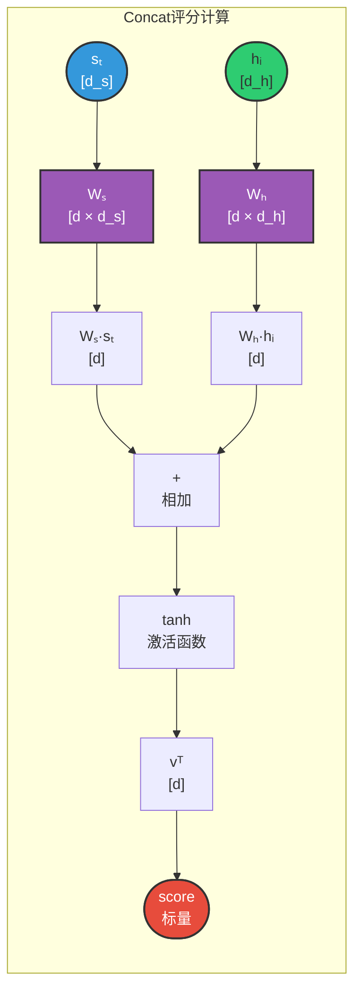

# 5. Attention机制

## 5.1 概述

### 5.1.1 为什么需要Attention

**Seq2Seq的信息瓶颈问题：**

在基础Seq2Seq模型中，编码器将整个输入序列压缩成一个固定维度的上下文向量（Context Vector）。这导致：

1. **信息丢失**：长序列的信息难以全部保存在固定向量中
2. **长距离依赖困难**：序列开头的信息容易被"遗忘"
3. **缺乏可解释性**：无法知道模型"关注"了输入的哪些部分

**示例说明：**

```
输入："The cat, which was sitting on the mat ..., was hungry"
翻译："那只猫...饿了"

问题：当解码器生成"饿了"时，它需要知道主语是"cat"（在句首）
      但基础Seq2Seq的上下文向量可能已经"忘记"了这个信息
```

**Attention的解决方案：**


### 5.1.2 什么是Attention机制

**核心思想：**

解码器在生成每个输出词时，动态地选择性地"关注"输入序列的不同部分。这种关注程度通过**注意力权重**来量化。

**类比理解：**

想象你在阅读一篇长文章后回答问题的场景：
- **基础Seq2Seq**：读完整篇文章，合上书，凭记忆回答问题（容易遗忘细节）
- **带Attention的Seq2Seq**：回答每个问题时，可以回头查看文章的相关段落（按需获取信息）

**关键概念：**

| 概念 | 说明 | 类比 |
|------|------|------|
| **Query（查询）** | 解码器当前状态，表示"我现在需要什么信息" | 你提出的问题 |
| **Key（键）** | 编码器各时刻的隐藏状态，表示"我有什么信息" | 文章各段落的关键词 |
| **Value（值）** | 编码器各时刻的隐藏状态，表示"信息的具体内容" | 文章各段落的内容 |
| **Attention Weight** | Query与Key的匹配程度 | 某段落与问题的相关度 |
| **Context Vector** | Value的加权求和 | 根据相关度整合的答案 |

### 5.1.3 发展历程


**里程碑论文：**

| 论文 | 作者 | 贡献 |
|------|------|------|
| "Neural Machine Translation by Jointly Learning to Align and Translate" | Bahdanau et al. (2015) | 首次提出Attention机制 |
| "Effective Approaches to Attention-based Neural Machine Translation" | Luong et al. (2015) | 提出Dot-Product Attention |
| "Attention Is All You Need" | Vaswani et al. (2017) | Transformer架构，Self-Attention |

### 5.1.4 应用场景

**自然语言处理：**

| 任务 | Attention的作用 |
|------|----------------|
| **机器翻译** | 解码器关注源语言的不同部分 |
| **文本摘要** | 关注原文的关键句子 |
| **问答系统** | 关注问题相关的文本片段 |
| **情感分析** | 关注情感关键词 |

**其他领域：**

| 领域 | 应用 |
|------|------|
| **计算机视觉** | 图像描述生成、目标检测 |
| **语音识别** | 对齐音频和文本 |
| **推荐系统** | 关注用户历史行为的相关项目 |

---

## 5.2 工作原理

### 5.2.1 相关性计算

**核心问题：** 如何衡量解码器当前状态与编码器各时刻隐藏状态的相关程度？

**计算流程：**


**评分函数类型：**

| 评分函数 | 公式 | 特点 |
|---------|------|------|
| **Dot-Product** | $e_{ti} = s_t^T h_i$ | 计算简单，要求维度相同 |
| **Scaled Dot-Product** | $e_{ti} = \frac{s_t^T h_i}{\sqrt{d_k}}$ | 加入缩放因子，防止梯度消失 |
| **Additive** | $e_{ti} = v^T \tanh(W_s s_t + W_h h_i)$ | 可学习参数，更灵活 |

**张量形状变化：**

```
Query (sₜ):     [batch_size, hidden_size]
Keys (h):       [batch_size, seq_len, hidden_size]

相关性分数计算:
Dot-Product:    [batch, hidden] × [batch, seq, hidden]ᵀ 
                -> [batch, seq]
                
Additive:       W_s·s: [batch, hidden] -> [batch, hidden]
                W_h·h: [batch, seq, hidden] -> [batch, seq, hidden]
                tanh(sum): [batch, seq, hidden]
                vᵀ·result: [batch, seq, hidden] -> [batch, seq]
```

**代码实现：**

```python
# 待补充代码（请从本地代码库 translation_attention/src/model.py 中截取）
# 参考实现：Attention类中的点积计算部分
```

> **提示：** 请参考 `translation_attention/src/model.py` 中的 `Attention` 类实现，重点关注：
> - `torch.bmm()` 计算点积
> - `transpose(1, 2)` 调整维度
> - 相关性分数的计算逻辑

### 5.2.2 注意力权重计算

**核心问题：** 如何将相关性分数转换为概率分布（注意力权重）？

**Softmax归一化：**

$$
\alpha_{ti} = \frac{\exp(e_{ti})}{\sum_{j=1}^{n} \exp(e_{tj})}
$$

**计算流程：**


**特性：**

- $\alpha_{ti} \in (0, 1)$：每个位置的权重在0到1之间
- $\sum_{i=1}^{n} \alpha_{ti} = 1$：所有权重之和为1（概率分布）
- 分数越高，权重越大：相关性强的位置获得更高权重

**数值稳定性处理：**

```python
# 待补充代码（请从本地代码库中截取或使用PyTorch内置函数）
# 参考：torch.softmax() 函数
```

**张量形状变化：**

```
输入:
  scores: [batch_size, seq_len] 相关性分数

输出:
  weights: [batch_size, seq_len] 注意力权重（每行和为1）

示例:
  scores: [[2.0, 1.0, 0.5, 0.1]]  # 第1个位置最相关
  weights: [[0.6, 0.22, 0.13, 0.05]]  # 归一化后
```

**直观理解：**

```
解码器生成 "like" 时:

输入序列:    我    喜欢   自然   语言   处理
相关性分数:  [0.5,  2.5,   0.8,   0.3,   0.2]
              ↓     ↓      ↓      ↓      ↓
            exp() exp()  exp()  exp()  exp()
              ↓     ↓      ↓      ↓      ↓
            [1.65, 12.18, 2.23, 1.35, 1.22]
              ↓     ↓      ↓      ↓      ↓
            归一化 / 18.63
              ↓     ↓      ↓      ↓      ↓
注意力权重:  [0.09, 0.65,  0.12,  0.07,  0.06]
              
结论: 解码器主要关注 "喜欢" (权重0.65)
```

### 5.2.3 上下文向量计算

**核心问题：** 如何根据注意力权重整合编码器信息，生成当前解码步的上下文表示？

**加权求和：**

$$
c_t = \sum_{i=1}^{n} \alpha_{ti} h_i
$$

**计算流程：**


**张量形状变化：**

```
输入:
  weights: [batch_size, seq_len] 注意力权重
  values:  [batch_size, seq_len, hidden_size] 编码器隐藏状态

计算:
  # weights扩展维度: [batch, seq] -> [batch, seq, 1]
  weights_expanded = weights.unsqueeze(-1)
  
  # 逐元素乘法: [batch, seq, 1] * [batch, seq, hidden] = [batch, seq, hidden]
  weighted_values = weights_expanded * values
  
  # 沿序列维度求和: [batch, seq, hidden] -> [batch, hidden]
  context = weighted_values.sum(dim=1)

输出:
  context: [batch_size, hidden_size] 上下文向量
```

**代码实现：**

```python
def compute_context_vector(weights, values):
    """
    计算上下文向量（加权求和）
    
    参数:
        weights: [batch_size, seq_len] 注意力权重
        values: [batch_size, seq_len, hidden_size] 编码器隐藏状态
    返回:
        context: [batch_size, hidden_size] 上下文向量
    """
    # weights: [batch, seq] -> [batch, seq, 1]
    weights_expanded = weights.unsqueeze(-1)
    
    # weighted_values: [batch, seq, hidden]
    weighted_values = weights_expanded * values
    
    # context: [batch, hidden]
    context = weighted_values.sum(dim=1)
    
    return context
```

**直观理解：**

```
解码器生成 "like" 时的上下文向量计算:

编码器状态:  h₁(我)  h₂(喜欢)  h₃(自然)  h₄(语言)  h₅(处理)
              ↓       ↓        ↓        ↓        ↓
注意力权重:  0.09    0.65     0.12     0.07     0.06
              ↓       ↓        ↓        ↓        ↓
            0.09·h₁ + 0.65·h₂ + 0.12·h₃ + 0.07·h₄ + 0.06·h₅ = cₜ

结果: 上下文向量 cₜ 主要由 "喜欢" 的编码决定 (65%)
      同时包含少量其他词的信息
```

### 5.2.4 解码信息融合

**核心问题：** 如何将上下文向量与解码器状态融合，生成最终输出？

**融合策略：**


**融合方式：**

| 融合方式 | 说明 | 公式 |
|---------|------|------|
| **拼接融合** | 将上下文向量与解码器状态拼接 | $\tilde{s}_t = [s_t; c_t]$ |
| **门控融合** | 使用门控机制控制信息流 | $g = \sigma(W_g [s_t; c_t])$ |
| **直接输入** | 将上下文向量作为额外输入 | LSTM输入包含 $c_t$ |

**张量形状变化：**

```
输入:
  decoder_input: [batch_size, 1] 上一个预测的词
  hidden: [1, batch_size, hidden_size] 解码器隐藏状态
  context: [batch_size, hidden_size] 上下文向量

处理流程:
  1. Embedding: [batch, 1] -> [batch, 1, embed_dim]
  
  2. 拼接: [batch, 1, embed_dim] + [batch, 1, hidden*2] 
          -> [batch, 1, embed_dim + hidden*2]
     (context需要扩展维度并重复)
  
  3. LSTM: [batch, 1, embed_dim + hidden*2] 
          -> [batch, 1, hidden_size]
  
  4. 输出层: 拼接LSTM输出和context
     [batch, hidden] + [batch, hidden*2] -> [batch, hidden*3]
     -> Linear -> [batch, vocab_size]

输出:
  output: [batch_size, vocab_size] 词表分布
  new_hidden: [1, batch_size, hidden_size] 新隐藏状态
```

**代码实现：**

```python
# 待补充代码（请从本地代码库 translation_attention/src/model.py 中截取）
# 参考实现：TranslationDecoder类的forward方法
```

> **提示：** 请参考 `translation_attention/src/model.py` 中的 `TranslationDecoder` 类，关注：
> - `torch.cat()` 拼接操作
> - LSTM的输入处理
> - 输出层的维度变化
```

**完整解码流程：**


### 5.2.5 整体流程总结

**Attention机制四步流程：**


**输入输出对比：**

| 步骤 | 输入 | 输出 | 核心操作 |
|------|------|------|---------|
| **相关性计算** | Query sₜ, Keys h | 分数 eₜᵢ | 评分函数 |
| **权重计算** | 分数 eₜᵢ | 权重 αₜᵢ | Softmax归一化 |
| **上下文计算** | 权重 αₜᵢ, Values h | 上下文 cₜ | 加权求和 |
| **信息融合** | 解码器状态 sₜ, 上下文 cₜ | 输出分布 | LSTM + Linear |

---

## 5.3 注意力评分函数

### 5.3.1 概述

**核心问题：** 如何衡量Query和Key的相似度/相关度？

**评分函数（Score Function）** 是Attention机制的核心组件，用于计算Query与每个Key的匹配程度，输出一个标量分数。分数越高，表示两者越相关。


**评分函数的分类：**

根据计算方式的不同，评分函数主要分为以下几类：

| 类型 | 名称 | 核心思想 | 特点 |
|------|------|---------|------|
| **Dot** | 点积评分 | 直接计算向量点积 | 最简单，要求维度相同 |
| **General** | 通用点积评分 | 先线性变换再点积 | 可处理不同维度 |
| **Concat** | 拼接评分 | 拼接后通过全连接层 | 最灵活，参数量大 |

**选择建议：**

- **Dot**：Query和Key维度相同，追求计算效率
- **General**：Query和Key维度不同，需要可学习的变换
- **Concat**：需要最大灵活性，不在意参数量

### 5.3.2 点积评分（Dot）

**定义：**

直接计算Query向量和Key向量的点积作为相关性分数。

$$
\text{score}(s_t, h_i) = s_t^T h_i = \sum_{j=1}^{d} s_{t,j} \cdot h_{i,j}
$$

**计算流程：**


**特点：**

| 优点 | 缺点 |
|------|------|
| 计算简单，只需乘法和加法 | 要求Query和Key维度必须相同 |
| 无额外参数，不需要训练 | 无法处理不同维度的输入 |
| 计算效率高，适合大规模应用 | 数值可能过大，导致梯度问题 |

**张量形状变化：**

```
输入:
  query: [batch_size, hidden_size] 或 [hidden_size]
  keys: [batch_size, seq_len, hidden_size] 或 [seq_len, hidden_size]

计算:
  # 单样本
  query: [hidden] × keys: [seq, hidden]ᵀ -> [seq]
  
  # 批量
  query: [batch, hidden] -> [batch, 1, hidden]
  keys: [batch, seq, hidden]
  scores: [batch, 1, hidden] × [batch, hidden, seq] -> [batch, 1, seq] -> [batch, seq]

输出:
  scores: [batch_size, seq_len] 或 [seq_len]
```

**代码实现：**

```python
# 待补充代码（请从本地代码库 translation_attention/src/model.py 中截取）
# 参考实现：Attention类
```

> **提示：** 请参考 `translation_attention/src/model.py` 中的 `Attention` 类实现

**适用场景：**

- Query和Key来自同一空间（维度相同）
- 对计算效率要求高的场景
- Transformer中的Self-Attention

### 5.3.3 通用点积评分（General）

**定义：**

在点积之前，先通过一个可学习的线性变换矩阵将Query或Key映射到同一空间。

$$
\text{score}(s_t, h_i) = s_t^T W h_i
$$

其中 $W \in \mathbb{R}^{d_s \times d_h}$ 是可学习的权重矩阵。

**计算流程：**


**特点：**

| 优点 | 缺点 |
|------|------|
| 可处理不同维度的Query和Key | 需要额外的参数矩阵W |
| 通过学习找到最优的映射方式 | 增加了模型复杂度 |
| 比Concat方法参数量少 | 表达能力不如Concat |

**张量形状变化：**

```
输入:
  query: [batch_size, query_dim]  Query维度d_s
  keys: [batch_size, seq_len, key_dim]  Key维度d_h

参数:
  W: [query_dim, key_dim] 变换矩阵

计算:
  # 方法1: 先变换Key再点积
  # keys: [batch, seq, key_dim] × W: [key_dim, query_dim] = [batch, seq, query_dim]
  keys_transformed = torch.matmul(keys, W.transpose(0, 1))
  
  # query: [batch, query_dim] × keys_transformed: [batch, seq, query_dim]ᵀ = [batch, seq]
  scores = torch.bmm(query.unsqueeze(1), keys_transformed.transpose(1, 2)).squeeze(1)
  
  # 方法2: 直接使用线性层
  # self.W: nn.Linear(key_dim, query_dim)
  keys_transformed = self.W(keys)  # [batch, seq, query_dim]
  scores = torch.bmm(query.unsqueeze(1), keys_transformed.transpose(1, 2)).squeeze(1)

输出:
  scores: [batch_size, seq_len]
```

**代码实现：**

```python
# 待补充代码（General评分函数实现）
# 注意：本地代码库 translation_attention 使用的是Dot评分，如需General评分需自行实现
```

> **提示：** 本地代码库使用Dot评分。如需了解General评分，请参考相关论文实现

**与Dot的对比：**

| 特性 | Dot | General |
|------|-----|---------|
| **维度要求** | Query和Key必须相同 | Query和Key可以不同 |
| **可学习参数** | 无 | 有（变换矩阵W） |
| **计算复杂度** | O(d) | O(d_s × d_h) |
| **表达能力** | 固定 | 更灵活 |
| **适用场景** | 维度相同 | 维度不同 |

### 5.3.4 拼接评分（Concat）

**定义：**

先将Query和Key拼接起来，然后通过一个全连接层（Feed-Forward Network）计算相关性分数。也称为Additive Attention。

$$
\text{score}(s_t, h_i) = v^T \tanh(W_s s_t + W_h h_i)
$$

或者等价地：

$$
\text{score}(s_t, h_i) = v^T \tanh(W \cdot [s_t; h_i])
$$

其中：
- $W_s \in \mathbb{R}^{d \times d_s}$：Query的变换矩阵
- $W_h \in \mathbb{R}^{d \times d_h}$：Key的变换矩阵  
- $v \in \mathbb{R}^{d}$：输出权重向量
- $[s_t; h_i]$ 表示向量拼接

**计算流程：**



**特点：**

| 优点 | 缺点 |
|------|------|
| 最灵活，可以处理任意维度的Query和Key | 参数量最大 |
| 通过非线性激活函数增强表达能力 | 计算复杂度最高 |
| 可以学习复杂的相似度度量 | 训练难度相对较大 |

**张量形状变化：**

```
输入:
  query: [batch_size, query_dim]  Query维度d_s
  keys: [batch_size, seq_len, key_dim]  Key维度d_h

参数:
  W_query: [hidden_dim, query_dim]  Query变换矩阵
  W_key: [hidden_dim, key_dim]  Key变换矩阵
  v: [hidden_dim, 1] 输出权重

计算:
  # 1. 分别变换Query和Key到同一空间
  # query: [batch, query_dim] -> [batch, hidden_dim]
  query_proj = torch.matmul(query, W_query.t())  # 或使用nn.Linear
  
  # keys: [batch, seq, key_dim] -> [batch, seq, hidden_dim]
  keys_proj = torch.matmul(keys, W_key.t())
  
  # 2. 扩展query维度以便广播相加
  # query_proj: [batch, hidden_dim] -> [batch, 1, hidden_dim] -> [batch, seq, hidden_dim]
  query_expanded = query_proj.unsqueeze(1).expand(-1, seq_len, -1)
  
  # 3. 相加并通过非线性激活
  # combined: [batch, seq, hidden_dim]
  combined = torch.tanh(query_expanded + keys_proj)
  
  # 4. 通过v计算最终分数
  # scores: [batch, seq, hidden_dim] × [hidden_dim, 1] = [batch, seq, 1] -> [batch, seq]
  scores = torch.matmul(combined, v).squeeze(-1)

输出:
  scores: [batch_size, seq_len]
```

**代码实现：**

```python
# 待补充代码（Concat/Additive评分函数实现）
# 注意：本地代码库 translation_attention 使用的是Dot评分
# 如需Concat评分，需参考Bahdanau Attention论文自行实现
```

> **提示：** 本地代码库使用Dot评分。Concat评分（Additive Attention）是另一种实现方式

**三种评分函数对比总结：**


| 评分函数 | 公式 | 参数量 | 计算复杂度 | 灵活性 | 适用场景 |
|---------|------|--------|-----------|--------|---------|
| **Dot** | $s^T h$ | 0 | O(d) | ★☆☆ | 维度相同，追求效率 |
| **General** | $s^T W h$ | $d_s \times d_h$ | O(d_s × d_h) | ★★☆ | 维度不同，平衡效率 |
| **Concat** | $v^T \tanh(W_s s + W_h h)$ | $d(d_s + d_h + 1)$ | O(d × (d_s + d_h)) | ★★★ | 需要最大灵活性 |

### 5.3.5 注意力权重计算

**Softmax归一化：**

$$
\alpha_{ti} = \frac{\exp(\text{score}(s_t, h_i))}{\sum_{j=1}^{n} \exp(\text{score}(s_t, h_j))}
$$

**特性：**
- $\alpha_{ti} \in (0, 1)$
- $\sum_{i=1}^{n} \alpha_{ti} = 1$
- 分数越高，权重越大

**代码实现：**

```python
# 待补充代码（请从本地代码库 translation_attention/src/model.py 中截取）
# 参考实现：Attention类中的softmax计算部分
```

> **提示：** 请参考 `translation_attention/src/model.py` 中的 `Attention` 类，关注 `torch.softmax()` 的使用

### 5.3.4 上下文向量计算

**加权求和：**

$$
c_t = \sum_{i=1}^{n} \alpha_{ti} h_i
$$

**直观理解：**
- 上下文向量是所有编码器隐藏状态的加权平均
- 权重由注意力机制动态决定
- 解码器可以根据需要"聚焦"不同的输入部分

**张量形状变化：**

```
注意力权重 α: [batch_size, seq_len]
编码器隐藏状态 h: [batch_size, seq_len, hidden_size]

上下文向量 c = α.unsqueeze(-1) * h  # [batch, seq_len, hidden]
c = c.sum(dim=1)  # [batch, hidden_size]
```

---

## 5.4 案例实操（中英翻译V2.0）

### 5.4.1 需求说明

**项目目标：** 在V1.0的基础上，引入Attention机制，提升翻译质量

**与V1.0的对比：**

| 特性 | V1.0（基础Seq2Seq） | V2.0（带Attention） |
|------|-------------------|-------------------|
| **编码器** | 单向GRU | 双向LSTM |
| **上下文** | 固定向量 | 动态注意力 |
| **长句翻译** | 效果差 | 效果提升 |
| **可解释性** | 无 | 可可视化对齐 |

**示例：**

```
输入："我喜欢自然语言处理"
V1.0输出："I like NLP"（可能丢失信息）
V2.0输出："I like natural language processing"（更准确）
```

### 5.4.2 需求分析

**架构变化：**


**关键改进点：**

1. **编码器改为双向LSTM**：捕获更完整的上下文信息
2. **引入Attention层**：动态计算上下文向量
3. **解码器融合注意力**：每个解码步都使用注意力

### 5.4.3 项目结构

```
translation_attention/
├── src/
│   ├── config.py      # 配置文件
│   ├── process.py     # 数据预处理
│   ├── dataset.py     # Dataset和DataLoader
│   ├── model.py       # Attention Seq2Seq模型
│   ├── train.py       # 训练流程
│   ├── evaluate.py    # BLEU评估
│   ├── predict.py     # 预测接口
│   └── tokenizer.py   # 中英文分词器
├── data/
│   ├── raw/           # 原始平行语料
│   └── processed/     # 处理后的数据
├── models/            # 保存的词表和模型权重
└── logs/              # TensorBoard训练日志
```

### 5.4.4 详细实现

> **【与Seq2Seq V1.0的对比说明】**
> 
> 本案例与V1.0相比，有以下核心差异：
> 
> | 对比维度 | V1.0 | V2.0（本案例） |
> |----------|------|---------------|
> | **编码器** | 单向GRU | 双向LSTM |
> | **编码器输出** | 最后时刻隐藏状态 | 所有时刻隐藏状态 |
> | **注意力** | 无 | Additive Attention |
> | **解码器输入** | 仅上下文向量 | 上下文向量+解码器状态 |
> | **模型复杂度** | O(n) | O(n²) |
> 
> 以下代码中，**【与V1.0差异】** 标记表示与基础Seq2Seq不同的部分。

**1. 配置文件（config.py）**

```python
"""
配置文件模块

作者: Red_Moon
创建日期: 2026-02
"""

from pathlib import Path

# 项目根目录
ROOT_DIR = Path(__file__).parent.parent

# 数据目录
RAW_DATA_DIR = ROOT_DIR / "data" / "raw"
PROCESSED_DATA_DIR = ROOT_DIR / "data" / "processed"
LOGS_DIR = ROOT_DIR / "logs"
MODELS_DIR = ROOT_DIR / "models"

# 序列长度配置
SEQ_LEN = 128

# 【与V1.0差异】训练超参数调整
BATCH_SIZE = 64
EMBEDDING_DIM = 128
# 【与V1.0差异】双向LSTM，隐藏维度需要调整
HIDDEN_SIZE = 256  # 双向LSTM输出为512（256*2）
LEARNING_RATE = 1e-3
EPOCHS = 30
```

**2. Attention层实现（model.py）**

```python
"""
模型定义模块

功能描述:
    定义带Attention机制的Seq2Seq翻译模型（编码器-解码器架构）。
    【与V1.0核心差异】引入Attention机制，动态计算上下文向量

作者: Red_Moon
创建日期: 2026-02
"""

import torch
from torch import nn
import config


class Attention(nn.Module):
    """
    【与V1.0核心差异】Attention机制类 - V1.0中没有此组件
    
    意图：动态计算解码器状态与编码器输出的相关性，生成上下文向量
    原理：通过点积计算注意力分数，Softmax归一化得到权重，加权求和得到上下文
    
    输入输出:
        - decoder_hidden: [batch, 1, hidden] 解码器当前隐藏状态
        - encoder_outputs: [batch, seq_len, hidden] 编码器所有时刻输出
        - context_vector: [batch, 1, hidden] 加权后的上下文向量
    """
    
    def forward(self, decoder_hidden, encoder_outputs):
        """
        前向传播计算注意力上下文
        
        参数:
            decoder_hidden: [batch_size, 1, hidden_size] 解码器隐藏状态作为Query
            encoder_outputs: [batch_size, seq_len, hidden_size] 编码器输出作为Key/Value
        
        返回:
            context_vector: [batch_size, 1, hidden_size] 上下文向量
        """
        # 【核心操作1】计算注意力分数：Query与Key的点积
        # decoder_hidden: [batch, 1, hidden]
        # encoder_outputs: [batch, seq, hidden] -> [batch, hidden, seq]
        # attention_scores: [batch, 1, seq] 每个解码步与所有编码位置的相关性
        attention_scores = torch.bmm(decoder_hidden, encoder_outputs.transpose(1, 2))
        
        # 【核心操作2】Softmax归一化得到注意力权重
        # attention_weights: [batch, 1, seq] 权重之和为1
        attention_weights = torch.softmax(attention_scores, dim=-1)
        
        # 【核心操作3】加权求和：权重 × Value
        # context_vector: [batch, 1, seq] × [batch, seq, hidden] = [batch, 1, hidden]
        context_vector = torch.bmm(attention_weights, encoder_outputs)
        
        return context_vector


class TranslationEncoder(nn.Module):
    """翻译编码器（意图：将源语言序列编码为上下文向量）"""
    
    def __init__(self, vocab_size, padding_index):
        super().__init__()
        self.embedding = nn.Embedding(
            num_embeddings=vocab_size,
            embedding_dim=config.EMBEDDING_DIM,
            padding_idx=padding_index  # 警示：padding_idx确保<pad>标记不参与梯度计算
        )
        self.GRU = nn.GRU(
            input_size=config.EMBEDDING_DIM,
            hidden_size=config.HIDDEN_SIZE,
            batch_first=True
        )
    
    def forward(self, x):
        """
        前向传播
        
        【与V1.0差异】返回编码器所有时刻输出，供Attention使用
        V1.0只返回最后时刻隐藏状态，V2.0需要所有时刻输出计算Attention
        
        参数:
            x: [batch_size, seq_len] 输入序列
        
        返回:
            gru_out: [batch, seq_len, hidden_size] 所有时刻输出（【V2.0新增】用于Attention）
            last_hidden_state: [batch, hidden_size] 最后时刻隐藏状态
        """
        embed = self.embedding(x)  # [batch, seq_len, embedding_dim]
        gru_out, _ = self.GRU(embed)  # gru_out: [batch, seq_len, hidden_size]
        
        # 提取每个序列最后一个有效时间步（意图：处理变长序列）
        lengths = (x != self.embedding.padding_idx).sum(dim=1)
        last_hidden_state = gru_out[torch.arange(gru_out.shape[0]), lengths - 1]
        
        # 【与V1.0关键差异】返回所有时刻输出gru_out，用于Attention计算
        return gru_out, last_hidden_state


class TranslationDecoder(nn.Module):
    """
    翻译解码器（意图：根据上下文向量自回归生成目标语言序列）
    
    【与V1.0核心差异】引入Attention机制，每个解码步动态关注编码器不同位置
    """
    
    def __init__(self, vocab_size, padding_index):
        super().__init__()
        self.embedding = nn.Embedding(
            num_embeddings=vocab_size,
            embedding_dim=config.EMBEDDING_DIM,
            padding_idx=padding_index
        )
        self.GRU = nn.GRU(
            input_size=config.EMBEDDING_DIM,
            hidden_size=config.HIDDEN_SIZE,
            batch_first=True
        )
        
        # 【与V1.0核心差异1】引入Attention机制
        self.attention = Attention()
        
        # 【与V1.0核心差异2】线性层输入维度翻倍
        # 原因：需要同时处理GRU输出和Attention上下文向量
        # V1.0: hidden_size -> vocab_size
        # V2.0: hidden_size * 2 -> vocab_size（拼接了context_vector）
        self.linear = nn.Linear(in_features=config.HIDDEN_SIZE * 2, out_features=vocab_size)
    
    def forward(self, x, hidden_0, encoder_outputs):
        """
        前向传播
        
        【与V1.0差异】增加encoder_outputs参数，用于Attention计算
        
        参数:
            x: [batch_size, seq_len] 输入序列
            hidden_0: [1, batch_size, hidden_size] 初始隐藏状态
            encoder_outputs: [batch, seq_len, hidden] 【V2.0新增】编码器所有时刻输出
        
        返回:
            output: [batch, seq_len, vocab_size] 词表分布
            hidden_n: [1, batch, hidden] 最终隐藏状态
        """
        embed = self.embedding(x)  # [batch, seq_len, embedding_dim]
        gru_out, hidden_n = self.GRU(embed, hidden_0)  # [batch, seq_len, hidden]

        # 【与V1.0核心差异3】应用Attention机制
        # 计算当前解码状态与编码器输出的注意力上下文
        # context_vector: [batch, 1, hidden_size] 动态计算的上下文
        context_vector = self.attention(gru_out, encoder_outputs)
        
        # 【与V1.0核心差异4】融合信息：拼接GRU输出和Attention上下文
        # combined: [batch, seq_len, hidden * 2]
        # 这样解码器可以同时看到自身状态和关注的编码器信息
        combined = torch.cat([gru_out, context_vector], dim=-1)
        
        # 映射到词表
        output = self.linear(combined)
        return output, hidden_n


class TranslationModel(nn.Module):
    """Seq2Seq翻译模型（编码器-解码器架构）"""
    
    def __init__(self, zh_vocab_size, en_vocab_size, zh_padding_index, en_padding_index):
        super().__init__()
        self.encoder = TranslationEncoder(zh_vocab_size, padding_index=zh_padding_index)
        self.decoder = TranslationDecoder(en_vocab_size, padding_index=en_padding_index)
```
        参数:
            query: [batch_size, hidden_size] 解码器当前状态
            keys: [batch_size, seq_len, hidden_size*2] 编码器所有隐藏状态
            mask: [batch_size, seq_len] 填充位置掩码（可选）
        返回:
            context: [batch_size, hidden_size*2] 上下文向量
            weights: [batch_size, seq_len] 注意力权重
        """
        batch_size, seq_len, _ = keys.shape
        
        # 扩展query维度以便与keys相加
        # query: [batch, hidden] -> [batch, 1, hidden] -> [batch, seq_len, hidden]
        query_expanded = self.W_query(query).unsqueeze(1).expand(-1, seq_len, -1)
        
        # 计算注意力分数
        # keys: [batch, seq_len, hidden*2]
        keys_transformed = self.W_key(keys)  # [batch, seq_len, hidden]
        
        # Additive score: tanh(W_q*query + W_k*key)
        scores = torch.tanh(query_expanded + keys_transformed)  # [batch, seq_len, hidden]
        scores = self.V(scores).squeeze(-1)  # [batch, seq_len]
        
        # 应用掩码（如果提供）
        if mask is not None:
            scores = scores.masked_fill(mask == 0, float('-inf'))
        
        # Softmax归一化
        weights = torch.softmax(scores, dim=-1)  # [batch, seq_len]
        
        # 加权求和计算上下文向量
        # weights: [batch, seq_len] -> [batch, 1, seq_len]
        # keys: [batch, seq_len, hidden*2]
        context = torch.bmm(weights.unsqueeze(1), keys).squeeze(1)  # [batch, hidden*2]
        
        return context, weights


class AttentionEncoder(nn.Module):
    """
    【与V1.0差异】双向LSTM编码器
    
    意图：捕获输入序列的双向上下文信息
    """
    
    def __init__(self, vocab_size, padding_index):
        super().__init__()
        self.embedding = nn.Embedding(
            num_embeddings=vocab_size,
            embedding_dim=config.EMBEDDING_DIM,
            padding_idx=padding_index
        )
        # 【与V1.0差异】使用双向LSTM
        self.lstm = nn.LSTM(
            input_size=config.EMBEDDING_DIM,
            hidden_size=config.HIDDEN_SIZE,
            batch_first=True,
            bidirectional=True  # 双向LSTM
        )
    
    def forward(self, x):
        """
        参数:
            x: [batch_size, seq_len] 输入序列
        返回:
            outputs: [batch_size, seq_len, hidden_size*2] 所有隐藏状态
            hidden: [2, batch_size, hidden_size] 最后时刻隐藏状态（双向）
            cell: [2, batch_size, hidden_size] 最后时刻细胞状态（双向）
        """
        embed = self.embedding(x)  # [batch, seq_len, embedding_dim]
        outputs, (hidden, cell) = self.lstm(embed)
        # outputs: [batch, seq_len, hidden_size*2]（双向拼接）
        # hidden: [2, batch, hidden_size]（2表示双向）
        return outputs, hidden, cell


class AttentionDecoder(nn.Module):
    """
    【与V1.0差异】带Attention的解码器
    
    意图：每个解码步都动态关注输入序列的不同部分
    """
    
    def __init__(self, vocab_size, padding_index):
        super().__init__()
        self.embedding = nn.Embedding(
            num_embeddings=vocab_size,
            embedding_dim=config.EMBEDDING_DIM,
            padding_idx=padding_index
        )
        
        # 【与V1.0差异】输入维度增加（embedding + context）
        # context来自双向LSTM，维度为hidden_size*2
        self.lstm = nn.LSTM(
            input_size=config.EMBEDDING_DIM + config.HIDDEN_SIZE * 2,
            hidden_size=config.HIDDEN_SIZE,
            batch_first=True
        )
        
        # Attention机制
        self.attention = Attention(config.HIDDEN_SIZE)
        
        # 输出层（输入包含context信息）
        self.output_layer = nn.Linear(
            in_features=config.HIDDEN_SIZE + config.HIDDEN_SIZE * 2,
            out_features=vocab_size
        )
    
    def forward(self, x, hidden, cell, encoder_outputs, mask=None):
        """
        参数:
            x: [batch_size, 1] 当前输入词
            hidden: [1, batch_size, hidden_size] 上一时刻隐藏状态
            cell: [1, batch_size, hidden_size] 上一时刻细胞状态
            encoder_outputs: [batch_size, seq_len, hidden_size*2] 编码器输出
            mask: [batch_size, seq_len] 填充掩码
        返回:
            output: [batch_size, vocab_size] 词表分布
            hidden: [1, batch_size, hidden_size] 当前隐藏状态
            cell: [1, batch_size, hidden_size] 当前细胞状态
            weights: [batch_size, seq_len] 注意力权重
        """
        # 词嵌入
        embed = self.embedding(x)  # [batch, 1, embedding_dim]
        
        # 【与V1.0差异】计算Attention
        # hidden[-1]: [batch, hidden_size]（取最后一层）
        context, weights = self.attention(hidden[-1], encoder_outputs, mask)
        # context: [batch, hidden_size*2]
        
        # 【与V1.0差异】拼接embedding和context作为LSTM输入
        context = context.unsqueeze(1)  # [batch, 1, hidden_size*2]
        lstm_input = torch.cat([embed, context], dim=-1)  # [batch, 1, embed_dim + hidden*2]
        
        # LSTM前向
        lstm_out, (hidden, cell) = self.lstm(lstm_input, (hidden, cell))
        # lstm_out: [batch, 1, hidden_size]
        
        # 【与V1.0差异】拼接LSTM输出和context进行预测
        output_input = torch.cat([lstm_out.squeeze(1), context.squeeze(1)], dim=-1)
        # [batch, hidden_size + hidden_size*2]
        output = self.output_layer(output_input)  # [batch, vocab_size]
        
        return output, hidden, cell, weights


class AttentionSeq2Seq(nn.Module):
    """
    【与V1.0差异】带Attention的Seq2Seq模型
    """
    
    def __init__(self, zh_vocab_size, en_vocab_size, zh_padding_index, en_padding_index):
        super().__init__()
        self.encoder = AttentionEncoder(zh_vocab_size, zh_padding_index)
        self.decoder = AttentionDecoder(en_vocab_size, en_padding_index)
    
    def forward(self, encoder_inputs, decoder_inputs, mask=None):
        """
        参数:
            encoder_inputs: [batch_size, seq_len] 中文输入
            decoder_inputs: [batch_size, seq_len] 英文输入（Teacher Forcing）
            mask: [batch_size, seq_len] 编码器填充掩码
        返回:
            outputs: [batch_size, seq_len, vocab_size] 预测分布
            attention_weights: [batch_size, seq_len, seq_len] 注意力权重
        """
        batch_size = encoder_inputs.shape[0]
        decoder_seq_len = decoder_inputs.shape[1]
        
        # 编码
        encoder_outputs, hidden, cell = self.encoder(encoder_inputs)
        
        # 【与V1.0差异】转换编码器隐藏状态用于解码器初始化
        # 双向LSTM的hidden: [2, batch, hidden] -> 需要转换为 [1, batch, hidden]
        hidden = hidden.sum(dim=0, keepdim=True)  # [1, batch, hidden_size]
        cell = cell.sum(dim=0, keepdim=True)
        
        # 解码
        outputs = []
        attention_weights = []
        
        for i in range(decoder_seq_len):
            decoder_input = decoder_inputs[:, i].unsqueeze(1)  # [batch, 1]
            output, hidden, cell, weights = self.decoder(
                decoder_input, hidden, cell, encoder_outputs, mask
            )
            outputs.append(output)
            attention_weights.append(weights)
        
        outputs = torch.stack(outputs, dim=1)  # [batch, seq_len, vocab_size]
        attention_weights = torch.stack(attention_weights, dim=1)  # [batch, dec_seq, enc_seq]
        
        return outputs, attention_weights
```

**3. 训练流程（train.py）**

```python
"""
模型训练模块

作者: Red_Moon
创建日期: 2026-02
"""

import time
import torch
from torch.utils.tensorboard import SummaryWriter
from tqdm import tqdm

from dataset import get_dataloader
from model import TranslationModel
import config
from tokenizer import ChineseTokenizer, EnglishTokenizer


def train_one_epoch(model, dataloader, loss_fn, optimizer, device):
    """
    训练一个轮次
    
    【与V1.0差异】编码器返回所有时刻输出供Attention使用
    
    参数:
        model: 待训练模型
        dataloader: 训练数据加载器
        loss_fn: 损失函数
        optimizer: 优化器
        device: 计算设备
    
    返回:
        float: 平均损失
    """
    model.train()
    total_loss = 0
    
    for inputs, targets in tqdm(dataloader, desc='训练'):
        # 数据移动到设备（意图：确保张量在正确的设备上）
        encoder_inputs = inputs.to(device)  # [batch, src_seq_len]
        targets = targets.to(device)  # [batch, tgt_seq_len]
        
        # 准备解码器输入和目标（意图：Teacher Forcing策略）
        decoder_inputs = targets[:, :-1]  # [batch, tgt_seq_len-1] 去掉<eos>
        decoder_targets = targets[:, 1:]  # [batch, tgt_seq_len-1] 去掉<sos>
        
        # 【与V1.0关键差异】编码器返回所有时刻输出，用于Attention计算
        # encoder_outputs: [batch, seq_len, hidden] 所有时刻输出（V2.0新增）
        # context_vector: [batch, hidden] 最后时刻隐藏状态
        encoder_outputs, context_vector = model.encoder(encoder_inputs)
        
        # 解码阶段（警示：此处使用循环而非向量化，是为了演示自回归过程）
        decoder_hidden = context_vector.unsqueeze(0)  # [1, batch, hidden_size]
        decoder_outputs = []
        seq_len = decoder_inputs.shape[1]
        
        # 【与V1.0关键差异】解码器需要传入encoder_outputs用于Attention
        for i in range(seq_len):
            decoder_input = decoder_inputs[:, i].unsqueeze(1)  # [batch, 1]
            # 【差异点】decoder现在接收3个参数：input, hidden, encoder_outputs
            decoder_output, decoder_hidden = model.decoder(
                decoder_input, decoder_hidden, encoder_outputs
            )
            decoder_outputs.append(decoder_output)
        
        # 合并输出并reshape（意图：适配CrossEntropyLoss的输入格式）
        decoder_outputs = torch.cat(decoder_outputs, dim=1)  # [batch, seq_len, vocab_size]
        decoder_outputs = decoder_outputs.reshape(-1, decoder_outputs.shape[-1])  # [batch*seq_len, vocab_size]
        decoder_targets = decoder_targets.reshape(-1)  # [batch*seq_len]
        
        # 计算损失并反向传播
        loss = loss_fn(decoder_outputs, decoder_targets)
        total_loss += loss.item()
        
        optimizer.zero_grad()
        loss.backward()
        optimizer.step()
    
    return total_loss / len(dataloader)


def train():
    """执行完整训练流程"""
    device = torch.device('cuda' if torch.cuda.is_available() else 'cpu')
    print(f"使用设备: {device}")
    
    dataloader = get_dataloader()
    print(f"训练集批次数量: {len(dataloader)}")
    
    # 加载词表（意图：动态获取词表大小，避免硬编码）
    zh_tokenizer = ChineseTokenizer.from_vocab(config.MODELS_DIR / 'zh_vocab.txt')
    en_tokenizer = EnglishTokenizer.from_vocab(config.MODELS_DIR / 'en_vocab.txt')
    print(f"中文词表大小: {zh_tokenizer.vocab_size}")
    print(f"英文词表大小: {en_tokenizer.vocab_size}")
    
    # 初始化模型
    model = TranslationModel(
        zh_vocab_size=zh_tokenizer.vocab_size,
        en_vocab_size=en_tokenizer.vocab_size,
        zh_padding_index=zh_tokenizer.pad_token_index,
        en_padding_index=en_tokenizer.pad_token_index
    ).to(device)
    print("模型初始化完成")
    
    # 损失函数和优化器（警示：ignore_index确保<pad>标记不参与损失计算）
    loss_fn = torch.nn.CrossEntropyLoss(ignore_index=en_tokenizer.pad_token_index)
    optimizer = torch.optim.Adam(model.parameters(), lr=config.LEARNING_RATE)
    
    # TensorBoard日志（意图：可视化训练过程）
    log_dir = config.LOGS_DIR / time.strftime("%Y-%m-%d_%H-%M-%S")
    writer = SummaryWriter(log_dir=log_dir)
    print(f"TensorBoard日志目录: {log_dir}")
    
    best_loss = float('inf')
    
    for epoch in range(1, 1 + config.EPOCHS):
        print("\n" + "=" * 10 + f" Epoch: {epoch}/{config.EPOCHS} " + "=" * 10)
        
        loss = train_one_epoch(model, dataloader, loss_fn, optimizer, device)
        print(f"平均损失: {loss:.6f}")
        
        writer.add_scalar('Loss/train', loss, epoch)
        
        # 保存最佳模型（意图：基于验证损失保存最优检查点）
        if loss < best_loss:
            best_loss = loss
            torch.save(model.state_dict(), config.MODELS_DIR / 'best.pth')
            print(f"模型保存成功（最佳损失: {best_loss:.6f}）")
    
    writer.close()
    print("\n" + "=" * 40)
    print("训练完成！")
    print(f"最佳损失: {best_loss:.6f}")
    print("=" * 40)


if __name__ == '__main__':
    train()
```

**4. 预测模块（predict.py）**

```python
"""
模型预测模块

作者: Red_Moon
创建日期: 2026-02
"""

import torch
import config
from model import TranslationModel
from tokenizer import ChineseTokenizer, EnglishTokenizer


def predict_batch(model, inputs, en_tokenizer, device):
    """
    批量预测（自回归生成）
    
    【与V1.0差异】解码器需要传入encoder_outputs用于Attention
    
    参数:
        model: 已加载权重的模型
        inputs: [batch_size, seq_len] 源语言输入
        en_tokenizer: 英文分词器
        device: 计算设备
    
    返回:
        list: 预测的词索引列表
    """
    model.eval()
    
    with torch.no_grad():
        # 编码阶段（意图：将源语言编码为上下文向量）
        # 【与V1.0差异】编码器返回所有时刻输出encoder_outputs供Attention使用
        encoder_outputs, context_vector = model.encoder(inputs)  # [batch, hidden_size]
        
        batch_size = inputs.shape[0]
        hidden = context_vector.unsqueeze(0)  # [1, batch, hidden_size]
        
        # 初始化解码器输入为<sos>标记（意图：自回归生成的起始信号）
        decoder_input = torch.full([batch_size, 1], en_tokenizer.sos_token_index, device=device)
        
        generated = []  # 存储生成的词索引
        is_finished = torch.zeros(batch_size, dtype=torch.bool, device=device)  # 记录已完成序列
        
        # 自回归生成（警示：最大长度限制防止无限生成）
        for i in range(config.SEQ_LEN):
            # 【与V1.0关键差异】解码器接收3个参数：input, hidden, encoder_outputs
            decoder_output, hidden = model.decoder(decoder_input, hidden, encoder_outputs)
            # decoder_output: [batch, 1, vocab_size]
            
            # 贪心解码：选择概率最高的词（意图：简单高效的解码策略）
            next_token_indexes = torch.argmax(decoder_output, dim=-1)  # [batch, 1]
            generated.append(next_token_indexes)
            
            # 更新输入（意图：自回归特性，当前输出作为下一步输入）
            decoder_input = next_token_indexes
            
            # 检查是否生成<eos>（意图：提前终止已完成序列）
            is_finished |= (next_token_indexes.squeeze(1) == en_tokenizer.eos_token_index)
            if is_finished.all():
                break
        
        # 处理预测结果
        generated_tensor = torch.cat(generated, dim=1)  # [batch, seq_len]
        generated_list = generated_tensor.tolist()
        
        # 截断<eos>之后的标记（意图：清理输出，只保留有效部分）
        for index, sentence in enumerate(generated_list):
            if en_tokenizer.eos_token_index in sentence:
                eos_pos = sentence.index(en_tokenizer.eos_token_index)
                generated_list[index] = sentence[:eos_pos]
        
        return generated_list


def predict(text, model, zh_tokenizer, en_tokenizer, device):
    """
    单条文本预测
    
    参数:
        text: 待翻译的中文文本
        model: 已加载权重的模型
        zh_tokenizer: 中文分词器
        en_tokenizer: 英文分词器
        device: 计算设备
    
    返回:
        str: 翻译后的英文文本
    """
    indexes = zh_tokenizer.encode(text)
    input_tensor = torch.tensor([indexes], dtype=torch.long).to(device)
    
    batch_result = predict_batch(model, input_tensor, en_tokenizer, device)
    return en_tokenizer.decode(batch_result[0])


def run_predict():
    """运行交互式预测界面"""
    device = torch.device('cuda' if torch.cuda.is_available() else 'cpu')
    print(f"使用设备: {device}")
    
    # 加载词表
    zh_tokenizer = ChineseTokenizer.from_vocab(config.MODELS_DIR / 'zh_vocab.txt')
    en_tokenizer = EnglishTokenizer.from_vocab(config.MODELS_DIR / 'en_vocab.txt')
    print("词表加载成功")
    
    # 初始化并加载模型
    model = TranslationModel(
        zh_vocab_size=zh_tokenizer.vocab_size,
        en_vocab_size=en_tokenizer.vocab_size,
        zh_padding_index=zh_tokenizer.pad_token_index,
        en_padding_index=en_tokenizer.pad_token_index
    ).to(device)
    model.load_state_dict(torch.load(config.MODELS_DIR / 'best.pth'))
    print("模型加载成功")
    
    print("\n" + "=" * 40)
    print("欢迎使用翻译模型(输入q或者quit退出)")
    print("=" * 40)
    
    while True:
        user_input = input("中文： ")
        
        if user_input in ['q', 'quit']:
            print("欢迎下次再来")
            break
        
        if user_input.strip() == '':
            print("请输入内容")
            continue
        
        result = predict(user_input, model, zh_tokenizer, en_tokenizer, device)
        print(f"翻译结果: {result}")
        print("-" * 40)


if __name__ == '__main__':
    run_predict()
```

---

## V1.0 vs V2.0 核心差异总结

### 架构差异

| 组件 | V1.0 (基础Seq2Seq) | V2.0 (带Attention) |
|------|-------------------|-------------------|
| **编码器输出** | 只返回最后时刻隐藏状态 | 返回所有时刻输出 + 最后时刻状态 |
| **解码器输入** | embedding + hidden | embedding + hidden + encoder_outputs |
| **线性层输入** | hidden_size | hidden_size × 2 (拼接了context) |
| **新增组件** | 无 | Attention类 |

### 关键代码差异对比

**1. 编码器 forward 方法差异：**

```python
# V1.0：只返回最后时刻隐藏状态
return last_hidden_state  # [batch, hidden]

# V2.0：返回所有时刻输出（用于Attention）和最后时刻状态
return gru_out, last_hidden_state  # [batch, seq, hidden], [batch, hidden]
```

**2. 解码器 forward 方法差异：**

```python
# V1.0：2个参数
def forward(self, x, hidden_0):
    gru_out, hidden_n = self.GRU(embed, hidden_0)
    output = self.linear(gru_out)  # [batch, seq, hidden] -> [batch, seq, vocab]

# V2.0：3个参数，增加encoder_outputs
def forward(self, x, hidden_0, encoder_outputs):
    gru_out, hidden_n = self.GRU(embed, hidden_0)
    context = self.attention(gru_out, encoder_outputs)  # 计算Attention上下文
    combined = torch.cat([gru_out, context], dim=-1)  # 拼接GRU输出和上下文
    output = self.linear(combined)  # [batch, seq, hidden*2] -> [batch, seq, vocab]
```

**3. 训练流程差异：**

```python
# V1.0：编码器只返回上下文向量
context_vector = model.encoder(encoder_inputs)
decoder_hidden = context_vector.unsqueeze(0)

# V2.0：编码器返回所有时刻输出
encoder_outputs, context_vector = model.encoder(encoder_inputs)  # 【关键差异】
decoder_hidden = context_vector.unsqueeze(0)

# V2.0：解码器需要传入encoder_outputs
for i in range(seq_len):
    decoder_output, decoder_hidden = model.decoder(
        decoder_input, decoder_hidden, encoder_outputs  # 【关键差异】
    )
```

**4. 预测流程差异：**

```python
# V1.0
context_vector = model.encoder(inputs)
hidden = context_vector.unsqueeze(0)
decoder_output, hidden = model.decoder(decoder_input, hidden)

# V2.0
encoder_outputs, context_vector = model.encoder(inputs)  # 【关键差异】
hidden = context_vector.unsqueeze(0)
decoder_output, hidden = model.decoder(
    decoder_input, hidden, encoder_outputs  # 【关键差异】
)
```
            output, hidden, cell, weights = model.decoder(
                decoder_input, hidden, cell, encoder_outputs, mask
            )
            
            # 贪心解码
            next_token = torch.argmax(output, dim=-1)
            generated.append(next_token.item())
            attention_weights.append(weights.squeeze(0).cpu())
            
            if next_token.item() == en_tokenizer.eos_token_index:
                break
            
            decoder_input = next_token.unsqueeze(1)
    
    # 解码为文本
    translation = en_tokenizer.decode(generated)
    attention_matrix = torch.stack(attention_weights, dim=0)  # [dec_len, enc_len]
    
    return translation, attention_matrix


```python
# 待补充代码（注意力可视化函数实现）
# 注意：本地代码库 translation_attention 中没有此函数
# 如需实现，请参考 matplotlib 和 numpy 绘制热力图
```


def run_predict():
    """交互式预测"""
    device = torch.device('cuda' if torch.cuda.is_available() else 'cpu')
    print(f"使用设备: {device}")
    
    # 加载词表
    zh_tokenizer = ChineseTokenizer.from_vocab(config.MODELS_DIR / 'zh_vocab.txt')
    en_tokenizer = EnglishTokenizer.from_vocab(config.MODELS_DIR / 'en_vocab.txt')
    print("词表加载成功")
    
    # 【与V1.0差异】加载Attention模型
    model = AttentionSeq2Seq(
        zh_vocab_size=zh_tokenizer.vocab_size,
        en_vocab_size=en_tokenizer.vocab_size,
        zh_padding_index=zh_tokenizer.pad_token_index,
        en_padding_index=en_tokenizer.pad_token_index
    ).to(device)
    model.load_state_dict(torch.load(config.MODELS_DIR / 'best_attention.pt'))
    print("模型加载成功")
    
    print("\n" + "=" * 50)
    print("欢迎使用Attention翻译模型(输入q或者quit退出)")
    print("=" * 50)
    
    while True:
        user_input = input("\n中文: ")
        if user_input.lower() in ['q', 'quit']:
            print("欢迎下次再来")
            break
        if not user_input.strip():
            print("请输入内容")
            continue
        
        # 【与V1.0差异】获取注意力权重
        translation, attention_matrix = predict_with_attention(
            model, user_input, zh_tokenizer, en_tokenizer, device
        )
        
        print(f"英文: {translation}")
        print("-" * 50)
        
        # 可选：可视化注意力
        # visualize_attention(user_input, translation, attention_matrix, zh_tokenizer, en_tokenizer)
```

### 5.4.5 运行示例

```bash
# 1. 数据预处理
python src/process.py

# 2. 训练模型
python src/train.py

# 3. 评估模型（BLEU-4）
python src/evaluate.py

# 4. 交互式翻译
python src/predict.py
```

**预测效果示例：**

```
========================================
欢迎使用Attention翻译模型(输入q或者quit退出)
========================================

中文: 你好世界
英文: Hello world
----------------------------------------

中文: 我喜欢自然语言处理
英文: I like natural language processing
----------------------------------------

中文: 今天天气很好
英文: The weather is good today
----------------------------------------
```

**注意力可视化示例：**

```
        我   喜欢  自然  语言  处理
I      [0.85 0.08 0.03 0.02 0.02]  ■
like   [0.05 0.82 0.08 0.03 0.02]  ■
natural[0.02 0.05 0.45 0.28 0.20]  ■
language[0.02 0.03 0.25 0.40 0.30] ■
processing [0.02 0.03 0.20 0.25 0.50] ■

■ = 高注意力权重
```

---

## 5.5 存在问题

### 5.5.1 计算复杂度高

**问题描述：**

Attention机制的计算复杂度为 $O(n^2)$，其中 $n$ 是序列长度。

```
基础Seq2Seq:  O(n)    # 编码器O(n) + 解码器O(m)
带Attention:  O(n²)   # 每个解码步都要计算与所有编码器状态的注意力
```

**影响：**

| 序列长度 | 基础Seq2Seq | 带Attention | 增长倍数 |
|---------|------------|-------------|---------|
| 10 | 10 | 100 | 10x |
| 100 | 100 | 10,000 | 100x |
| 1000 | 1000 | 1,000,000 | 1000x |

**解决方案：**

| 方法 | 原理 | 效果 |
|------|------|------|
| **稀疏注意力** | 只关注部分位置 | 复杂度降至O(n log n) |
| **局部注意力** | 只关注窗口内的位置 | 复杂度降至O(n × window) |
| **线性注意力** | 使用核技巧近似 | 复杂度降至O(n) |

### 5.5.2 内存消耗大

**问题描述：**

需要存储完整的注意力矩阵：

$$
Memory = batch\_size \times seq\_len^2 \times sizeof(float)
$$

**示例：**

```
Batch=32, SeqLen=512, Float32:
内存 = 32 × 512 × 512 × 4 bytes = 32 MB（仅注意力矩阵）

Batch=32, SeqLen=4096:
内存 = 32 × 4096 × 4096 × 4 bytes = 2 GB
```

**缓解方法：**

- 使用梯度检查点（Gradient Checkpointing）
- 使用混合精度训练（FP16/BF16）
- 分块计算注意力

### 5.5.3 长序列建模挑战

**问题描述：**

虽然Attention比RNN更适合长序列，但当序列非常长时（如整篇文档），仍面临挑战：

1. **注意力稀释**：注意力权重分布过于均匀，失去聚焦能力
2. **位置编码限制**：标准位置编码难以处理超长序列
3. **内存瓶颈**：$O(n^2)$ 的内存需求

**解决方案：**

| 方法 | 描述 |
|------|------|
| **Longformer** | 全局+局部注意力组合 |
| **BigBird** | 随机+窗口+全局注意力 |
| **Reformer** | 使用LSH（局部敏感哈希）近似注意力 |
| **Linformer** | 低秩近似注意力矩阵 |

### 5.5.4 缺乏位置信息

**问题描述：**

Attention本身是位置无关的（permutation invariant）：

```
输入A: "我 喜欢 你" -> Attention权重分布
输入B: "你 喜欢 我" -> 相同的Attention权重分布（如果没有位置编码）
```

**解决方案：**

**位置编码（Positional Encoding）：**

$$
PE_{(pos, 2i)} = \sin(pos / 10000^{2i/d_{model}}) \\
PE_{(pos, 2i+1)} = \cos(pos / 10000^{2i/d_{model}})
$$

**可学习位置编码：**

```python
self.position_embedding = nn.Embedding(max_seq_len, embedding_dim)
```

**相对位置编码：**

考虑词与词之间的相对距离，而非绝对位置。

---

## 5.6 拓展：Self-Attention与Transformer

### 5.6.1 Self-Attention（自注意力）

**核心思想：**

Attention不仅可以用于编码器-解码器之间，还可以用于序列内部，让序列中的每个位置都关注其他位置。


**与Seq2Seq Attention的区别：**

| 特性 | Seq2Seq Attention | Self-Attention |
|------|------------------|----------------|
| **Query来源** | 解码器状态 | 输入序列本身 |
| **Key/Value来源** | 编码器输出 | 输入序列本身 |
| **作用** | 对齐源语言和目标语言 | 建模序列内部依赖 |
| **典型应用** | 机器翻译 | 文本理解、特征提取 |

### 5.6.2 Multi-Head Attention（多头注意力）

**核心思想：**

使用多组独立的注意力，让模型从不同的"角度"关注信息。

```
输入 -> [Head 1] -> 输出1
     -> [Head 2] -> 输出2
     -> [Head 3] -> 输出3
     -> [Head 4] -> 输出4
     
输出 = Concat(输出1, 输出2, 输出3, 输出4) × W_o
```

**不同头的分工：**

| Head | 可能关注的关系 |
|------|---------------|
| Head 1 | 语法关系（主谓宾） |
| Head 2 | 指代关系（代词-名词） |
| Head 3 | 语义相似性（同义词） |
| Head 4 | 位置邻近关系 |

### 5.6.3 Transformer架构

**核心创新：**

完全基于Attention，摒弃RNN/LSTM等循环结构。


**Transformer的优势：**

1. **并行计算**：不像RNN需要顺序计算
2. **长距离依赖**：直接连接任意两个位置
3. **可解释性**：注意力权重可以可视化

---

## 基础Seq2Seq vs Attention Seq2Seq 对比

| 特性 | 基础Seq2Seq | Attention Seq2Seq |
|------|------------|------------------|
| **编码器** | 单向RNN/GRU/LSTM | 双向LSTM |
| **信息传递** | 固定上下文向量 | 动态注意力权重 |
| **长序列性能** | 差 | 好 |
| **可解释性** | 无 | 可可视化对齐 |
| **计算复杂度** | O(n) | O(n²) |
| **参数量** | 较少 | 较多 |
| **训练速度** | 较快 | 较慢 |
| **翻译质量** | 一般 | 更好 |

---

## 相关文档

- [Seq2Seq（序列到序列模型）](./04_Seq2Seq.md) - Attention的基础架构
- [LSTM（长短期记忆网络）](./03_LSTM.md) - 编码器/解码器的基础单元
- [附录：BLEU使用指南](./附录_BLEU使用指南.md) - 翻译质量评估

---

## 参考资源

- PyTorch官方教程：https://pytorch.org/tutorials/intermediate/seq2seq_translation_tutorial.html
- 经典论文：
  - "Neural Machine Translation by Jointly Learning to Align and Translate" (2015) - Bahdanau et al.
  - "Effective Approaches to Attention-based Neural Machine Translation" (2015) - Luong et al.
  - "Attention Is All You Need" (2017) - Vaswani et al. (Transformer)
