# 6. Transformer模型

## 6.1 概述

### 6.1.1 为什么需要Transformer

**RNN/LSTM的局限性：**

在深度学习发展历程中，RNN及其变体（LSTM、GRU）长期占据序列建模的主导地位，但存在根本性缺陷：

1. **顺序计算瓶颈**：RNN的循环结构导致必须按时间步顺序计算，无法并行化
2. **长距离依赖困难**：尽管LSTM通过门控机制缓解了梯度消失，但长距离信息传递仍需跨越多个时间步
3. **计算效率低下**：序列长度增加时，计算时间线性增长

**计算复杂度对比：**

| 架构 | 每层计算复杂度 | 顺序操作数 | 最大路径长度 |
|------|---------------|-----------|-------------|
| **RNN** | $O(n \cdot d^2)$ | $O(n)$ | $O(n)$ |
| **LSTM** | $O(n \cdot d^2)$ | $O(n)$ | $O(n)$ |
| **Transformer** | $O(n^2 \cdot d)$ | $O(1)$ | $O(1)$ |

> $n$ = 序列长度，$d$ = 模型维度

**关键洞察：**

2017年，Vaswani等人在论文《Attention Is All You Need》中提出一个革命性观点：**完全基于注意力机制，摒弃循环结构**。

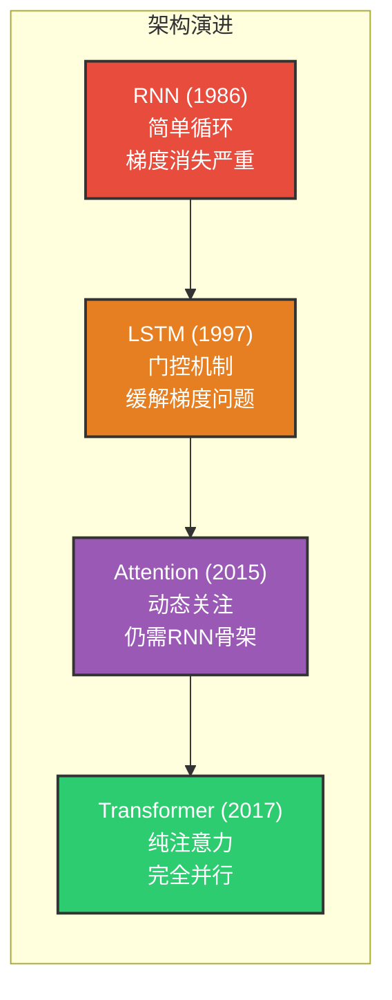

### 6.1.2 Transformer的核心创新

**三大核心创新：**

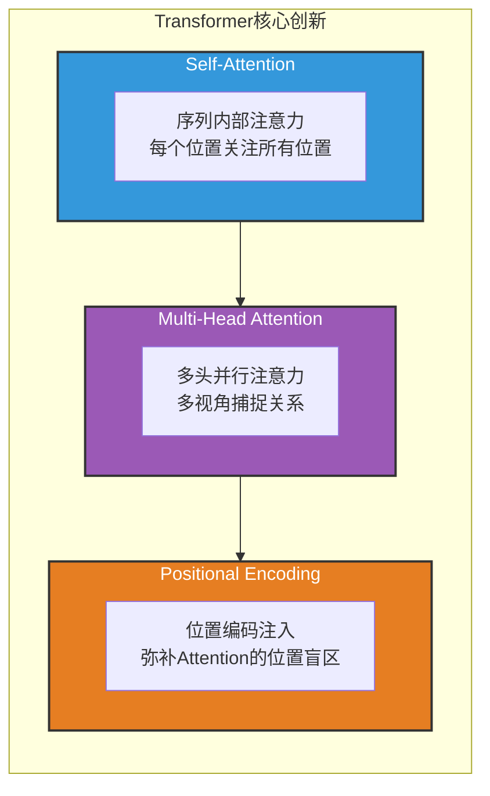

**1. Self-Attention（自注意力）**

- 让序列中的每个位置都能直接关注其他所有位置
- 计算任意两个位置的相关性只需一步，路径长度 $O(1)$

**2. Multi-Head Attention（多头注意力）**

- 使用多组独立的注意力参数
- 不同头学习不同类型的关系（语法、语义、指代等）

**3. Positional Encoding（位置编码）**

- Attention本身是位置无关的，需要显式注入位置信息
- 使用正弦/余弦函数编码绝对位置，支持外推到更长序列

### 6.1.3 发展历程与影响

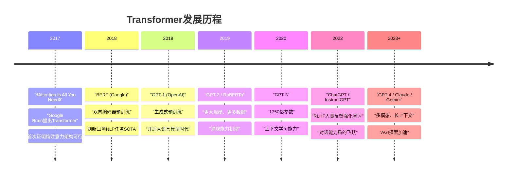

**Transformer的统治地位：**

| 领域 | 代表模型 | 架构基础 |
|------|---------|---------|
| **自然语言处理** | BERT, GPT, T5 | Transformer Encoder/Decoder |
| **计算机视觉** | ViT, DETR, SAM | Vision Transformer |
| **语音处理** | Whisper, Wav2Vec 2.0 | Transformer |
| **多模态** | CLIP, DALL-E, GPT-4V | Transformer |
| **科学计算** | AlphaFold 2, Graphormer | Transformer |

### 6.1.4 应用场景

**核心优势场景：**

1. **机器翻译**：Transformer最初就是为翻译任务设计
2. **文本生成**：GPT系列在生成任务上表现卓越
3. **文本理解**：BERT系列在理解任务上领先
4. **多模态融合**：统一的注意力机制处理不同模态

---

## 6.2 模型结构详解

### 6.2.1 核心思想

**从RNN到Attention的演进：**

Transformer的核心洞察是：**完全基于注意力机制，摒弃循环结构**。这一思想的形成经历了以下演进：

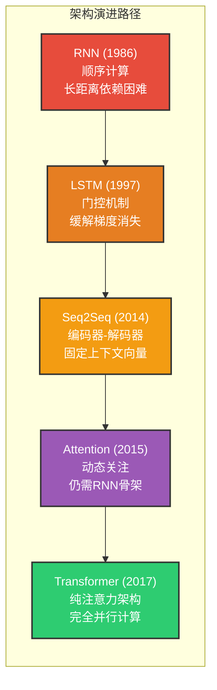

**三大核心设计思想：**

| 设计思想 | 解决的问题 | 实现方式 |
|---------|-----------|---------|
| **Self-Attention** | 长距离依赖、并行计算 | 每个位置直接关注所有位置 |
| **Multi-Head Attention** | 单一视角局限 | 多组独立注意力并行 |
| **Positional Encoding** | Attention的位置无关性 | 显式注入位置信息 |

**设计哲学：**

```
传统RNN: "我一步一步地读，记住重要的"
          ↓
Attention: "我一次性读完，重点标记重要的"
          ↓
Transformer: "我让所有词互相交流，找出关系"
```

### 6.2.2 整体结构

**宏观架构：**

Transformer采用经典的**编码器-解码器**架构，但内部完全由注意力机制和前馈网络组成：

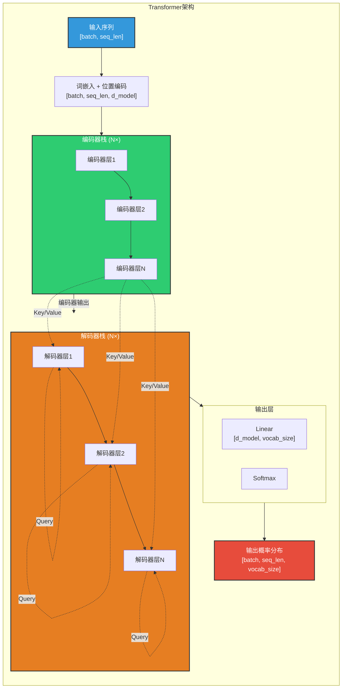

**架构参数（原论文配置）：**

| 参数 | 值 | 说明 |
|------|-----|------|
| $d_{model}$ | 512 | 模型维度/嵌入维度 |
| $d_{ff}$ | 2048 | 前馈网络隐藏层维度 |
| $h$ | 8 | 注意力头数 |
| $d_k = d_v$ | 64 | 每个头的维度 ($512/8$) |
| $N$ | 6 | 编码器/解码器层数 |
| $P_{dropout}$ | 0.1 | Dropout概率 |

**数据流概览：**

```
输入序列
    ↓
[词嵌入 + 位置编码] ───────────────────────┐
    ↓                                       │
[编码器层1] ──→ [编码器层2] ──→ ... ──→ [编码器层N]
    ↓                                       │
编码器输出 ────────────────────────────────┤
    ↓                                       │
[解码器层1] ──→ [解码器层2] ──→ ... ──→ [解码器层N]
    ↓                                       │
[输出层]                                    │
    ↓                                       │
输出概率 ←──────────────────────────────────┘
```

### 6.2.3 编码器

#### 6.2.3.1 概述

**编码器的定位：**

编码器是Transformer架构的**左半部分**，负责将输入序列转换为连续的上下文表示。与RNN的顺序处理不同，编码器可以**并行处理整个输入序列**。

**整体结构：**

编码器由**N个相同的编码器层**堆叠而成（原论文中N=6），每个编码器层包含两个子层：

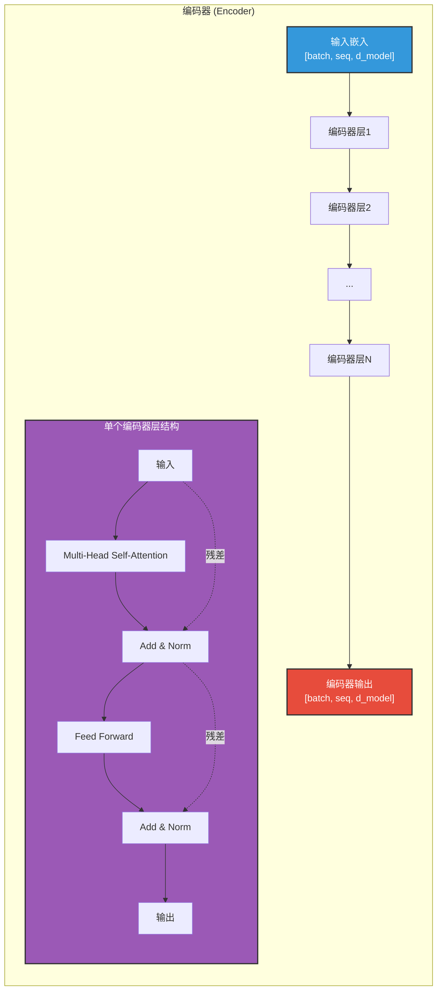

**编码器层的两个子层：**

| 子层 | 功能 | 输入 | 输出 |
|------|------|------|------|
| **Multi-Head Self-Attention** | 让序列中每个位置关注其他所有位置 | $X \in \mathbb{R}^{batch \times seq \times d_{model}}$ | $AttnOutput \in \mathbb{R}^{batch \times seq \times d_{model}}$ |
| **Position-wise Feed-Forward** | 对每个位置独立进行非线性变换 | $X \in \mathbb{R}^{batch \times seq \times d_{model}}$ | $FFNOutput \in \mathbb{R}^{batch \times seq \times d_{model}}$ |

**每个子层的处理流程：**

$$
Output = LayerNorm(x + Dropout(Sublayer(x)))
$$

其中 $Sublayer$ 是Self-Attention或Feed-Forward。

#### 6.2.3.2 自注意力层

**核心思想：**

让序列中的每个位置都能**直接**关注序列中的所有位置，计算它们之间的相关性。这是Transformer能够捕获长距离依赖的关键。

**Encoder Layer数据流（类似您提供的图片风格）：**

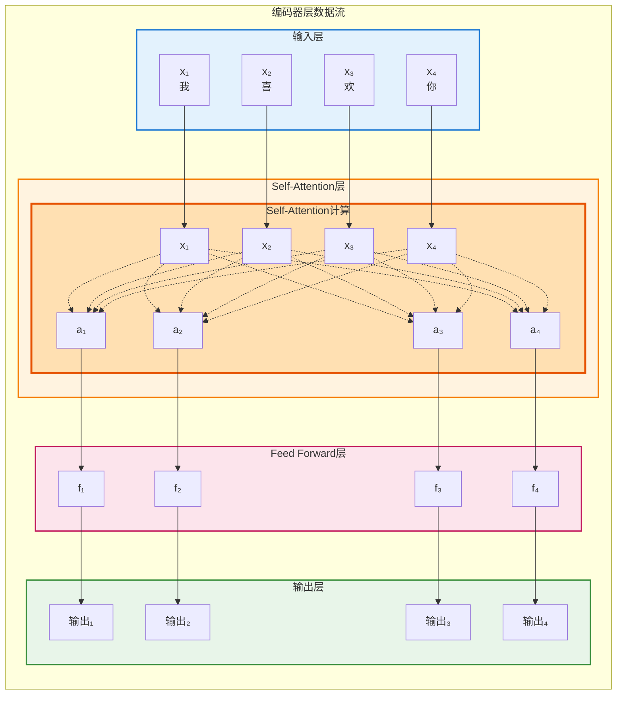

**上图说明：**
- **输入层**：词嵌入向量 $x_1, x_2, x_3, x_4$（对应"我喜欢你"）
- **Self-Attention层**：每个位置的Query与所有位置的Key计算注意力（全连接）
- **Feed Forward层**：对每个位置独立进行非线性变换
- **输出层**：编码器层的最终输出

**Self-Attention的全连接特性：**

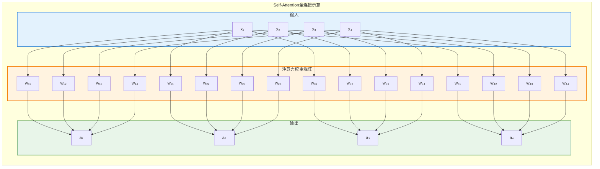

**Q/K/V生成可视化：**

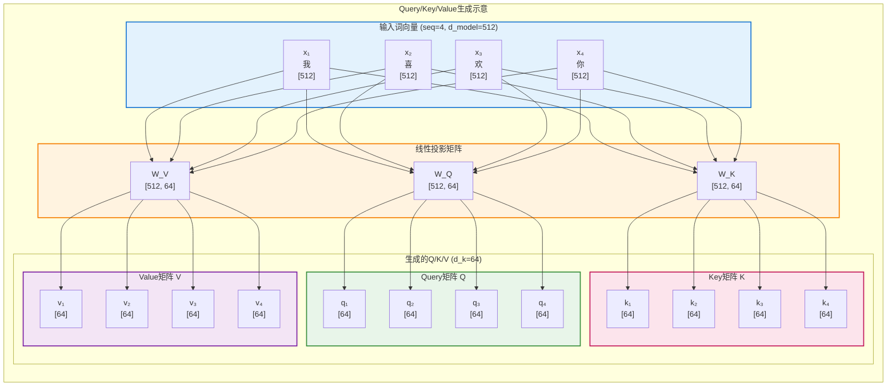

**Q/K/V的直观理解：**

```
比喻：在图书馆找书

Query (查询):  "我想找关于深度学习的书"
              ↓
Key (索引):     每本书的标签和简介
              ↓
Value (内容):   书的实际内容

计算过程:
  1. 你的Query和所有书的Key比较相似度
  2. 相似度高的书获得更高的注意力权重
  3. 根据权重加权组合这些书的Value
  4. 得到与你查询最相关的信息

在NLP中:
  Query: 当前词想"问"什么信息
  Key:   每个词能"回答"什么信息
  Value: 每个词实际携带的信息
```

**计算流程：**

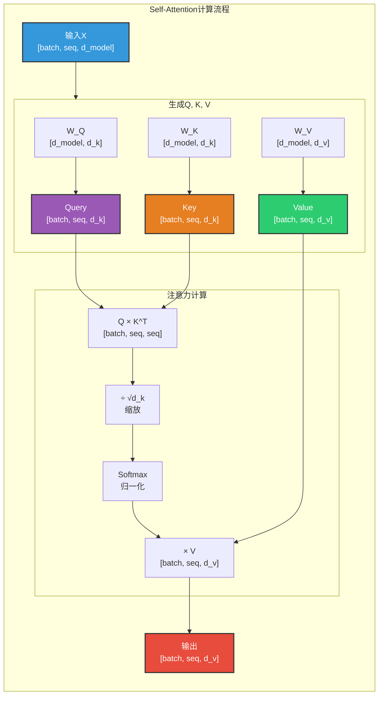

**数学公式：**

$$
Attention(Q, K, V) = softmax(\frac{QK^T}{\sqrt{d_k}})V
$$

**图文对应：Self-Attention矩阵计算过程**

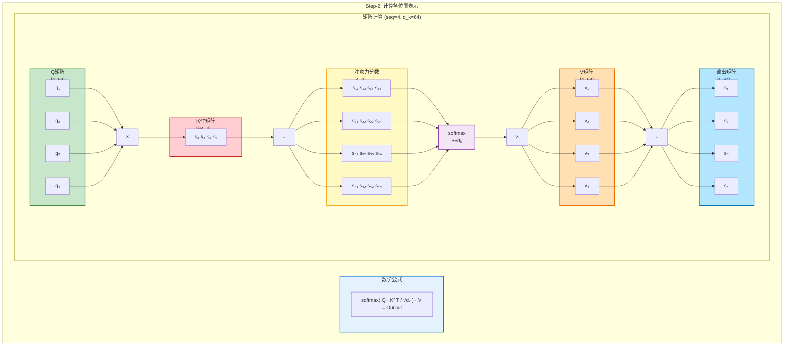

**矩阵计算步骤详解：**

```
步骤1: Q × K^T  (计算注意力分数)
       [4, 64] × [64, 4] = [4, 4]
       
       每个位置的Query与所有位置的Key计算点积
       得到注意力分数矩阵（相似度矩阵）

步骤2: ÷ √d_k  (缩放)
       防止点积值过大导致softmax饱和
       d_k=64, √d_k=8

步骤3: softmax  (归一化)
       将分数转换为概率分布（每行和为1）
       得到注意力权重矩阵

步骤4: × V  (加权求和)
       [4, 4] × [4, 64] = [4, 64]
       用注意力权重对Value进行加权求和
       得到最终的Self-Attention输出
```

**为什么要除以 $\sqrt{d_k}$？**

```
问题：当d_k较大时，Q·K^T的点积值会很大
      导致softmax梯度消失（饱和区）
      
解决方案：除以√d_k进行缩放

示例：
  d_k = 64, √d_k = 8
  
  原始分数: [80, 70, 60, 50]  -> softmax -> [0.999, 0.001, ~0, ~0]
  缩放后:   [10, 8.75, 7.5, 6.25] -> softmax -> [0.6, 0.25, 0.1, 0.05]
  
  缩放后的分布更平滑，梯度更大
```

**Multi-Head Attention：**

使用多组独立的注意力参数，让模型从不同的"视角"捕捉信息。

**Multi-Head分割可视化：**

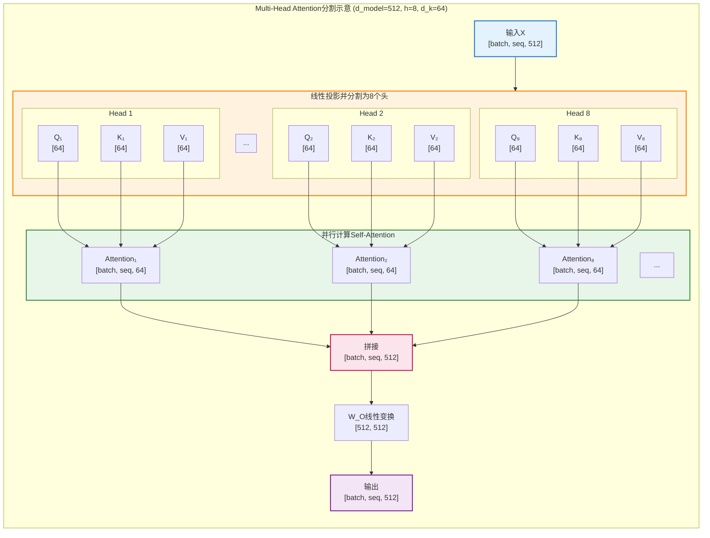

**张量分割示意：**

```
输入X: [batch, seq, 512]
          ↓ 线性投影并分割
┌─────────────────────────────────────────────────────────┐
│  Head 1  │  Head 2  │  Head 3  │ ... │  Head 8         │
│  [0:64]  │ [64:128] │[128:192] │ ... │ [448:512]       │
├─────────────────────────────────────────────────────────┤
│  Q₁,K₁,V₁│  Q₂,K₂,V₂│  Q₃,K₃,V₃│ ... │  Q₈,K₈,V₈       │
│  [64dim] │  [64dim] │  [64dim] │ ... │  [64dim]        │
└─────────────────────────────────────────────────────────┘
          ↓ 并行计算Attention
┌─────────────────────────────────────────────────────────┐
│  Output₁ │  Output₂ │  Output₃ │ ... │  Output₈        │
│  [64dim] │  [64dim] │  [64dim] │ ... │  [64dim]        │
└─────────────────────────────────────────────────────────┘
          ↓ 拼接
Concat: [batch, seq, 512]
          ↓ W_O线性变换
输出: [batch, seq, 512]
```

**标准流程图：**

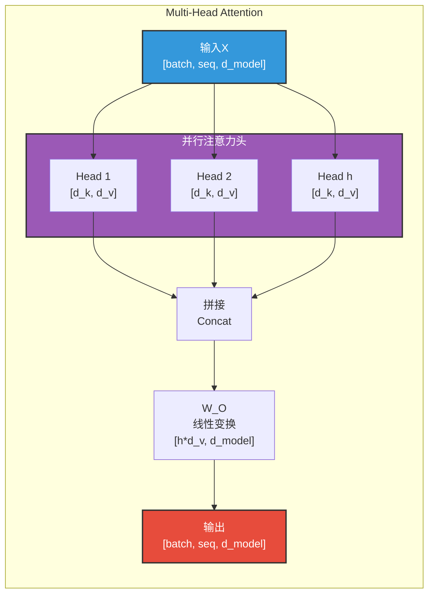

**不同头的分工（直观理解）：**

```
输入: "The cat sat on the mat"

Head 1 (语法关系):
  The -> cat (det -> noun)
  cat -> sat (nsubj -> verb)
  sat -> on (verb -> prep)
  
Head 2 (指代关系):
  The -> cat (共现)
  cat -> mat (空间关系)
  
Head 3 (语义相似):
  cat <-> mat (都是名词)
  sat <-> on (都是动词/介词)
  
Head 4 (位置邻近):
  The <-> cat (相邻)
  on <-> the <-> mat (相邻)
```

#### 6.2.3.3 前馈神经网络层

**结构：**

每个编码器层包含一个全连接前馈网络（FFN）：

$$
FFN(x) = max(0, xW_1 + b_1)W_2 + b_2
$$

**特点：**

| 特性 | 说明 |
|------|------|
| **位置独立** | 对每个位置单独应用相同的网络 |
| **维度变化** | $d_{model} \rightarrow d_{ff} \rightarrow d_{model}$ |
| **ReLU激活** | 引入非线性，增强表达能力 |

**张量形状变化：**

```
输入:  [batch, seq, d_model]
        ↓ Linear + ReLU
隐藏:  [batch, seq, d_ff]  (d_ff = 2048)
        ↓ Linear
输出:  [batch, seq, d_model]
```

**图文对应：FFN矩阵计算过程**

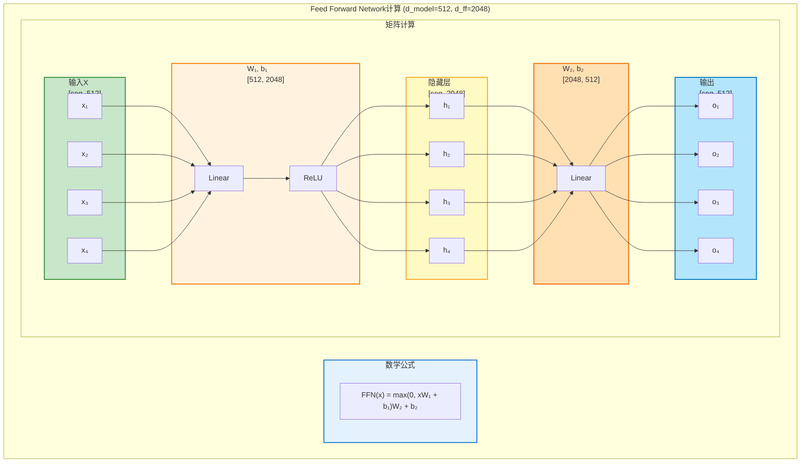

**FFN计算步骤详解：**

```
步骤1: x · W₁ + b₁  (第一个线性变换)
       [seq, 512] × [512, 2048] = [seq, 2048]
       将维度从512扩展到2048

步骤2: max(0, ...)  (ReLU激活)
       引入非线性，过滤负值

步骤3: · W₂ + b₂  (第二个线性变换)
       [seq, 2048] × [2048, 512] = [seq, 512]
       将维度从2048压缩回512

特点:
  - 位置独立: 每个位置的FFN参数相同
  - 先扩后缩: 512 → 2048 → 512
  - 非线性: ReLU激活增强表达能力
```

**作用：**

- 在Attention捕捉全局依赖后，FFN对每个位置进行独立的非线性变换
- 增加模型的表达能力，相当于对每个位置进行"特征提炼"

#### 6.2.3.4 残差连接与层归一化

**残差连接（Residual Connection）：**

解决深层网络的梯度消失问题，使网络可以训练得更深：

$$
Output = x + Sublayer(x)
$$

**层归一化（Layer Normalization）：**

对每个样本的所有特征进行归一化，稳定训练：

$$
LayerNorm(x) = \gamma \odot \frac{x - \mu}{\sqrt{\sigma^2 + \epsilon}} + \beta
$$

其中：
- $\mu, \sigma$：当前层的均值和标准差
- $\gamma, \beta$：可学习的缩放和平移参数
- $\epsilon$：数值稳定性常数

**为什么用LayerNorm而不是BatchNorm？**

```
BatchNorm:
  - 对一个batch中所有样本的同一特征归一化
  - 问题：序列长度不同时，统计量不稳定
  - 不适合变长序列
  
LayerNorm:
  - 对每个样本的所有特征归一化
  - 优势：与batch大小和序列长度无关
  - 更适合NLP任务
```

**残差连接数据流可视化：**

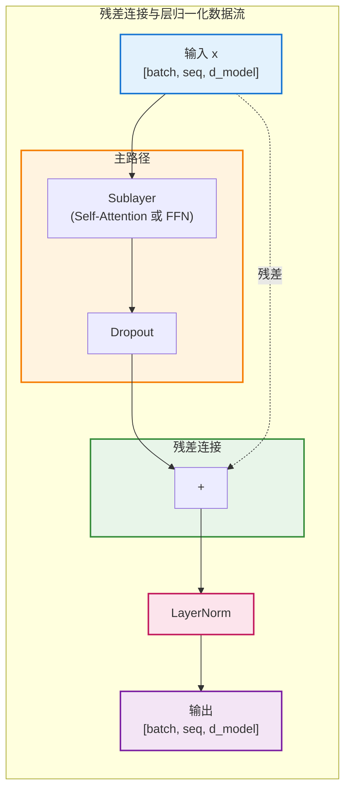

**为什么残差连接有效？**

```
没有残差连接时：
  梯度需要经过: x → Sublayer → ... → Loss
  深层网络梯度会消失

有残差连接时：
  梯度可以直接回传: Output → x (跳过Sublayer)
  相当于多了一条"高速公路"

数学表达：
  Output = LayerNorm(x + Sublayer(x))
  
  反向传播时：
  ∂Loss/∂x = ∂Loss/∂Output · (1 + ∂Sublayer/∂x)
  
  即使∂Sublayer/∂x很小，梯度也不会完全消失
```

**完整的子层处理流程：**

```
输入 x
    ↓
[Self-Attention] 或 [Feed-Forward]
    ↓
Dropout（正则化）
    ↓
残差连接: x + Dropout(Sublayer(x))
    ↓
LayerNorm
    ↓
输出
```

#### 6.2.3.5 位置编码

**为什么需要位置编码？**

Self-Attention是**位置无关**的（permutation invariant），如果不注入位置信息：

```
"我 喜欢 你" 和 "你 喜欢 我" 会产生相同的注意力权重分布
```

**位置编码公式：**

$$
PE_{(pos, 2i)} = \sin(pos / 10000^{2i/d_{model}}) \\
PE_{(pos, 2i+1)} = \cos(pos / 10000^{2i/d_{model}})
$$

**图文对应：位置编码计算过程**

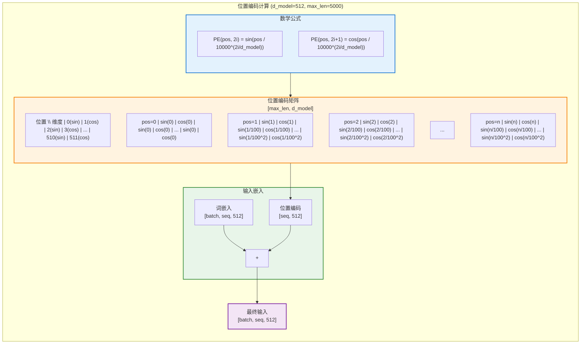

**位置编码计算步骤详解：**

```
步骤1: 确定位置pos和维度i
       pos ∈ [0, max_len-1], i ∈ [0, d_model-1]

步骤2: 计算角度
       angle = pos / 10000^(2i/d_model)
       
       不同维度使用不同频率:
       - i=0:   wavelength = 2π·10000^0 = 2π
       - i=2:   wavelength = 2π·10000^(2/512) ≈ 2π·1.04
       - i=512: wavelength = 2π·10000^(512/512) = 2π·10000

步骤3: 计算编码值
       - 偶数维度(2i):   sin(angle)
       - 奇数维度(2i+1): cos(angle)

步骤4: 与词嵌入相加
       Input = Embedding + PositionalEncoding
```

**直观理解：**

```
位置编码矩阵示例 (d_model=4):

位置  维度0      维度1      维度2      维度3
  0   sin(0)    cos(0)    sin(0)    cos(0)
  1   sin(1)    cos(1)    sin(0.01) cos(0.01)
  2   sin(2)    cos(2)    sin(0.02) cos(0.02)
  ...
  
特点：
- 每个位置有唯一的编码
- 编码值在[-1, 1]之间
- 不同维度使用不同频率（波长从2π到10000·2π）
- 支持外推到未见过的长度
```

**输入处理流程：**

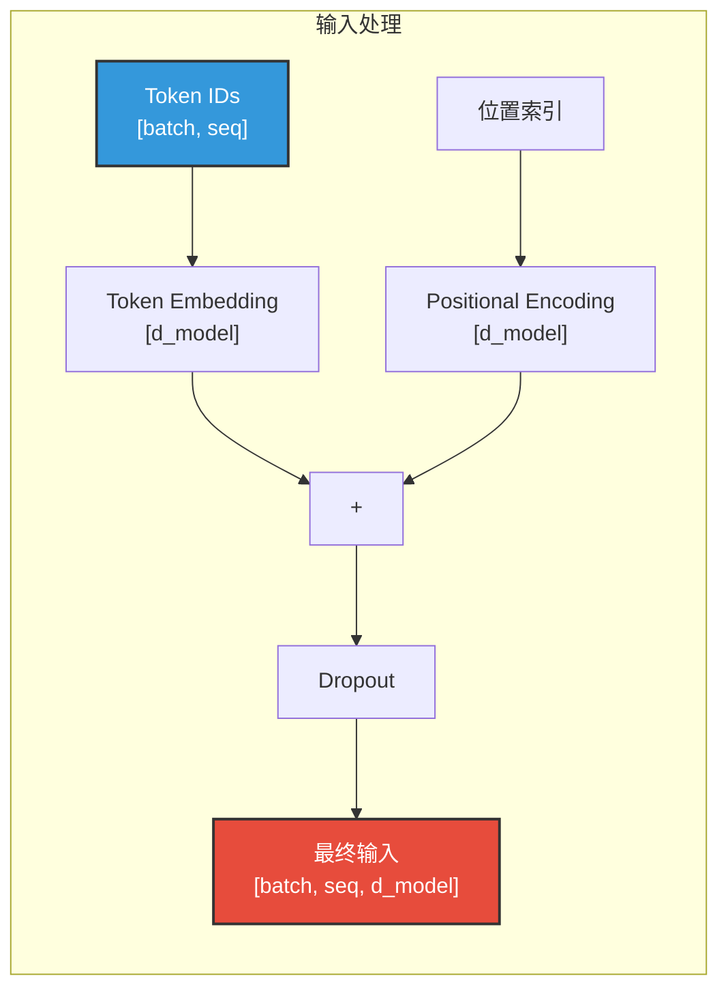

**使用正弦函数的原因：**

1. **唯一性**：每个位置有唯一编码
2. **相对位置**：$PE_{pos+k}$ 可以通过 $PE_{pos}$ 线性表示
3. **有界性**：值域在[-1, 1]之间，不会破坏嵌入的数值范围
4. **外推性**：可以处理训练时未见过的长度

#### 6.2.3.6 小结

**编码器的核心设计：**

| 组件 | 功能 | 关键特性 |
|------|------|---------|
| **Self-Attention** | 全局依赖建模 | 并行计算，O(1)路径长度 |
| **Multi-Head** | 多视角信息捕捉 | 8个独立注意力头 |
| **FFN** | 非线性特征变换 | 位置独立，维度先扩后缩 |
| **残差连接** | 缓解梯度消失 | 支持深层网络训练 |
| **LayerNorm** | 训练稳定性 | 样本级归一化 |
| **位置编码** | 注入位置信息 | 正弦编码，支持外推 |

**编码器的优势：**

```
vs RNN:
  ✓ 完全并行计算
  ✓ 长距离依赖O(1)路径长度
  ✓ 易于训练深层网络

vs CNN:
  ✓ 全局感受野
  ✓ 不需要多层堆叠扩大感受野
  ✓ 更好的长距离建模能力
```

**代码实现：**

```python
# 待补充代码（请从本地代码库 translation_transformer/src/model.py 中截取）
# 参考实现：EncoderLayer类
```

### 6.2.4 解码器

#### 6.2.4.1 概述

**解码器的定位：**

解码器是Transformer架构的**右半部分**，负责根据编码器的输出和已生成的目标语言序列，**自回归地生成**翻译结果。与编码器相比，解码器有两个关键区别：

1. **Masked Self-Attention**：防止看到未来的信息
2. **Cross-Attention**：关注编码器的输出

**整体结构：**

解码器同样由**N个相同的解码器层**堆叠而成（原论文中N=6），但每个解码器层包含**三个子层**：

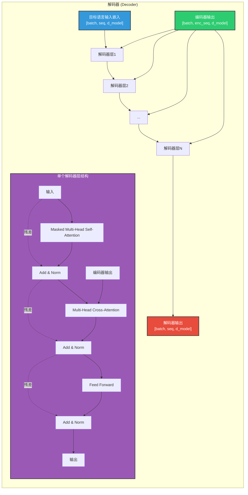

**解码器层的三个子层：**

| 子层 | 功能 | Query来源 | Key/Value来源 |
|------|------|----------|--------------|
| **Masked Self-Attention** | 解码器内部信息交互（带掩码） | 解码器输入 | 解码器输入 |
| **Cross-Attention** | 关注编码器输出 | 解码器输出 | 编码器输出 |
| **Position-wise Feed-Forward** | 非线性变换 | - | - |

**三种注意力的对比：**

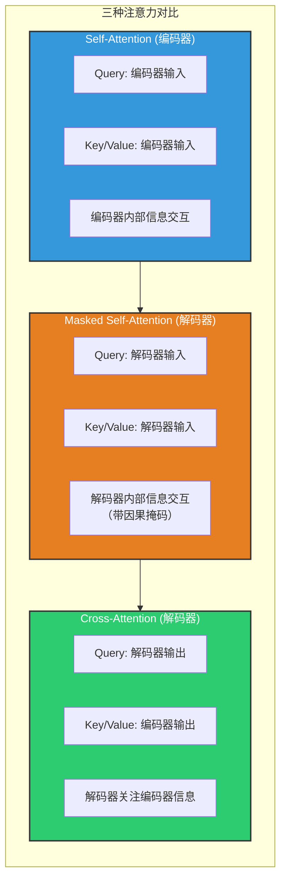

#### 6.2.4.2 Masked 自注意力子层

**核心思想：**

Masked Self-Attention与标准Self-Attention的区别在于**引入了因果掩码（Causal Mask）**，防止解码器在生成第i个词时看到第i+1及之后的词。

**为什么需要掩码？**

```
问题：在训练时，解码器是一次性输入整个目标序列的
      如果不加掩码，每个位置都能看到所有位置的信息
      这会导致信息泄露（看到未来的答案）

示例：翻译 "I like NLP"
  不加掩码时，预测"like"时可以看到"NLP"
  这相当于考试作弊，模型学不到真正的能力

解决方案：使用下三角掩码矩阵
  每个位置只能看到自己和之前的位置
```

**Masked Self-Attention计算过程（图文对应）：**

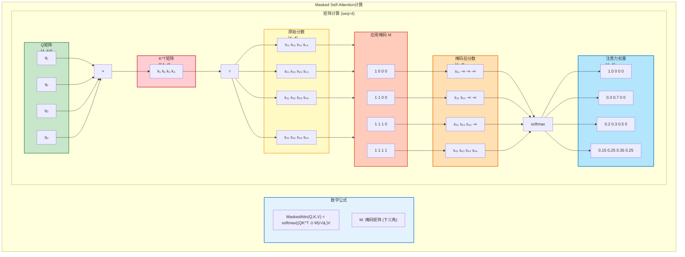

**掩码矩阵详解：**

```
原始注意力分数矩阵 (未归一化):
        pos1    pos2    pos3    pos4
pos1   [8.5    2.3    1.2    0.5  ]
pos2   [3.2    7.8    2.1    1.0  ]
pos3   [2.0    3.5    6.5    2.2  ]
pos4   [1.5    2.0    3.0    5.5  ]

下三角掩码矩阵 M:
        pos1    pos2    pos3    pos4
pos1   [1      0      0      0    ]  <- pos1只能看自己
pos2   [1      1      0      0    ]  <- pos2能看pos1,pos2
pos3   [1      1      1      0    ]  <- pos3能看pos1-3
pos4   [1      1      1      1    ]  <- pos4能看全部

应用掩码 (将0位置设为-∞):
        pos1    pos2    pos3    pos4
pos1   [8.5    -∞     -∞     -∞   ]
pos2   [3.2    7.8    -∞     -∞   ]
pos3   [2.0    3.5    6.5    -∞   ]
pos4   [1.5    2.0    3.0    5.5  ]

Softmax后 (每行和为1):
        pos1    pos2    pos3    pos4
pos1   [1.0    0      0      0    ]  <- pos1只看自己
pos2   [0.01   0.99   0      0    ]  <- pos2主要关注自己和pos1
pos3   [0.02   0.08   0.90   0    ]  <- pos3主要关注自己和前面位置
pos4   [0.03   0.05   0.12   0.80 ]  <- pos4关注所有位置
```

**Masked Self-Attention vs 标准Self-Attention：**

| 特性 | 标准Self-Attention | Masked Self-Attention |
|------|-------------------|----------------------|
| **注意力范围** | 所有位置 | 当前位置及之前的位置 |
| **掩码矩阵** | 全1矩阵 | 下三角矩阵 |
| **应用场景** | 编码器 | 解码器 |
| **并行性** | 完全并行 | 训练时并行，推理时自回归 |

#### 6.2.4.3 编码器-解码器注意力子层

**核心思想：**

Cross-Attention（交叉注意力）让解码器能够**关注编码器的输出**，从而将源语言的信息引入到目标语言的生成过程中。

**Cross-Attention计算过程（图文对应）：**

```mermaid
flowchart LR
    subgraph CrossAttnCalc["Cross-Attention计算"]
        direction LR
        
        %% 公式展示
        subgraph Formula["数学公式"]
            direction TB
            F1["CrossAttn(Q,K,V) = softmax(QK^T/√dₖ)V"]
            F2["Q: 来自解码器, K/V: 来自编码器"]
        end
        
        %% 矩阵计算可视化
        subgraph Matrices["矩阵计算 (dec_seq=4, enc_seq=6)"]
            direction LR
            
            %% Q矩阵（来自解码器）
            subgraph QMatrix["Q矩阵 (解码器)<br/>[4, 64]"]
                direction TB
                Q1["q₁"] 
                Q2["q₂"] 
                Q3["q₃"] 
                Q4["q₄"]
            end
            
            %% 乘号
            Times1["×"]
            
            %% K^T矩阵（来自编码器）
            subgraph KMatrix["K^T矩阵 (编码器)<br/>[64, 6]"]
                direction LR
                KRow["k₁ k₂ k₃ k₄ k₅ k₆"]
            end
            
            %% 等于
            Equal1["="]
            
            %% 交叉注意力分数矩阵
            subgraph ScoreMatrix["交叉注意力分数<br/>[4, 6]"]
                direction TB
                S1["s₁₁ s₁₂ s₁₃ s₁₄ s₁₅ s₁₆"] 
                S2["s₂₁ s₂₂ s₂₃ s₂₄ s₂₅ s₂₆"] 
                S3["s₃₁ s₃₂ s₃₃ s₃₄ s₃₅ s₃₆"] 
                S4["s₄₁ s₄₂ s₄₃ s₄₄ s₄₅ s₄₆"]
            end
            
            %% Softmax
            SoftmaxOp["softmax<br/>÷√dₖ"]
            
            %% 注意力权重
            subgraph WeightMatrix["注意力权重<br/>[4, 6]"]
                direction TB
                W1["0.5  0.3  0.1  0.05 0.03 0.02"] 
                W2["0.1  0.2  0.4  0.2  0.07 0.03"] 
                W3["0.05 0.1  0.15 0.3  0.3  0.1 "] 
                W4["0.02 0.05 0.08 0.15 0.4  0.3 "]
            end
            
            %% 乘号2
            Times2["×"]
            
            %% V矩阵（来自编码器）
            subgraph VMatrix["V矩阵 (编码器)<br/>[6, 64]"]
                direction TB
                V1["v₁"] 
                V2["v₂"] 
                V3["v₃"] 
                V4["v₄"] 
                V5["v₅"] 
                V6["v₆"]
            end
            
            %% 等于2
            Equal2["="]
            
            %% 输出矩阵
            subgraph OutputMatrix["输出 (解码器)<br/>[4, 64]"]
                direction TB
                O1["o₁"] 
                O2["o₂"] 
                O3["o₃"] 
                O4["o₄"]
            end
        end
        
        %% 连接
        Q1 & Q2 & Q3 & Q4 --> Times1
        Times1 --> KRow
        KRow --> Equal1
        Equal1 --> S1 & S2 & S3 & S4
        S1 & S2 & S3 & S4 --> SoftmaxOp
        SoftmaxOp --> W1 & W2 & W3 & W4
        W1 & W2 & W3 & W4 --> Times2
        Times2 --> V1 & V2 & V3 & V4 & V5 & V6
        V1 & V2 & V3 & V4 & V5 & V6 --> Equal2
        Equal2 --> O1 & O2 & O3 & O4
    end
    
    style Formula fill:#e3f2fd,stroke:#1976d2,stroke-width:2px
    style QMatrix fill:#c8e6c9,stroke:#388e3c,stroke-width:2px
    style KMatrix fill:#ffcdd2,stroke:#c62828,stroke-width:2px
    style ScoreMatrix fill:#fff9c4,stroke:#f9a825,stroke-width:2px
    style WeightMatrix fill:#ffe0b2,stroke:#ef6c00,stroke-width:2px
    style VMatrix fill:#f8bbd0,stroke:#c2185b,stroke-width:2px
    style OutputMatrix fill:#b3e5fc,stroke:#0277bd,stroke-width:2px
```

**Cross-Attention的直观理解：**

```
比喻：翻译官听演讲并实时翻译

场景：中文演讲 -> 英文翻译

编码器（听演讲）:
  将中文句子编码为上下文表示
  "自然语言处理很有趣"
  ↓
  [编码器输出: 6个位置的向量表示]

解码器（翻译）:
  生成"Natural language processing is fun"
  
  生成"Natural"时:
    Query: "我要翻译第一个词"
    关注编码器的所有位置
    发现与"自然"最相关
    
  生成"language"时:
    Query: "我要翻译第二个词"
    关注编码器的所有位置
    发现与"语言"最相关
    
  生成"processing"时:
    Query: "我要翻译第三个词"
    关注编码器的所有位置
    发现与"处理"最相关
```

**Cross-Attention vs Self-Attention：**

| 特性 | Self-Attention | Cross-Attention |
|------|---------------|-----------------|
| **Q来源** | 同一序列 | 解码器输出 |
| **K/V来源** | 同一序列 | 编码器输出 |
| **矩阵形状** | [seq, seq] | [dec_seq, enc_seq] |
| **作用** | 序列内部信息交互 | 两个序列间的信息对齐 |
| **应用** | 编码器、解码器 | 仅解码器 |

**解码器的工作流程：**

```
训练阶段（并行）:
输入: [<sos>, "I", "like", "NLP", <eos>]
        ↓
[Masked Self-Attention]  每个位置只能看到自己和之前的位置
        ↓
[Cross-Attention]        查询编码器输出的所有位置
        ↓
[Feed Forward]
        ↓
输出: 预测每个位置的下一个词

推理阶段（自回归）:
时间步1: 输入[<sos>] -> 预测"I"
时间步2: 输入[<sos>, "I"] -> 预测"like"
时间步3: 输入[<sos>, "I", "like"] -> 预测"NLP"
时间步4: 输入[<sos>, "I", "like", "NLP"] -> 预测<eos>
```

#### 6.2.4.4 小结

**解码器的核心设计：**

| 组件 | 功能 | 关键特性 |
|------|------|---------|
| **Masked Self-Attention** | 防止信息泄露 | 下三角掩码，因果约束 |
| **Cross-Attention** | 对齐源目标语言 | Q来自解码器，K/V来自编码器 |
| **Feed Forward** | 非线性变换 | 与编码器相同 |
| **残差连接+LayerNorm** | 训练稳定性 | 与编码器相同 |

**三种注意力的完整对比：**

| 注意力类型 | Query来源 | Key/Value来源 | 掩码 | 作用 |
|-----------|----------|--------------|------|------|
| **Self-Attention** | 编码器输入 | 编码器输入 | 无 | 编码器内部信息交互 |
| **Masked Self-Attention** | 解码器输入 | 解码器输入 | 下三角 | 解码器内部信息交互 |
| **Cross-Attention** | 解码器输出 | 编码器输出 | 无 | 源目标语言对齐 |

**解码器的优势：**

```
vs 传统Seq2Seq:
  ✓ 完全并行训练（除自回归推理）
  ✓ 长距离依赖建模能力强
  ✓ 通过Cross-Attention精确对齐源目标语言
  ✓ 多头注意力捕捉多种对齐关系
```

**代码实现：**

```python
# 待补充代码（请从本地代码库 translation_transformer/src/model.py 中截取）
# 参考实现：DecoderLayer类
```

解码器比编码器多一个**Cross-Attention**子层，用于关注编码器输出。

```mermaid
flowchart TB
    subgraph DecoderLayer["解码器层"]
        direction TB
        
        Input["解码器输入<br/>[batch, seq, d_model]"]
        EncoderOutput["编码器输出<br/>[batch, enc_seq, d_model]"]
        
        subgraph SubLayer1["子层1: Masked Self-Attention"]
            MaskedMH["Masked Multi-Head Attention"]
            Dropout1["Dropout"]
            AddNorm1["Add & Norm"]
        end
        
        subgraph SubLayer2["子层2: Cross-Attention"]
            CrossMH["Cross Multi-Head Attention"]
            Dropout2["Dropout"]
            AddNorm2["Add & Norm"]
        end
        
        subgraph SubLayer3["子层3: Feed Forward"]
            FF["Feed Forward"]
            Dropout3["Dropout"]
            AddNorm3["Add & Norm"]
        end
        
        Output["输出<br/>[batch, seq, d_model]"]
        
        Input --> MaskedMH --> Dropout1 --> AddNorm1
        Input -.->|残差| AddNorm1
        
        AddNorm1 --> CrossMH
        EncoderOutput -->|Key/Value| CrossMH
        CrossMH --> Dropout2 --> AddNorm2
        AddNorm1 -.->|残差| AddNorm2
        
        AddNorm2 --> FF --> Dropout3 --> AddNorm3
        AddNorm2 -.->|残差| AddNorm3
        AddNorm3 --> Output
    end
    
    style Input fill:#3498db,stroke:#333,stroke-width:2px,color:#fff
    style EncoderOutput fill:#2ecc71,stroke:#333,stroke-width:2px,color:#fff
    style MaskedMH fill:#9b59b6,stroke:#333,stroke-width:2px,color:#fff
    style CrossMH fill:#e67e22,stroke:#333,stroke-width:2px,color:#fff
    style Output fill:#e74c3c,stroke:#333,stroke-width:2px,color:#fff
```

**三种注意力的区别：**

| 注意力类型 | Query来源 | Key/Value来源 | 作用 |
|-----------|----------|--------------|------|
| **Self-Attention** | 编码器输入 | 编码器输入 | 编码器内部信息交互 |
| **Masked Self-Attention** | 解码器输入 | 解码器输入 | 解码器内部信息交互（带掩码） |
| **Cross-Attention** | 解码器输出 | 编码器输出 | 解码器关注编码器信息 |

**Masked Self-Attention原理：**

```
目标：防止解码器在生成第i个词时看到第i+1及之后的词

原始注意力矩阵 (seq_len=4):
        pos1  pos2  pos3  pos4
pos1   [0.4   0.3   0.2   0.1 ]
pos2   [0.3   0.4   0.2   0.1 ]
pos3   [0.2   0.3   0.3   0.2 ]
pos4   [0.1   0.2   0.3   0.4 ]

掩码矩阵:
        pos1  pos2  pos3  pos4
pos1   [1     0     0     0   ]  <- 只能看自己
pos2   [1     1     0     0   ]  <- 能看pos1, pos2
pos3   [1     1     1     0   ]  <- 能看pos1-3
pos4   [1     1     1     1   ]  <- 能看全部

掩码后 (softmax前设-inf):
        pos1  pos2  pos3  pos4
pos1   [0.4   -inf  -inf  -inf ] -> [1     0     0     0   ]
pos2   [0.3   0.4   -inf  -inf ] -> [0.43  0.57  0     0   ]
pos3   [0.2   0.3   0.3   -inf ] -> [0.27  0.36  0.36  0   ]
pos4   [0.1   0.2   0.3   0.4 ] -> [0.17  0.24  0.31  0.28]
```

**代码实现：**

```python
# 待补充代码（请从本地代码库 translation_transformer/src/model.py 中截取）
# 参考实现：DecoderLayer类
```

### 6.2.9 完整模型结构

**Transformer模型组装：**

```mermaid
flowchart TB
    subgraph TransformerModel["Transformer模型"]
        direction TB
        
        subgraph InputEmbed["输入嵌入"]
            TokenEmbed["Token Embedding"]
            PosEmbed["Positional Encoding"]
            Add["+"]
            Dropout["Dropout"]
        end
        
        subgraph Encoder["编码器 (N×)"]
            EncLayer["EncoderLayer × N"]
        end
        
        subgraph Decoder["解码器 (N×)"]
            DecLayer["DecoderLayer × N"]
        end
        
        subgraph Output["输出层"]
            Linear["Linear"]
            Softmax["Softmax"]
        end
        
        SrcInput["源语言输入"] --> TokenEmbed
        TokenEmbed --> Add
        PosEmbed --> Add
        Add --> Dropout --> EncLayer
        
        TgtInput["目标语言输入"] -->|嵌入| DecLayer
        EncLayer -->|编码器输出| DecLayer
        
        DecLayer --> Linear --> Softmax --> Result["输出概率"]
    end
    
    style SrcInput fill:#3498db,stroke:#333,stroke-width:2px,color:#fff
    style TgtInput fill:#9b59b6,stroke:#333,stroke-width:2px,color:#fff
    style Result fill:#e74c3c,stroke:#333,stroke-width:2px,color:#fff
```

**代码实现：**

```python
# 待补充代码（请从本地代码库 translation_transformer/src/model.py 中截取）
# 参考实现：Transformer类
```

---

## 6.3 模型训练与推理机制

### 6.3.1 训练策略

**Teacher Forcing：**

与Seq2Seq相同，训练时使用真实标签作为解码器输入，而非模型上一时刻的预测：

```python
# 训练时
decoder_input = target[:, :-1]  # 真实标签（去掉<eos>）
decoder_target = target[:, 1:]  # 预测目标（去掉<sos>）

# 推理时
decoder_input = model_prediction  # 模型上一时刻的预测
```

**标签平滑（Label Smoothing）：**

防止模型过度自信，提升泛化能力：

$$
q'(k|x) = (1 - \epsilon) \cdot q(k|x) + \epsilon / K
$$

其中 $\epsilon$ 是平滑因子（通常0.1），$K$ 是类别数。

### 6.3.2 优化器配置

**学习率调度（Noam Scheduler）：**

Transformer使用特殊的学习率调度策略：

$$
lrate = d_{model}^{-0.5} \cdot min(step\_num^{-0.5}, step\_num \cdot warmup\_steps^{-1.5})
$$

**特点：**
- 预热阶段（warmup）：学习率线性增加
- 衰减阶段：学习率按步数的平方根衰减

```mermaid
flowchart LR
    subgraph LRSchedule["学习率变化曲线"]
        direction TB
        
        Y["学习率"] --> X["训练步数"]
        
        Curve["    ↗  线性增加
         ↘  平方根衰减"]
    end
    
    style Curve fill:#3498db,stroke:#333,stroke-width:2px,color:#fff
```

**代码实现：**

```python
# 待补充代码（请从本地代码库 translation_transformer/src/train.py 中截取）
# 参考实现：NoamOpt优化器类
```

### 6.3.3 损失函数

**交叉熵损失：**

```python
# 待补充代码（请从本地代码库 translation_transformer/src/train.py 中截取）
# 参考实现：损失计算部分
```

### 6.3.4 推理机制

**自回归生成：**

```mermaid
sequenceDiagram
    participant User as 用户输入
    participant Encoder as 编码器
    participant Decoder as 解码器
    participant Output as 输出
    
    User->>Encoder: 源语言序列
    Encoder->>Decoder: 编码器输出
    
    loop 直到生成<eos>
        Decoder->>Decoder: 1. 计算Masked Self-Attention
        Decoder->>Decoder: 2. 计算Cross-Attention
        Decoder->>Decoder: 3. Feed Forward
        Decoder->>Output: 预测下一个词
        Output->>Decoder: 拼接到已有序列末尾
    end
    
    Note over Decoder,Output: 【Transformer自回归特性】<br/>每步输入=[sos, w1, w2, ..., w_i]<br/>而非仅上一个词（区别于RNN）
```

**解码策略：**

| 策略 | 描述 | 优点 | 缺点 |
|------|------|------|------|
| **贪心解码** | 每步选概率最高的词 | 简单快速 | 可能陷入局部最优 |
| **Beam Search** | 维护k个最优候选序列 | 质量更高 | 计算量增加 |
| **采样解码** | 按概率分布采样 | 多样性高 | 可能不连贯 |
| **Top-k采样** | 从top-k中采样 | 平衡质量和多样性 | 需要调参 |
| **Top-p采样** | 从累积概率>p中采样 | 动态调整候选集 | 需要调参 |

**代码实现：**

```python
# 待补充代码（请从本地代码库 translation_transformer/src/predict.py 中截取）
# 参考实现：greedy_decode和beam_search函数
```

---

## 6.4 API使用

### 6.4.1 使用Hugging Face Transformers

**安装：**

```bash
pip install transformers
```

**加载预训练模型：**

```python
from transformers import BertTokenizer, BertModel

# 加载tokenizer和模型
tokenizer = BertTokenizer.from_pretrained('bert-base-chinese')
model = BertModel.from_pretrained('bert-base-chinese')

# 编码输入
text = "自然语言处理是人工智能的重要方向"
inputs = tokenizer(text, return_tensors="pt")

# 前向传播
outputs = model(**inputs)
last_hidden_states = outputs.last_hidden_state
```

**文本生成：**

```python
from transformers import GPT2Tokenizer, GPT2LMHeadModel

# 加载模型
tokenizer = GPT2Tokenizer.from_pretrained('gpt2')
model = GPT2LMHeadModel.from_pretrained('gpt2')

# 生成文本
input_text = "The future of AI is"
inputs = tokenizer(input_text, return_tensors="pt")

outputs = model.generate(
    **inputs,
    max_length=50,
    num_return_sequences=1,
    temperature=0.7
)

generated_text = tokenizer.decode(outputs[0])
```

### 6.4.2 使用PyTorch原生实现

**PyTorch nn.Transformer API参数详解**

PyTorch提供了`torch.nn.Transformer`模块，以下是核心API的参数说明：

#### transformer.forward() 参数

| 参数名 | 类型 | 形状 | 默认值 | 说明 |
|--------|------|------|--------|------|
| `src` | Tensor | $(S, N, E)$ 或 $(N, S, E)$ | 必需 | 源语言序列（编码器输入），$S$为源序列长度，$N$为batch_size，$E$为嵌入维度 |
| `tgt` | Tensor | $(T, N, E)$ 或 $(N, T, E)$ | 必需 | 目标语言序列（解码器输入），$T$为目标序列长度 |
| `src_mask` | Tensor | $(S, S)$ | None | 源序列的自注意力掩码，用于阻止某些位置参与注意力计算 |
| `tgt_mask` | Tensor | $(T, T)$ | None | 目标序列的自注意力掩码（因果掩码），防止解码器看到未来信息 |
| `memory_mask` | Tensor | $(T, S)$ | None | 编码器-解码器注意力掩码，控制解码器对编码器输出的关注范围 |
| `src_key_padding_mask` | Tensor | $(N, S)$ | None | 源序列填充掩码，`True`表示该位置为`<pad>`应被忽略 |
| `tgt_key_padding_mask` | Tensor | $(N, T)$ | None | 目标序列填充掩码，`True`表示该位置为`<pad>`应被忽略 |
| `memory_key_padding_mask` | Tensor | $(N, S)$ | None | 编码器输出的填充掩码，用于Cross-Attention中屏蔽填充位置 |

**掩码类型对比：**

```
src_mask (自注意力掩码):
  用途: 编码器Self-Attention
  形状: [src_len, src_len]
  示例: 全1矩阵（无限制）
  
tgt_mask (因果掩码):
  用途: 解码器Masked Self-Attention
  形状: [tgt_len, tgt_len]
  示例: 下三角矩阵（防止看到未来）
  
src_key_padding_mask (填充掩码):
  用途: 屏蔽<pad>位置
  形状: [batch_size, src_len]
  示例: [False, False, True, True] 表示后两个位置是填充
```

#### transformer.encoder() 参数

| 参数名 | 类型 | 形状 | 默认值 | 说明 |
|--------|------|------|--------|------|
| `src` | Tensor | $(S, N, E)$ 或 $(N, S, E)$ | 必需 | 源语言序列输入 |
| `src_mask` | Tensor | $(S, S)$ | None | 自注意力掩码，控制位置间的注意力关系 |
| `src_key_padding_mask` | Tensor | $(N, S)$ | None | 填充掩码，`True`位置不参与注意力计算 |

**编码器掩码使用示例：**

```python
# src_key_padding_mask示例
# 假设batch_size=2, src_len=5
src = torch.tensor([
    [1, 2, 3, 4, 5],      # 有效长度5
    [6, 7, 8, 0, 0]       # 有效长度3，后两个是<pad>
])

# 创建填充掩码 (True表示要屏蔽的位置)
src_key_padding_mask = torch.tensor([
    [False, False, False, False, False],  # 全部有效
    [False, False, False, True, True]     # 后两个是填充
])

# 编码器前向传播
memory = transformer.encoder(src, src_key_padding_mask=src_key_padding_mask)
```

#### transformer.decoder() 参数

| 参数名 | 类型 | 形状 | 默认值 | 说明 |
|--------|------|------|--------|------|
| `tgt` | Tensor | $(T, N, E)$ 或 $(N, T, E)$ | 必需 | 目标语言序列输入 |
| `memory` | Tensor | $(S, N, E)$ 或 $(N, S, E)$ | 必需 | 编码器输出（作为Cross-Attention的Key/Value来源） |
| `tgt_mask` | Tensor | $(T, T)$ | None | 因果掩码，下三角矩阵，防止看到未来信息 |
| `memory_mask` | Tensor | $(T, S)$ | None | Cross-Attention掩码，控制解码器对编码器的关注范围 |
| `tgt_key_padding_mask` | Tensor | $(N, T)$ | None | 目标序列填充掩码，`True`位置不参与注意力计算 |
| `memory_key_padding_mask` | Tensor | $(N, S)$ | None | 编码器输出的填充掩码，用于Cross-Attention |

**解码器掩码使用示例：**

```python
# tgt_mask示例 (因果掩码)
# 防止解码器在生成第i个词时看到第i+1及之后的词
tgt_len = 5
tgt_mask = torch.triu(torch.ones(tgt_len, tgt_len) * float('-inf'), diagonal=1)
# 结果:
# [[0, -inf, -inf, -inf, -inf],
#  [0,   0,  -inf, -inf, -inf],
#  [0,   0,    0,  -inf, -inf],
#  [0,   0,    0,    0,  -inf],
#  [0,   0,    0,    0,    0]]

# tgt_key_padding_mask示例
tgt = torch.tensor([
    [1, 2, 3, 4, 0],      # 有效长度4，最后一个是<pad>
    [5, 6, 0, 0, 0]       # 有效长度2，后三个是<pad>
])

tgt_key_padding_mask = torch.tensor([
    [False, False, False, False, True],   # 最后一个填充
    [False, False, True, True, True]      # 后三个填充
])

# 解码器前向传播
output = transformer.decoder(
    tgt, 
    memory, 
    tgt_mask=tgt_mask,
    tgt_key_padding_mask=tgt_key_padding_mask,
    memory_key_padding_mask=src_key_padding_mask
)
```

**三种掩码的作用对比：**

| 掩码类型 | 作用位置 | 形状 | 典型用途 |
|---------|---------|------|---------|
| `*_mask` | 注意力分数矩阵 | $(L, L)$ | 因果约束、位置间关系控制 |
| `*_key_padding_mask` | Key/Value位置 | $(N, L)$ | 屏蔽填充位置`<pad>` |
| `memory_mask` | Cross-Attention | $(T, S)$ | 控制解码器对编码器的关注 |

**模型定义：**

```python
# 待补充代码（请从本地代码库 translation_transformer/src/model.py 中截取）
# 参考实现：完整的Transformer模型定义
```

**训练示例：**

```python
# 待补充代码（请从本地代码库 translation_transformer/src/train.py 中截取）
# 参考实现：训练循环
```

**推理示例：**

```python
# 待补充代码（请从本地代码库 translation_transformer/src/predict.py 中截取）
# 参考实现：翻译推理
```

---

## 6.5 案例实操（中英翻译V3.0）

### 6.5.1 需求说明

**项目目标：** 基于Transformer架构实现中英翻译模型（V3.0）

**与V2.0（Attention Seq2Seq）的对比：**

| 特性 | V2.0 (Attention) | V3.0 (Transformer) |
|------|-----------------|-------------------|
| **核心机制** | RNN + Attention | Pure Attention |
| **并行性** | 顺序计算 | 完全并行 |
| **长距离依赖** | 较好 | 优秀 |
| **训练速度** | 较慢 | 快 |
| **位置信息** | RNN隐式编码 | 显式位置编码 |
| **参数量** | 较少 | 较多 |

**预期效果：**

```
输入："自然语言处理是人工智能的重要分支"
V2.0输出："Natural language processing is an important branch of AI"
V3.0输出："Natural language processing is an important branch of artificial intelligence"
```

### 6.5.2 需求分析

**架构设计：**

```mermaid
flowchart TB
    subgraph V3["V3.0 Transformer架构"]
        direction LR
        
        Input["中文输入"] --> Embed["词嵌入 + 位置编码"]
        Embed --> Encoder["编码器\n(6层)"]
        Encoder -->|Key/Value| Decoder["解码器\n(6层)"]
        
        TgtInput["英文输入"] --> TgtEmbed["词嵌入 + 位置编码"]
        TgtEmbed --> Decoder
        
        Decoder --> Linear["Linear"]
        Linear --> Softmax["Softmax"]
        Softmax --> Output["英文输出"]
    end
    
    style Input fill:#3498db,stroke:#333,stroke-width:2px,color:#fff
    style TgtInput fill:#9b59b6,stroke:#333,stroke-width:2px,color:#fff
    style Output fill:#e74c3c,stroke:#333,stroke-width:2px,color:#fff
```

**关键改进点：**

1. **完全并行编码**：编码器可以同时处理整个序列
2. **多头注意力**：8个注意力头并行工作
3. **位置编码**：显式注入位置信息
4. **层归一化**：稳定深层网络训练

### 6.5.3 项目结构

```
translation_transformer/
├── src/
│   ├── config.py          # 配置文件
│   ├── process.py         # 数据预处理
│   ├── dataset.py         # Dataset和DataLoader
│   ├── model.py           # Transformer模型
│   ├── train.py           # 训练流程
│   ├── evaluate.py        # BLEU评估
│   ├── predict.py         # 预测接口
│   └── tokenizer.py       # 中英文分词器
├── data/
│   ├── raw/               # 原始平行语料
│   └── processed/         # 处理后的数据
├── models/                # 保存的词表和模型权重
└── logs/                  # TensorBoard训练日志
```

### 6.5.4 详细实现

> **【与V2.0（Attention Seq2Seq）的对比说明】**
> 
> 本案例与V2.0相比，有以下核心差异：
> 
> | 对比维度 | V2.0 | V3.0（本案例） |
> |----------|------|---------------|
> | **核心架构** | 双向LSTM + Attention | Pure Transformer |
> | **计算方式** | 顺序计算 | 完全并行 |
> | **位置编码** | RNN隐式 | 正弦位置编码 |
> | **注意力** | 单头 | 多头(8头) |
> | **归一化** | 无 | LayerNorm |
> | **残差连接** | 无 | 每层都有 |
> 
> 以下代码中，**【与V2.0差异】** 标记表示与Attention Seq2Seq不同的部分。

**1. 配置文件（config.py）**

```python
"""
配置文件模块

功能描述:
    集中管理项目的所有配置参数，包括路径配置、模型超参数、训练参数等。
    采用集中式配置便于参数调整和实验管理。

设计原则:
    - 路径配置：使用pathlib保证跨平台兼容性
    - 超参数：参考Transformer原论文设置，可根据硬件调整

作者: Red_Moon
创建日期: 2026-02
"""

from pathlib import Path

# ==================== 路径配置 ====================
# 项目根目录（意图：确保所有路径基于项目根目录，保证跨平台兼容性）
ROOT_DIR = Path(__file__).parent.parent

# 数据目录
RAW_DATA_DIR = ROOT_DIR / "data" / "raw"           # 原始数据目录（存放cmn.txt）
PROCESSED_DATA_DIR = ROOT_DIR / "data" / "processed"  # 处理后数据目录（存放jsonl文件）
LOGS_DIR = ROOT_DIR / "logs"                       # TensorBoard日志目录
MODELS_DIR = ROOT_DIR / "models"                   # 模型权重和词表保存目录

# ==================== 序列长度配置 ====================
SEQ_LEN = 128  # 最大序列长度
# 意图：平衡内存占用和语义完整性
# 警示：增大序列长度会显著增加显存占用（Self-Attention复杂度为O(n²)）

# ==================== 训练超参数 ====================
BATCH_SIZE = 64  # 批次大小
# 意图：在显存限制和训练稳定性之间取得平衡
# 警示：批次大小影响梯度估计的方差，过大可能导致收敛到较差的局部最优

DIM_MODEL = 128  # 词嵌入维度（d_model）
# 意图：决定模型的表示能力
# 【与原论文差异】原论文d_model=512，此处为教学目的简化

HIDDEN_SIZE = 256  # 隐藏层维度（d_ff）
# 意图：Feed Forward网络的中间层维度
# 警示：增大可提升表达能力但会增加计算量
# 【与原论文差异】原论文d_ff=2048，此处按比例缩小

LEARNING_RATE = 1e-3  # 学习率
# 警示：过大导致震荡，过小收敛慢
# 【与原论文差异】原论文使用Noam调度器，此处简化为固定学习率

EPOCHS = 30  # 训练轮数
# 意图：根据数据集大小和模型复杂度调整

# ==================== Transformer架构参数 ====================
NUM_HEADS = 4  # 注意力头数
# 意图：并行处理不同位置的信息，捕捉不同类型的关系
# 约束：d_model必须能被num_heads整除，即 d_k = d_model / num_heads
# 【与原论文差异】原论文num_heads=8，此处为教学目的简化

NUM_ENCODER_LAYERS = 2  # 编码器层数
# 意图：增加深度以捕捉更复杂的特征
# 【与原论文差异】原论文N=6，此处为教学目的简化

NUM_DECODER_LAYERS = 2  # 解码器层数
# 意图：增加深度以生成更复杂的序列
# 【与原论文差异】原论文N=6，此处为教学目的简化
```

**2. 模型实现（model.py）**

```python
"""
模型定义模块

功能描述:
    定义Seq2Seq翻译模型（编码器-解码器架构）。
    使用PyTorch内置的nn.Transformer组件构建完整的翻译模型。

核心组件:
    - PositionEncoding: 位置编码层，为输入注入位置信息
    - TranslationModel: 完整的翻译模型，包含编码器和解码器

设计说明:
    本实现使用PyTorch内置的nn.Transformer，简化了手动实现Multi-Head Attention的复杂度。
    适合初学者理解Transformer的整体架构和数据流向。

作者: Red_Moon
创建日期: 2026-02
"""

import math

import torch
from torch import nn
import config


class PositionEncoding(nn.Module):
    """
    位置编码层
    
    功能:
        为输入序列注入位置信息，弥补Self-Attention的位置无关性。
        Self-Attention本身无法区分不同位置的token，需要显式添加位置编码。
    
    原理:
        使用正弦/余弦函数生成位置编码:
        - PE(pos, 2i)   = sin(pos / 10000^(2i/d_model))
        - PE(pos, 2i+1) = cos(pos / 10000^(2i/d_model))
        
        其中pos是位置索引，i是维度索引。
    
    优势:
        1. 每个位置有唯一编码
        2. 编码值有界[-1, 1]
        3. 可以外推到训练时未见过的长度
        4. 相对位置可以通过线性变换得到
    
    输入输出:
        - 输入: [batch_size, seq_len, d_model] 词嵌入
        - 输出: [batch_size, seq_len, d_model] 加入位置编码后的嵌入
    """

    def __init__(self, d_model, max_len=500):
        """
        初始化位置编码层
        
        参数:
            d_model: 模型维度（嵌入维度）
            max_len: 最大序列长度（预计算的位置编码矩阵大小）
        """
        super().__init__()
        self.d_model = d_model
        self.max_len = max_len

        # ==================== 预计算位置编码矩阵 ====================
        # 意图：避免每次前向传播时重复计算，提高效率
        
        # 位置索引: [0, 1, 2, ..., max_len-1]
        # pos.shape: (max_len, 1)
        pos = torch.arange(0, self.max_len, dtype=torch.float).unsqueeze(1)
        
        # 维度索引（偶数）: [0, 2, 4, ..., d_model-2]
        # _2i.shape: (d_model/2,)
        _2i = torch.arange(0, self.d_model, step=2, dtype=torch.float)
        
        # 计算分母项: 10000^(2i/d_model)
        # div_term.shape: (d_model/2,)
        # 意图：不同维度使用不同的频率，低维度变化快，高维度变化慢
        div_term = torch.pow(10000, _2i / self.d_model)

        # 计算sin和cos值
        # sins.shape: (max_len, d_model/2) - 偶数维度
        # coss.shape: (max_len, d_model/2) - 奇数维度
        sins = torch.sin(pos / div_term)
        coss = torch.cos(pos / div_term)

        # 组合成完整的位置编码矩阵
        # pe.shape: (max_len, d_model)
        pe = torch.zeros(self.max_len, self.d_model, dtype=torch.float)
        pe[:, 0::2] = sins  # 偶数维度填充sin值
        pe[:, 1::2] = coss  # 奇数维度填充cos值

        # 注册为buffer（不参与梯度计算，但会随模型移动到GPU）
        # 意图：位置编码是固定的，不需要学习
        self.register_buffer('pe', pe)

    def forward(self, x):
        """
        前向传播：将位置编码加到输入上
        
        参数:
            x: [batch_size, seq_len, d_model] 输入词嵌入
        
        返回:
            [batch_size, seq_len, d_model] 加入位置编码后的嵌入
        """
        seq_len = x.size(1)
        # 只取当前序列长度对应的位置编码
        # x.shape: [batch, seq_len, d_model]
        # pe[:seq_len].shape: [seq_len, d_model]
        # 广播加法：每个batch使用相同的位置编码
        return x + self.pe[:seq_len]


class TranslationModel(nn.Module):
    """
    翻译模型
    
    功能:
        完整的中英翻译模型，基于Transformer架构。
        编码器处理中文输入，解码器生成英文输出。
    
    架构:
        1. 源语言嵌入层（中文）
        2. 目标语言嵌入层（英文）
        3. 位置编码层
        4. Transformer编码器-解码器
        5. 输出线性层
    
    数据流:
        中文输入 -> 嵌入 -> 位置编码 -> 编码器 -> memory
                                              ↓
        英文输入 -> 嵌入 -> 位置编码 -> 解码器 -> 线性层 -> 输出概率
    """
    
    def __init__(self, zh_vocab_size, en_vocab_size, zh_padding_index, en_padding_index):
        """
        初始化翻译模型
        
        参数:
            zh_vocab_size: 中文词表大小
            en_vocab_size: 英文词表大小
            zh_padding_index: 中文<pad>标记的索引
            en_padding_index: 英文<pad>标记的索引
        """
        super().__init__()
        
        # ==================== 嵌入层 ====================
        # 意图：将离散的词索引转换为连续的向量表示
        
        # 中文嵌入层
        # padding_idx: 指定填充标记的索引，该位置的嵌入始终为0
        # 意图：避免<pad>标记参与计算，节省计算资源
        self.zh_embedding = nn.Embedding(num_embeddings=zh_vocab_size,
                                         embedding_dim=config.DIM_MODEL,
                                         padding_idx=zh_padding_index)
        
        # 英文嵌入层
        self.en_embedding = nn.Embedding(num_embeddings=en_vocab_size,
                                         embedding_dim=config.DIM_MODEL,
                                         padding_idx=en_padding_index)
        
        # ==================== 位置编码层 ====================
        # 意图：为输入注入位置信息
        # 注意：编码器和解码器共享同一个位置编码层（参数相同）
        self.position_encoding = PositionEncoding(config.DIM_MODEL, config.DIM_MODEL)

        # ==================== Transformer核心 ====================
        # 使用PyTorch内置的nn.Transformer
        # d_model: 模型维度
        # nhead: 注意力头数
        # num_encoder_layers: 编码器层数
        # num_decoder_layers: 解码器层数
        # batch_first: 输入形状为[batch, seq, feature]而非[seq, batch, feature]
        self.transformer = nn.Transformer(d_model=config.DIM_MODEL,
                                       nhead=config.NUM_HEADS,
                                       num_encoder_layers=config.NUM_ENCODER_LAYERS,
                                       num_decoder_layers=config.NUM_DECODER_LAYERS,
                                       batch_first=True)
        
        # ==================== 输出层 ====================
        # 意图：将解码器输出映射到词表大小的概率分布
        # 输入: [batch, seq_len, d_model]
        # 输出: [batch, seq_len, en_vocab_size]
        self.linear = nn.Linear(in_features=config.DIM_MODEL, out_features=en_vocab_size)
    
    def forward(self, src, tgt, src_pad_mask, tgt_pad_mask):
        """
        完整前向传播
        
        参数:
            src: [batch_size, src_len] 源语言输入（中文词索引）
            tgt: [batch_size, tgt_len] 目标语言输入（英文词索引）
            src_pad_mask: [batch_size, src_len] 源语言填充掩码
            tgt_pad_mask: [batch_size, tgt_len] 目标语言填充掩码（因果掩码）
        
        返回:
            [batch_size, tgt_len, en_vocab_size] 输出概率分布
        """
        # 编码阶段：将源语言编码为上下文向量
        memory = self.encode(src, src_pad_mask)
        
        # 解码阶段：根据上下文向量生成目标语言
        return self.decode(tgt, memory, tgt_pad_mask, src_pad_mask)


    def encode(self, src, src_pad_mask):
        """
        编码阶段
        
        功能:
            将源语言序列编码为上下文表示（memory）
        
        参数:
            src: [batch_size, src_len] 源语言输入
            src_pad_mask: [batch_size, src_len] 源语言填充掩码
                          True表示该位置是<pad>，应被忽略
        
        返回:
            memory: [batch_size, src_len, d_model] 编码器输出
        """
        # src.shape = [batch_size, src_len]
        # src_pad_mask.shape = [batch_size, src_len]
        
        # 词嵌入
        embed = self.zh_embedding(src)
        # embed.shape = [batch_size, src_len, dim_model]
        
        # 位置编码
        embed = self.position_encoding(embed)

        # 编码器前向传播
        # src_key_padding_mask: 填充掩码，True位置不参与注意力计算
        memory = self.transformer.encoder(src=embed, src_key_padding_mask=src_pad_mask)
        # memory.shape: [batch_size, src_len, d_model]

        return memory


    def decode(self, tgt, memory, tgt_mask, memory_pad_mask):
        """
        解码阶段
        
        功能:
            根据编码器输出和已生成的目标语言序列，预测下一个词
        
        参数:
            tgt: [batch_size, tgt_len] 目标语言输入
            memory: [batch_size, src_len, d_model] 编码器输出
            tgt_mask: [tgt_len, tgt_len] 因果掩码（下三角矩阵）
                      防止解码器看到未来信息
            memory_pad_mask: [batch_size, src_len] 编码器输出的填充掩码
        
        返回:
            [batch_size, tgt_len, en_vocab_size] 输出概率分布
        """
        # tgt.shape: [batch_size, tgt_len]
        
        # 词嵌入
        embed = self.en_embedding(tgt)
        
        # 位置编码
        embed = self.position_encoding(embed)
        # embed.shape: [batch_size, tgt_len, dim_model]
        
        # 解码器前向传播
        # tgt_mask: 因果掩码，确保位置i只能看到位置<=i的信息
        # memory_key_padding_mask: 编码器输出的填充掩码
        decoder_output = self.transformer.decoder(
            tgt=embed, 
            memory=memory, 
            tgt_mask=tgt_mask, 
            memory_key_padding_mask=memory_pad_mask
        )
        
        # 线性变换到词表大小
        output = self.linear(decoder_output)
        return output
```

**3. 训练流程（train.py）**

```python
"""
模型训练模块

功能描述:
    实现Transformer翻译模型的完整训练流程。
    包括数据加载、模型初始化、训练循环、模型保存等功能。

核心组件:
    - train_one_epoch: 单轮训练函数
    - train: 完整训练流程

训练策略:
    - Teacher Forcing: 使用真实标签作为解码器输入
    - 交叉熵损失: 忽略<pad>标记的损失
    - Adam优化器: 自适应学习率

作者: Red_Moon
创建日期: 2026-02
"""

import time
import torch
from torch.utils.tensorboard import SummaryWriter
from tqdm import tqdm

from dataset import get_dataloader
from model import TranslationModel
import config
from tokenizer import ChineseTokenizer, EnglishTokenizer


def train_one_epoch(model, dataloader, loss_fn, optimizer, device):
    """
    训练一个轮次
    
    功能:
        遍历整个训练数据集，执行前向传播、反向传播和参数更新。
    
    参数:
        model: 待训练模型
        dataloader: 训练数据加载器
        loss_fn: 损失函数（交叉熵）
        optimizer: 优化器（Adam）
        device: 计算设备（CPU/GPU）
    
    返回:
        float: 平均损失
    
    训练流程:
        1. 准备编码器输入和解码器输入/目标
        2. 创建掩码（填充掩码和因果掩码）
        3. 前向传播
        4. 计算损失
        5. 反向传播
        6. 参数更新
    """
    model.train()
    total_loss = 0
    
    for inputs, targets in tqdm(dataloader, desc='训练'):
        # ==================== 数据准备 ====================
        # 数据移动到设备（意图：确保张量在正确的设备上）
        encoder_inputs = inputs.to(device)  # [batch, src_seq_len]
        targets = targets.to(device)  # [batch, tgt_seq_len]
        
        # ==================== Teacher Forcing策略 ====================
        # 意图：训练时使用真实标签作为解码器输入，加速收敛
        # decoder_inputs: 去掉<eos>，作为解码器输入
        # decoder_targets: 去掉<sos>，作为预测目标
        decoder_inputs = targets[:, :-1]  # [batch, tgt_seq_len-1]
        decoder_targets = targets[:, 1:]  # [batch, tgt_seq_len-1]
        
        # ==================== 创建掩码 ====================
        # 源语言填充掩码（意图：屏蔽<pad>位置，不参与注意力计算）
        # True表示该位置是<pad>，应被忽略
        src_pad_mask = encoder_inputs == model.zh_embedding.padding_idx
        
        # 目标语言因果掩码（意图：防止解码器看到未来信息）
        # generate_square_subsequent_mask生成下三角矩阵
        # 形状: [tgt_seq_len-1, tgt_seq_len-1]
        tgt_mask = model.transformer.generate_square_subsequent_mask(decoder_inputs.shape[1]).to(device)

        # ==================== 前向传播 ====================
        # 输出形状: [batch, tgt_seq_len-1, en_vocab_size]
        decoder_outputs = model(encoder_inputs, decoder_inputs, src_pad_mask, tgt_mask)

        # ==================== 计算损失 ====================
        # reshape: 将批次和序列维度展平
        # decoder_outputs: [batch*(seq-1), en_vocab_size]
        # decoder_targets: [batch*(seq-1)]
        loss = loss_fn(decoder_outputs.reshape(-1, decoder_outputs.shape[-1]), decoder_targets.reshape(-1))
        total_loss += loss.item()
        
        # ==================== 反向传播 ====================
        optimizer.zero_grad()  # 清零梯度
        loss.backward()        # 计算梯度
        optimizer.step()       # 更新参数
    
    return total_loss / len(dataloader)


def train():
    """
    执行完整训练流程
    
    功能:
        初始化模型、数据、优化器，执行多轮训练，保存最佳模型。
    
    流程:
        1. 设置设备
        2. 加载数据
        3. 加载词表
        4. 初始化模型
        5. 配置损失函数和优化器
        6. 训练循环
        7. 保存最佳模型
    
    输出:
        - TensorBoard日志
        - 最佳模型权重文件
    """
    # ==================== 设备设置 ====================
    device = torch.device('cuda' if torch.cuda.is_available() else 'cpu')
    print(f"使用设备: {device}")
    
    # ==================== 数据加载 ====================
    dataloader = get_dataloader()
    print(f"训练集批次数量: {len(dataloader)}")
    
    # ==================== 词表加载 ====================
    # 意图：动态获取词表大小，避免硬编码
    zh_tokenizer = ChineseTokenizer.from_vocab(config.MODELS_DIR / 'zh_vocab.txt')
    en_tokenizer = EnglishTokenizer.from_vocab(config.MODELS_DIR / 'en_vocab.txt')
    print(f"中文词表大小: {zh_tokenizer.vocab_size}")
    print(f"英文词表大小: {en_tokenizer.vocab_size}")
    
    # ==================== 模型初始化 ====================
    model = TranslationModel(
        zh_vocab_size=zh_tokenizer.vocab_size,
        en_vocab_size=en_tokenizer.vocab_size,
        zh_padding_index=zh_tokenizer.pad_token_index,
        en_padding_index=en_tokenizer.pad_token_index
    ).to(device)
    print("模型初始化完成")
    
    # ==================== 损失函数和优化器 ====================
    # 损失函数（警示：ignore_index确保<pad>标记不参与损失计算）
    # 意图：<pad>是填充标记，不应该影响模型学习
    loss_fn = torch.nn.CrossEntropyLoss(ignore_index=en_tokenizer.pad_token_index)
    
    # 优化器
    optimizer = torch.optim.Adam(model.parameters(), lr=config.LEARNING_RATE)
    
    # ==================== TensorBoard日志 ====================
    # 意图：可视化训练过程，便于调参
    log_dir = config.LOGS_DIR / time.strftime("%Y-%m-%d_%H-%M-%S")
    writer = SummaryWriter(log_dir=log_dir)
    print(f"TensorBoard日志目录: {log_dir}")
    
    # ==================== 训练循环 ====================
    best_loss = float('inf')
    
    for epoch in range(1, 1 + config.EPOCHS):
        print("\n" + "=" * 10 + f" Epoch: {epoch}/{config.EPOCHS} " + "=" * 10)
        
        # 训练一个轮次
        loss = train_one_epoch(model, dataloader, loss_fn, optimizer, device)
        print(f"平均损失: {loss:.6f}")
        
        # 记录到TensorBoard
        writer.add_scalar('Loss/train', loss, epoch)
        
        # ==================== 保存最佳模型 ====================
        # 意图：基于训练损失保存最优检查点
        # 警示：更严谨的做法是使用验证集损失
        if loss < best_loss:
            best_loss = loss
            torch.save(model.state_dict(), config.MODELS_DIR / 'best.pth')
            print(f"模型保存成功（最佳损失: {best_loss:.6f}）")
    
    # ==================== 训练结束 ====================
    writer.close()
    print("\n" + "=" * 40)
    print("训练完成！")
    print(f"最佳损失: {best_loss:.6f}")
    print("=" * 40)


if __name__ == '__main__':
    train()
```

**4. 预测模块（predict.py）**

```python
"""
模型预测模块

功能描述:
    实现Transformer翻译模型的推理功能。
    包括自回归生成、批量预测、交互式翻译界面。

核心组件:
    - predict_batch: 批量预测函数（自回归生成）
    - predict: 单条文本预测
    - run_predict: 交互式预测界面

解码策略:
    - 贪心解码: 每步选择概率最高的词
    - 自回归生成: 每一步将之前所有已生成的词作为输入，预测下一个词
                  （区别于RNN：Transformer每次重新计算整个序列的注意力）

作者: Red_Moon
创建日期: 2026-02
"""

import torch
import config
from model import TranslationModel
from tokenizer import ChineseTokenizer, EnglishTokenizer


def predict_batch(model, inputs, en_tokenizer, device):
    """
    批量预测（自回归生成）
    
    功能:
        使用贪心解码策略，自回归地生成翻译结果。
        每次生成一个词，直到生成<eos>或达到最大长度。
    
    参数:
        model: 已加载权重的模型
        inputs: [batch_size, seq_len] 源语言输入（中文词索引）
        en_tokenizer: 英文分词器
        device: 计算设备
    
    返回:
        list: 预测的词索引列表（不含<sos>和<eos>）
    
    自回归生成流程:
        1. 编码源语言序列得到memory
        2. 初始化解码器输入为<sos>
        3. 循环生成：
           a. 解码得到输出概率
           b. 选择概率最高的词
           c. 添加到已生成序列
           d. 检查是否生成<eos>
        4. 截断<eos>之后的标记
    """
    model.eval()
    
    with torch.no_grad():
        # ==================== 编码阶段 ====================
        # 意图：将源语言编码为上下文向量（memory）
        # 创建填充掩码
        src_pad_mask = (inputs == model.zh_embedding.padding_idx)
        
        # 编码
        memory = model.encode(inputs, src_pad_mask)
        # memory.shape: [batch, src_len, d_model]

        batch_size = inputs.shape[0]
        device = inputs.device

        # ==================== 解码初始化 ====================
        # 初始化解码器输入为<sos>标记（意图：自回归生成的起始信号）
        # decoder_input.shape: [batch, 1]
        decoder_input = torch.full([batch_size, 1], en_tokenizer.sos_token_index, device=device)

        generated = []  # 存储生成的词索引
        is_finished = torch.zeros(batch_size, dtype=torch.bool, device=device)  # 记录已完成序列
        
        # ==================== 自回归生成循环 ====================
        # 警示：最大长度限制防止无限生成
        for i in range(config.SEQ_LEN):
            # 创建因果掩码（意图：防止看到未来信息）
            tgt_mask = model.transformer.generate_square_subsequent_mask(decoder_input.size(1)).to(device)
            
            # 解码
            decoder_output = model.decode(decoder_input, memory, tgt_mask, src_pad_mask)
            # decoder_output.shape: [batch, tgt_seq_len, en_vocab_size]
            
            # ==================== 贪心解码 ====================
            # 意图：简单高效的解码策略，选择概率最高的词
            # 取最后一个位置的预测
            next_token_indexes = torch.argmax(decoder_output[:, -1, :], dim=-1, keepdim=True)
            # next_token_indexes.shape: [batch, 1]
            
            generated.append(next_token_indexes)
            
            # ==================== 更新解码器输入 ====================
            # 【自回归生成核心机制】
            # 将新生成的词拼接到已有序列末尾，形成新的完整输入序列
            # 
            # 自回归特性详解：
            # - 第1步：decoder_input = [<sos>]                    -> 预测 w1
            # - 第2步：decoder_input = [<sos>, w1]               -> 预测 w2
            # - 第3步：decoder_input = [<sos>, w1, w2]           -> 预测 w3
            # - 第i步：decoder_input = [<sos>, w1, w2, ..., w_i-1] -> 预测 w_i
            # 
            # 【与RNN的关键差异】
            # - RNN: decoder_input = next_token（仅传入上一个词）
            #        历史信息通过 hidden state 隐式传递
            # - Transformer: decoder_input = [sos, w1, w2, ..., w_i]（传入所有已生成的词）
            #                历史信息通过 Self-Attention 显式计算
            #                每步重新计算整个序列的注意力，而非增量计算
            decoder_input = torch.cat([decoder_input, next_token_indexes], dim=-1)
            
            # ==================== 检查终止条件 ====================
            # 意图：提前终止已完成序列，节省计算
            is_finished |= (next_token_indexes.squeeze(1) == en_tokenizer.eos_token_index)
            if is_finished.all():
                break
        
        # ==================== 处理预测结果 ====================
        # 拼接所有生成的词
        generated_tensor = torch.cat(generated, dim=1)  # [batch, seq_len]
        generated_list = generated_tensor.tolist()
        
        # 截断<eos>之后的标记（意图：清理输出，只保留有效部分）
        for index, sentence in enumerate(generated_list):
            if en_tokenizer.eos_token_index in sentence:
                eos_pos = sentence.index(en_tokenizer.eos_token_index)
                generated_list[index] = sentence[:eos_pos]
        
        return generated_list


def predict(text, model, zh_tokenizer, en_tokenizer, device):
    """
    单条文本预测
    
    功能:
        将中文文本翻译为英文文本。
    
    参数:
        text: 待翻译的中文文本
        model: 已加载权重的模型
        zh_tokenizer: 中文分词器
        en_tokenizer: 英文分词器
        device: 计算设备
    
    返回:
        str: 翻译后的英文文本
    
    流程:
        1. 中文文本编码为索引
        2. 批量预测
        3. 索引解码为英文文本
    """
    # 编码中文文本
    indexes = zh_tokenizer.encode(text)
    input_tensor = torch.tensor([indexes], dtype=torch.long).to(device)
    
    # 批量预测
    batch_result = predict_batch(model, input_tensor, en_tokenizer, device)
    
    # 解码为英文文本
    return en_tokenizer.decode(batch_result[0])


def run_predict():
    """
    运行交互式预测界面
    
    功能:
        提供命令行交互界面，用户输入中文，模型输出英文翻译。
    
    流程:
        1. 加载词表
        2. 加载模型权重
        3. 循环读取用户输入
        4. 输出翻译结果
    
    退出方式:
        输入 'q' 或 'quit' 退出程序
    """
    # ==================== 设备设置 ====================
    device = torch.device('cuda' if torch.cuda.is_available() else 'cpu')
    print(f"使用设备: {device}")
    
    # ==================== 加载词表 ====================
    zh_tokenizer = ChineseTokenizer.from_vocab(config.MODELS_DIR / 'zh_vocab.txt')
    en_tokenizer = EnglishTokenizer.from_vocab(config.MODELS_DIR / 'en_vocab.txt')
    print("词表加载成功")
    
    # ==================== 加载模型 ====================
    model = TranslationModel(
        zh_vocab_size=zh_tokenizer.vocab_size,
        en_vocab_size=en_tokenizer.vocab_size,
        zh_padding_index=zh_tokenizer.pad_token_index,
        en_padding_index=en_tokenizer.pad_token_index
    ).to(device)
    model.load_state_dict(torch.load(config.MODELS_DIR / 'best.pth'))
    print("模型加载成功")
    
    # ==================== 交互界面 ====================
    print("\n" + "=" * 40)
    print("欢迎使用翻译模型(输入q或者quit退出)")
    print("=" * 40)
    
    while True:
        user_input = input("中文： ")
        
        # 检查退出命令
        if user_input in ['q', 'quit']:
            print("欢迎下次再来")
            break
        
        # 检查空输入
        if user_input.strip() == '':
            print("请输入内容")
            continue
        
        # 执行翻译
        result = predict(user_input, model, zh_tokenizer, en_tokenizer, device)
        print(f"翻译结果: {result}")
        print("-" * 40)


if __name__ == '__main__':
    run_predict()
```

### 6.5.5 运行示例

```bash
# 1. 数据预处理
python src/process.py

# 2. 训练模型
python src/train.py

# 3. 评估模型（BLEU-4）
python src/evaluate.py

# 4. 交互式翻译
python src/predict.py
```

**预测效果示例：**

```
==================================================
欢迎使用Transformer翻译模型(输入q或者quit退出)
==================================================

中文: 你好世界
英文: Hello world
--------------------------------------------------

中文: 我喜欢自然语言处理
英文: I like natural language processing
--------------------------------------------------

中文: 今天天气很好
英文: The weather is good today
--------------------------------------------------

中文: 人工智能正在改变我们的生活
英文: Artificial intelligence is changing our lives
--------------------------------------------------
```

---

## V2.0 vs V3.0 核心差异总结

### 架构差异

| 组件 | V2.0 (Attention Seq2Seq) | V3.0 (Transformer) |
|------|-------------------------|-------------------|
| **核心单元** | LSTM | Multi-Head Attention |
| **位置编码** | RNN隐式 | 正弦位置编码（显式） |
| **注意力** | 单头 | 多头（8头） |
| **归一化** | 无 | LayerNorm |
| **残差连接** | 无 | 每层都有 |
| **并行性** | 顺序计算 | 完全并行 |

### 关键代码差异对比

**1. 模型初始化差异：**

```python
# V2.0：AttentionSeq2Seq
model = AttentionSeq2Seq(
    zh_vocab_size=zh_tokenizer.vocab_size,
    en_vocab_size=en_tokenizer.vocab_size,
    zh_padding_index=zh_tokenizer.pad_token_index,
    en_padding_index=en_tokenizer.pad_token_index
)

# V3.0：Transformer
model = Transformer(
    src_vocab_size=zh_tokenizer.vocab_size,
    tgt_vocab_size=en_tokenizer.vocab_size,
    src_pad_idx=zh_tokenizer.pad_token_index,
    tgt_pad_idx=en_tokenizer.pad_token_index
)
```

**2. 前向传播差异：**

```python
# V2.0：需要循环逐个时间步解码
for i in range(seq_len):
    decoder_input = decoder_inputs[:, i].unsqueeze(1)
    output, hidden, cell, weights = model.decoder(
        decoder_input, hidden, cell, encoder_outputs, mask
    )

# V3.0：一次性处理整个序列
output = model(src, tgt_input)  # 并行计算
```

**3. 优化器差异：**

```python
# V2.0：固定学习率
optimizer = torch.optim.Adam(model.parameters(), lr=config.LEARNING_RATE)

# V3.0：Noam学习率调度
base_optimizer = torch.optim.Adam(model.parameters(), lr=0, betas=(0.9, 0.98), eps=1e-9)
optimizer = NoamOpt(config.D_MODEL, config.WARMUP_STEPS, base_optimizer)
```

**4. 解码差异：**

```python
# V2.0：每次只传入上一个词
for i in range(max_len):
    decoder_output, hidden = model.decoder(decoder_input, hidden, encoder_outputs)
    next_token = torch.argmax(decoder_output, dim=-1)
    decoder_input = next_token  # 只传入上一个词

# V3.0：传入整个已生成序列
for i in range(max_len):
    output = model.decode(tgt, enc_output, src_mask)  # 传入整个序列
    next_word = torch.argmax(output[:, -1], dim=-1)
    tgt = torch.cat([tgt, next_word.unsqueeze(0)], dim=1)  # 扩展序列
```

---

## 6.6 Transformer的优势与局限

### 6.6.1 核心优势

| 优势 | 说明 |
|------|------|
| **并行计算** | 不像RNN需要顺序计算，Transformer可以并行处理整个序列 |
| **长距离依赖** | 任意两个位置的距离都是 $O(1)$，不受序列长度影响 |
| **可解释性** | 注意力权重可以可视化，了解模型关注哪些位置 |
| **迁移能力** | 预训练-微调范式在下游任务表现优异 |

### 6.6.2 主要局限

| 局限 | 说明 | 解决方案 |
|------|------|---------|
| **计算复杂度高** | Self-Attention的复杂度是 $O(n^2)$ | 稀疏注意力、线性注意力 |
| **内存消耗大** | 需要存储 $n \times n$ 的注意力矩阵 | 梯度检查点、分块计算 |
| **位置信息弱** | 位置编码不如RNN的隐式编码强大 | 相对位置编码、旋转位置编码 |
| **小数据表现差** | 参数量大，需要大量数据训练 | 预训练+微调、数据增强 |

### 6.6.3 复杂度对比

```
序列长度n=512, 模型维度d=512, batch_size=32

+----------------+----------------+----------------+----------------+
|     模型       |   时间复杂度    |   空间复杂度    |   最大路径长度  |
+----------------+----------------+----------------+----------------+
|     RNN        |    O(n·d²)     |    O(d)        |     O(n)       |
|     LSTM       |    O(n·d²)     |    O(d)        |     O(n)       |
|   Attention    |    O(n²·d)     |    O(n²)       |     O(1)       |
|  Transformer   |    O(n²·d)     |    O(n²)       |     O(1)       |
+----------------+----------------+----------------+----------------+

实际计算量（近似值）:
- RNN: 512 × 512² × 32 ≈ 4.3×10⁹ 操作
- Transformer: 512² × 512 × 32 ≈ 4.3×10⁹ 操作

但当n=4096时:
- RNN: 4096 × 512² × 32 ≈ 3.4×10¹⁰ 操作
- Transformer: 4096² × 512 × 32 ≈ 2.7×10¹¹ 操作
```

---

## 相关文档

- [Attention机制](./05_Attention机制.md) - Transformer的基础组件
- [Seq2Seq（序列到序列模型）](./04_Seq2Seq.md) - Transformer的架构基础
- [附录：BLEU使用指南](./附录_BLEU使用指南.md) - 翻译质量评估

---

## 参考资源

- 原论文：《Attention Is All You Need》(Vaswani et al., 2017)
- PyTorch官方教程：https://pytorch.org/tutorials/beginner/transformer_tutorial.html
- Hugging Face文档：https://huggingface.co/docs/transformers/
- The Illustrated Transformer: https://jalammar.github.io/illustrated-transformer/
